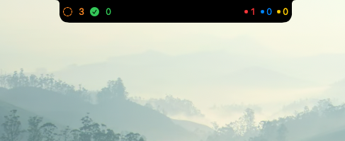
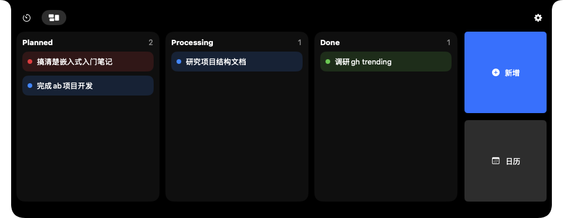
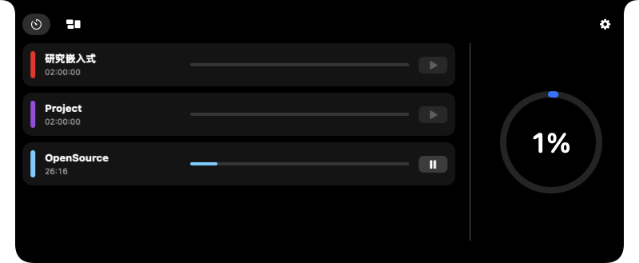

<div align="center">
  

  # Peeker

  极简、轻量的MacBook灵动岛

  [English](README_EN.md)
</div>

完全Swift实现的MacBook原生体验。

非常适合管理日程。

## 运行效果

收起时平躺在屏幕顶部
<p align="center">
  
</p>


鼠标移动到灵动岛上展开，显示功能卡片

| 展开状态 | 任务卡片 |
| --- | --- |
|  |  |

## 安装

```bash
brew install --cask SCPZ24/peeker/peeker
```

首次启动后，请前往“系统设置 → 隐私与安全”，选择信任 Peeker。

## 贡献

欢迎提交 Issue 汇报 Bug、提出 Feature Request，或直接发起 PR。
