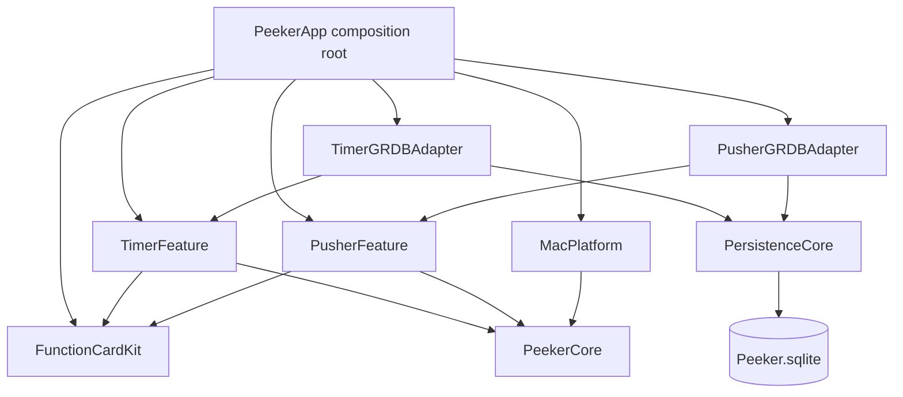

# Peeker Architecture

Peeker is a single-process, Swift-native modular monolith. SwiftUI owns view state and rendering; AppKit is restricted to the floating panel, display topology, input monitors, login items and system audio.

Dependency rules:

- Timer and Pusher never import one another.
- Feature domains do not import GRDB or AppKit.
- SwiftUI views send intents to `@MainActor @Observable final class` stores.
- GRDB records never cross repository ports.
- A single `TemporalEventHub` schedules the earliest target or business-day boundary; target completion has higher priority when timestamps tie.
- One `DatabaseQueue` serializes all SQLite work. Feature adapters own their own tables and transactions.

Persistent business data lives at `~/Library/Application Support/Peeker/Peeker.sqlite`. Lightweight display and card preferences use `UserDefaults`.
