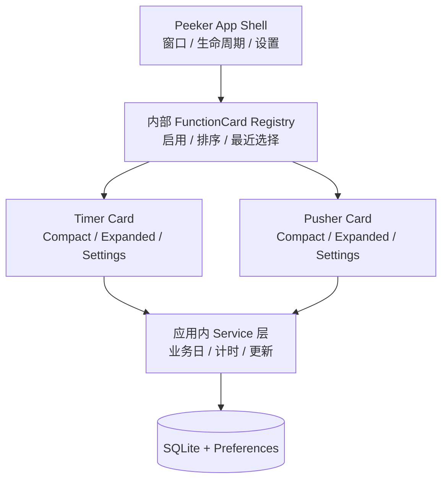
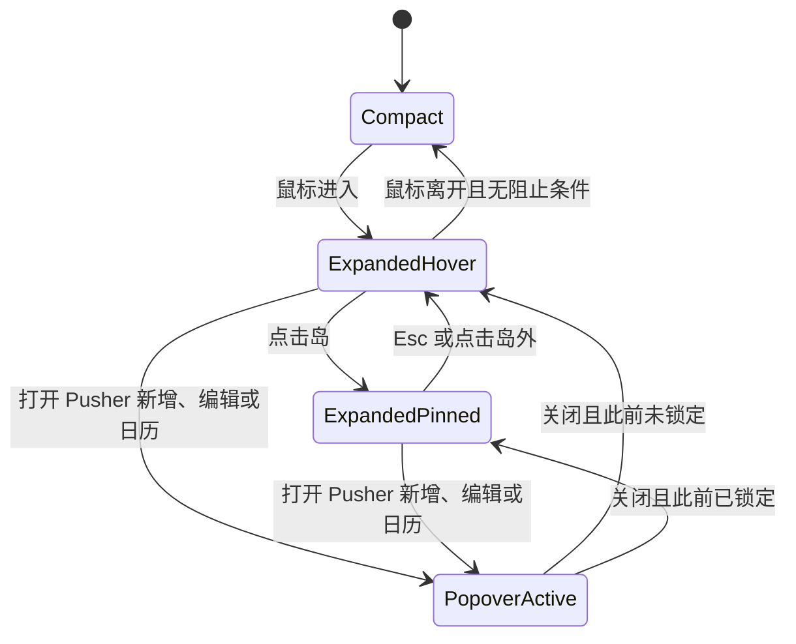
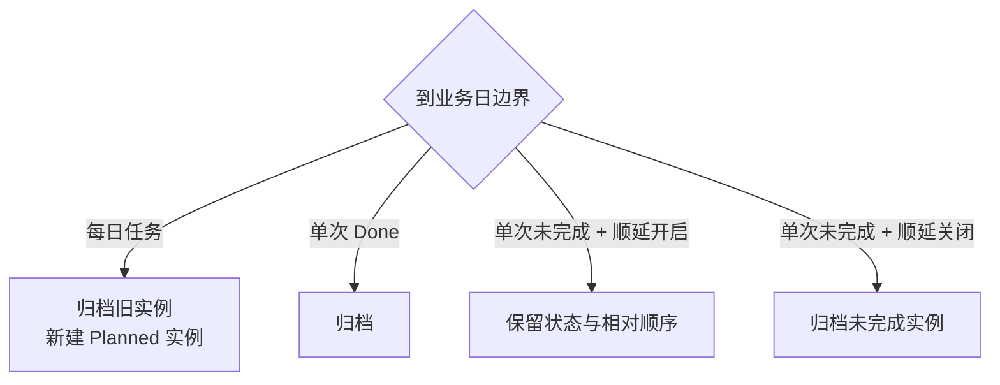

# Peeker v1 产品需求文档

> 文档状态：已确认，可用于设计、开发和验收
>
> 目标版本：v1
>
> 最低系统：macOS 26
>
> 最后更新：2026-08-03

本文档是 Peeker v1 的需求事实来源。`docs/concept.md` 用于描述高层概念；当概念文档、功能文档与本文档存在细节差异时，以本文档为准。Timer 与 Pusher 的功能细节分别同步维护在 `docs/functions/timer.md` 和 `docs/functions/pusher.md`。

## 1. 产品概述

Peeker 是一个面向个人 Mac 用户的低打扰每日推进面板。它以屏幕顶部居中的灵动岛形态常驻，让用户无需切换到完整应用窗口即可：

- 查看和记录每天在目标事项上的投入时间；
- 快速推进当天需要处理的计划；
- 在收敛状态下持续获得必要但不过量的进度反馈。

Peeker v1 不是完整的项目管理器，也不是深度量化或复盘工具。所有产品取舍优先服务“顶部快速查看、快速计时、快速推进”。

### 1.1 目标用户

目标用户是希望在一台 Mac 上进行个人日常自我管理，但不希望频繁打开大型任务管理应用的人。典型使用包括：

- 为健身、阅读、编程等每日目标累计投入时长；
- 管理当天处于规划、推进和完成状态的事项；
- 从全屏应用或任意桌面快速查看今日进度。

### 1.2 v1 目标

1. 提供稳定、低打扰、跨 Space 和全屏可用的顶部灵动岛。
2. 交付 Timer 与 Pusher 两张可独立启用、排序和配置的功能卡。
3. 在睡眠、退出、崩溃、跨日和显示器变化后正确恢复用户状态。
4. 采用纯本地数据模型，不要求账号、网络服务或云端基础设施。
5. 建立内部模块化功能卡边界，避免 Timer 与 Pusher 互相依赖。

### 1.3 v1 不包含

- 账号、云同步、跨设备同步或遥测；
- 团队协作、子任务、标签、搜索或批量操作；
- 数据导出、深度历史分析或逐日详情页；
- 通知中心通知；
- Dock 图标或菜单栏图标；
- 自动检查更新、应用内自动更新或自动执行 Homebrew 命令；
- 第三方插件、插件市场或公开 SDK；
- Mac App Store 分发、Developer ID 签名或公证；
- 对 macOS 25 及更早版本的兼容。

## 2. 产品结构

Peeker 是单个原生 macOS App。SwiftUI 负责主要界面，AppKit 负责顶层窗口、屏幕定位和应用生命周期。业务服务和数据访问全部运行在 App 进程内，不启动本地 HTTP 服务、守护进程或 XPC 服务。

## 3. 平台与应用生命周期

### 3.1 系统与设备

- 最低支持 macOS 26。
- 支持带刘海和无刘海的 Mac。
- 岛位于目标屏幕顶部居中；带刘海和无刘海设备均显示为贴紧屏幕上沿的黑色软角矩形，可见表面与屏幕上沿之间不得出现透明缝隙。
- 带刘海设备按系统报告的安全区和顶部左右辅助区域覆盖完整摄像头区域；收敛摘要分列在物理刘海左右两侧。无刘海设备不预留中央空洞。
- 岛只显示在一块屏幕上。用户可在设置中选择目标屏幕。
- 首次启动默认优先选择内建屏；没有内建屏时选择系统主屏。
- 目标屏幕断开时，岛立即回退到当前主屏。目标屏幕重新连接后不自动迁回，除非用户再次选择。
- 岛出现在所有 Space 和全屏应用中；设置窗口保持普通窗口层级，不强制置顶。

### 3.2 应用入口

- App 不显示 Dock 图标和菜单栏图标。
- 展开岛的标签栏最右侧固定显示齿轮按钮；齿轮不参与功能卡排序。
- 点击齿轮打开标准设置窗口。
- 当 Peeker 已运行时，用户再次从 Finder、Spotlight 或命令行打开 App，应将已有设置窗口置前；若窗口尚未打开，则创建并置前。该行为是岛不可见或不可交互时的恢复入口。
- 设置窗口包含退出 App 的操作。

### 3.3 登录时启动与首次启动

- “登录时启动”首次默认开启，并立即注册系统登录项。
- 用户可在设置中关闭或重新开启；修改即时生效。
- 首次启动不显示自定义 onboarding，不自动打开设置窗口，也不显示教学弹窗；直接显示默认收敛岛。
- 首次默认启用 Timer 与 Pusher，顺序为 Timer、Pusher。

## 4. 灵动岛交互

### 4.1 状态机

状态定义：

- `Compact`：收敛态，显示最近选择功能卡的实时摘要。
- `ExpandedHover`：鼠标悬停触发的展开态；无阻止条件时，鼠标离开后延迟收起。
- `ExpandedPinned`：用户点击岛后锁定展开；再次解除锁定前，鼠标离开不收起。
- `PopoverActive`：Pusher 的编辑、新增或日历 Popover 打开；岛强制保持展开。

交互规则：

- `Esc` 或点击岛及其 Popover 之外的区域可解除锁定。解除后应根据当前鼠标位置决定保持悬停展开或回到收敛态。
- Popover、拖拽或岛内文本输入进行中时禁止自动收起。
- Popover 关闭后恢复打开前的锁定状态。
- 展开和收起动画必须响应系统“减少动态效果”设置。
- 不复刻 Atoll 的动画参数、源码或资源。Atoll 的 GPLv3 实现只用于行为调研，不复制到 MIT 授权的 Peeker 源码。

### 4.2 功能卡导航

- 展开态顶部按设置中的顺序显示所有已启用功能卡标签。
- 用户切换标签后立即记录最近选择卡片。
- 收起、重新展开和 App 重启后均恢复最近选择的已启用卡。
- 若最近卡片已被禁用，则回退到已启用列表的第一张。
- 至少必须启用一张功能卡。关闭最后一张时阻止操作，并显示原因。
- 收敛态始终对应最近选择卡片，并随业务状态实时更新，不保存为静态截图。

### 4.3 尺寸与滚动

- 每张功能卡具有稳定的最大展开尺寸，切换卡片时可按卡片预设尺寸平滑调整。
- 收敛态使用顶部 `6pt`、底部 `14pt` 的软角轮廓；展开态使用顶部 `19pt`、底部 `24pt` 的软角轮廓，两种状态均不得退化为胶囊形。
- 带刘海屏的收敛宽度必须容纳左侧摘要、物理刘海和右侧摘要；收敛高度不得小于系统报告的顶部安全区高度。
- 在较小屏幕上，岛不得超出屏幕可用区域，应按可用宽高收缩。
- 数据量增加时不得让岛无限向下扩张。
- Timer 任务列表和 Pusher 三列分别在自己的内容区域内滚动。

## 5. 内部功能卡边界

v1 定义仅供 Peeker 内部使用的 `FunctionCard` 概念接口。它是源码组织约束，不是公开 API、稳定 ABI 或第三方兼容承诺。

每张卡需要提供：

| 能力 | 要求 |
| --- | --- |
| Identity | 稳定 `cardID`、名称、图标和默认排序 |
| Compact | 收敛态内容及实时摘要 |
| Expanded | 完整功能卡内容 |
| Settings | 卡片专属设置内容 |
| Summary | 可持久化、可观察的轻量摘要状态 |
| Lifecycle | 启用、禁用、成为当前卡及跨业务日事件 |

边界约束：

- Timer 与 Pusher 拥有独立的模型、状态和业务服务，不互相引用。
- 两张卡只共享业务日计算、SQLite 访问、Preferences、功能卡注册表和 App 生命周期服务。
- v1 不扫描插件目录，不加载 `.bundle`、`.dylib` 或运行时第三方 Swift Package。
- 任何功能卡写入失败都必须由自身服务回滚 UI，不得影响另一张卡的状态。

## 6. 统一业务日

“业务日”不是固定的自然日，而是相邻两次用户配置刷新时间之间的区间。

- Timer 与 Pusher 分别拥有自己的刷新时间，默认均为本地时间 00:00，精确到分钟。
- 业务日以系统当前时区和本地时间计算。
- 时区或夏令时改变时，重新计算下一次边界，但不改写已冻结的历史快照。
- App 在边界时运行，应立即结算旧业务日并生成新业务日状态。
- App 未运行时，应在下次启动时依次补做所有遗漏边界，最终恢复到当前业务日。
- 每个业务日使用稳定标识，避免仅用显示日期推导记录归属。

## 7. Timer 功能卡

Timer 用于累计每日目标事项的真实投入时间。详细规则见 `docs/functions/timer.md`。

### 7.1 配置与数据

Timer 设置包括：

- 是否启用；
- 右侧显示模式：今日总完成度或当月热力日历；
- 独立业务日刷新时间；
- 每日任务模板的新增、编辑、删除和拖拽排序。

单个任务模板包括：

- 稳定 ID；
- 非空名称；
- 目标时长，范围为 1 秒至 23:59:59；
- 显示颜色；
- 手动排序位置。

模板变化立即作用于当前业务日和未来业务日，过去业务日快照不回写。岛内任务始终使用设置排序，不因运行或完成状态自动移动。

### 7.2 计时规则

- 同一时刻只允许一个任务处于运行状态。
- 用户必须先暂停当前任务，才能启动另一个任务。
- 计时使用持久化开始时间和时间区间计算，不依赖内存逐秒累加。
- 睡眠、锁屏、正常退出和崩溃期间继续按真实时间计时；重启后恢复活动会话。
- 跨业务日时，在边界精确拆分会话：旧日结算到边界，新日从零继续同一任务。
- 到达目标时自动停止，累计值封顶于目标，不记录超出时长。
- App 正在运行时，由自然计时到达目标应播放短暂岛内完成动效、显示绿色对勾并播放单一内置提示音。提示音遵循系统输出音量。用户编辑目标导致任务立即完成时不播放提示音。
- 若目标在 App 未运行期间到达，重启后直接恢复为完成状态，不补播提示音。
- 在线运行或离线恢复都按时间顺序处理事件：比较当前实例的目标达成时刻与下一业务日边界，先处理较早者。若先达标，则停止且不续跑；若先到边界，则结算旧日、为新日创建实例，并使用新日完整目标继续比较。
- 完成任务在当前业务日不可重新启动。提高目标使剩余时间重新大于零时，任务回到暂停状态。
- 删除运行中的任务必须二次确认；确认后先按当前时间结算。
- 删除任务后保留底层历史会话，但该任务立即从当前日可见总时长和目标分母中排除。

### 7.3 展开态与收敛态

- 展开态左侧约 75% 为今日任务列表，右侧约 25% 为统计区域。
- 右侧“今日总完成度”使用环形进度；“当月热力日历”使用月历热力格。
- 今日完成度 = 当前可见任务的已计时总和 ÷ 当前可见任务的目标总和，视觉范围为 0% 至 100%。没有任务时不显示误导性的 0% 完成结果。
- 历史热力日历使用业务日结算时冻结的完成比例；支持切换月份，不提供日期详情。
- 收敛态显示最近 Timer 任务的“颜色点 + 名称 + 剩余时长”。达标后显示“名称 + 绿色对勾”。
- 最近 Timer 任务的选择优先级为：正在运行项、最近操作项、排序第一项。
- 没有任务时，展开态显示空状态和进入 Timer 设置的操作；收敛态显示 Timer 未配置状态。

## 8. Pusher 功能卡

Pusher 用于管理当前业务日需要规划、推进和完成的事项。详细规则见 `docs/functions/pusher.md`。

### 8.1 配置与数据

Pusher 设置包括：

- 是否启用；
- 单次未完成任务是否顺延；
- 独立业务日刷新时间。

单个任务实例包括：

- 稳定实例 ID；
- 可选的每日系列 ID；单次任务为空，每日任务的所有历史及未来实例共享同一个系列 ID；
- 非空名称；
- 急迫度：紧急（红）、推进（蓝）、规划（绿）；
- 状态：`Planned`、`Processing`、`Done`；
- 是否每日刷新；
- 列内排序位置；
- 所属业务日。

### 8.2 看板交互

- 展开态左侧约 80% 为 Planned、Processing、Done 三列，右侧约 20% 为“新增”和“日历”按钮。
- 各列独立滚动。
- 任务状态只能通过拖拽改变。
- 支持跨列迁移和同列手动排序；落点同时决定状态与排序位置，并立即持久化。
- 新任务默认进入 Planned 末尾。
- 无效拖拽必须回到原位置，不能产生部分更新或丢失任务。
- 卡片默认显示名称，并使用卡片颜色表示急迫度；悬停后显示“编辑”。

### 8.3 新增、编辑与删除

- 新增、编辑和日历均从岛下方打开 Popover。
- Popover 打开期间岛自动保持展开；关闭后恢复原锁定状态。
- 新增和编辑表单支持名称、急迫度和每日刷新属性，不直接编辑状态。
- 新增表单提供取消和确认；编辑表单额外提供红色删除按钮。
- 删除必须二次确认。
- 删除每日任务时，移除当前实例并停止未来生成；过去历史不回写。
- 每日任务跨业务日生成新的实例 ID，但保持同一每日系列 ID。单次任务改为每日任务时创建系列 ID；每日任务改为单次任务时仅让当前实例脱离系列，历史实例保留原系列 ID。

### 8.4 跨业务日规则

- 每日任务规则优先于单次任务顺延开关。
- 每日任务在边界归档旧实例，并在新业务日创建 Planned 实例；新实例追加到 Planned 末尾。
- 单次 Done 任务在边界归档。
- 单次未完成任务在顺延开启时保留原状态和相对顺序；顺延关闭时归档。
- App 多日未运行时，启动后逐日补做结算。首先按持久化状态结算最后一个实际使用过的业务日，其中已经处于 Done 的任务必须计入该日完成数；之后完全离线的中间业务日，其每日任务记录为 0 完成。可顺延单次任务最终带到当前业务日。

### 8.5 摘要与日历

- 收敛态实时显示 `Planned 数 | Processing 数 | Done 数`。
- 拖拽、新增、编辑或删除后立即刷新计数。
- 日历 Popover 支持切换月份。
- 历史业务日显示边界结算时冻结的 Done 数；当前业务日显示实时 Done 数。
- 日期不可点击进入任务详情。

## 9. 设置窗口

设置窗口使用侧边栏组织：

| 页面 | 内容 |
| --- | --- |
| 通用 | 目标屏幕、登录时启动 |
| 功能卡 | 启用状态、拖拽排序；至少保留一张 |
| Timer | 显示模式、刷新时间、任务 CRUD 与排序 |
| Pusher | 未完成顺延开关、刷新时间 |
| 关于 | 当前版本、检查更新、退出 App |

- 普通开关、屏幕选择和排序操作即时保存。
- 新增或编辑表单使用明确的取消和确认操作。
- 设置窗口关闭后 App 继续运行，岛不退出。
- 退出 App 不停止活动 Timer；其开始时间保持持久化，后续重新启动时按真实时间恢复。

## 10. 数据与错误处理

### 10.1 数据位置

- 任务、会话、任务实例、每日快照和结算记录存入 Application Support 下的 SQLite 数据库。
- 屏幕选择、功能卡启用与排序、最近卡片、显示模式等轻量配置存入系统 Preferences。
- 首版不提供历史数据清理界面；SQLite 历史默认持续保留。

### 10.2 一致性与迁移

- SQLite 使用显式 schema 版本和可重复执行的顺序迁移。
- 业务操作需要原子提交；跨日结算不得产生重复实例或重复历史快照。
- 所有持久化对象使用稳定 ID，不以名称或数组下标作为身份。
- App 启动恢复必须先完成必要迁移，再向功能卡发布状态。

### 10.3 错误处理

- UI 可先乐观更新，但写入失败时必须恢复到写入前状态，并显示可见、可重试的错误。
- 一张功能卡的数据错误不得重置或破坏另一张卡的数据。
- 更新检查失败不得影响本地业务功能。
- 显示器断开不得导致岛留在不可见坐标。
- 禁止静默丢弃任务、会话或排序变化。

## 11. 更新、分发与许可证

### 11.1 更新检查

更新只由用户在“关于”页面手动触发，数据源为 [SCPZ24/Peeker GitHub Releases](https://github.com/SCPZ24/Peeker/releases)。

- 已是最新版：显示当前版本和明确成功状态。
- 有新版本：显示最新版本号、发布说明及可复制的 `brew upgrade --cask peeker` 命令。
- 网络、限流或解析失败：显示可重试错误。
- 不在启动时自动检查。
- 不执行 shell，不下载或替换 App，不集成 Sparkle。

### 11.2 分发

- v1 通过 GitHub Release 产物和 Homebrew Cask 分发。
- 安装文档必须说明未签名、未公证状态及 macOS Gatekeeper 的手动放行步骤。

### 11.3 许可证与 Atoll 边界

- Peeker 继续使用 MIT License。
- [Ebullioscopic/Atoll](https://github.com/Ebullioscopic/Atoll) 只作为公开产品行为、交互方式和工程问题的参考。
- 禁止复制或改写 Atoll 的 GPL-3.0 Swift 源码、图形资源、文案、声音和动画参数。
- 后续实现应独立命名、独立设计并保留 Peeker 自己的版权边界。

## 12. 非功能要求

- **本地优先**：除手动更新检查外，业务功能不依赖网络。
- **恢复能力**：退出、崩溃、睡眠、跨日和屏幕变化后恢复结果必须确定且可重复。
- **低打扰**：收敛态只显示当前卡片摘要；除 Timer 达标提示音外，不主动弹出通知。
- **性能**：常驻状态不得通过高频数据库轮询或不受控计时器持续占用 CPU；界面显示可按需刷新，但计时事实来源必须是时间戳。
- **可访问性**：文字、按钮和状态提供系统可访问性标签；动画尊重“减少动态效果”。Pusher v1 的状态迁移仍以拖拽为唯一业务操作。
- **隐私**：无账号、无遥测、无业务数据上传。

## 13. 验收标准

### 13.1 应用外壳

- [ ] App 在 macOS 26 的带刘海和无刘海 Mac 上启动并显示顶部居中岛。
- [ ] 收敛态和展开态都与屏幕上沿严格贴合，不出现亮线、透明缝隙或悬浮间距。
- [ ] 带刘海屏完整遮住摄像头区域，摘要分列刘海左右；无刘海屏使用连续摘要布局且不预留中央空洞。
- [ ] App 无 Dock 和菜单栏入口，齿轮可打开设置，第二次启动可置前设置窗口。
- [ ] 岛可在所有 Space 和全屏应用显示。
- [ ] 用户可选择目标屏幕；断开该屏幕后岛回退到主屏。
- [ ] 登录时启动首次默认开启，并可关闭和重新开启。
- [ ] 首次启动没有 Peeker 自定义 onboarding。

### 13.2 岛与功能卡

- [ ] 悬停展开、离开收起、点击锁定、`Esc`/外部点击解锁行为符合状态机。
- [ ] Popover、拖拽和文本输入期间岛不会意外收起。
- [ ] 功能卡启用、排序和最近选择跨重启保留。
- [ ] 无法禁用最后一张功能卡。
- [ ] 收敛态与最近选择卡一致并实时更新。
- [ ] 小屏和大量数据场景使用内部滚动，不超出可用屏幕区域。

### 13.3 Timer

- [ ] 任意时刻最多一个任务运行；暂停后可切换任务。
- [ ] 睡眠、锁屏、退出和崩溃期间按真实时间恢复。
- [ ] 跨业务日会话正确拆分并在新日续跑。
- [ ] 离线恢复按时间顺序处理“目标达成”和“业务日边界”；较早事件先发生，达标后不得继续跨日累计。
- [ ] 达标时自动停止在 0，显示绿色对勾；App 在线时播放提示音，离线达标后不补播。
- [ ] 模板修改立即影响今日与未来，过去快照不变化。
- [ ] 删除活动任务需要确认并先结算；当前完成度正确排除删除项。
- [ ] 今日完成环和月历热力图使用一致的完成度算法。
- [ ] 收敛态显示颜色点、名称和剩余时长，完成后显示绿色对勾。

### 13.4 Pusher

- [ ] 可新增、编辑和删除任务；每日任务删除后不再生成。
- [ ] 跨列和列内拖拽正确保存状态及顺序；无效拖拽回弹。
- [ ] 每日任务、单次 Done、单次未完成顺延开关在边界按规则结算。
- [ ] 每日任务的新实例使用新实例 ID，并沿用同一个每日系列 ID；删除系列不改写历史实例。
- [ ] App 多日未运行后的补结算不会重复任务或丢失顺延任务。
- [ ] 离线前最后一个业务日已有 Done 任务时，该日按保存状态结算；只有完全离线的中间业务日记为 0 完成。
- [ ] 收敛态实时显示三列数量。
- [ ] 日历历史 Done 数冻结，今天的 Done 数实时变化。

### 13.5 数据、更新与合规

- [ ] SQLite 迁移、重启恢复和写入失败回滚可验证。
- [ ] 过去快照不因当前模板编辑而改变。
- [ ] 更新检查覆盖最新版、有更新、断网和畸形响应四种结果。
- [ ] Peeker 不自动运行 Homebrew 命令或替换 App。
- [ ] 代码和资源中不包含 Atoll 的 GPL 派生内容。

## 14. 后续方向

真正的第三方功能卡社区不属于 v1。未来若验证有需求，应优先采用 macOS 26 的 ExtensionFoundation、ExtensionKit 与 XPC：第三方扩展在独立进程中提供多个 UI scene，由系统发现和批准，Peeker 负责托管和协议通信。在启动该工作前，必须先确定 Developer ID 签名、公证、扩展协议版本、权限、数据所有权、崩溃占位和兼容策略；不得以运行时加载第三方 Swift 动态库作为捷径。
