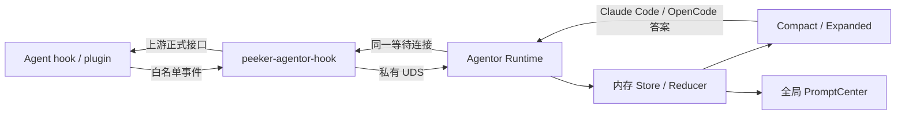

# Agentor 功能卡设计

> 状态：已实现，自 Peeker v2.0.2 提供
> 适用平台：macOS  
> 支持 Agent：Pi、OpenCode、Hermes、Codex、Claude Code

## 1. 摘要

Agentor 是 Peeker 的第 4 张内置功能卡。它通过用户主动安装的 hook 或 plugin 观察本机 Agent 的顶层执行会话，在灵动岛中展示：

- 当前执行中的会话数量；
- 会话处于思考、执行工具或等待回答中的状态；
- 开始、结束、失败、取消和等待回答提示；
- Claude Code 与 OpenCode 的问题表单及岛内回答；
- Hermes、Pi 与 Codex 的只读问题提醒及原生界面跳转。

Agentor 不提供公开 CLI，不处理普通工具权限审批，也不以 Agent 进程或终端窗口数量代替“正在执行”的会话数量。

## 2. 目标与非目标

### 2.1 目标

1. 用统一模型聚合五种 Agent 的执行状态，不要求用户持续查看终端或 Agent App。
2. 只统计当前正在执行的一轮顶层会话，避免将空闲进程计入运行数量。
3. 在上游能力可靠时允许用户直接从 Peeker 回答问题。
4. 以显式、幂等、可修复、可移除的方式管理用户级 hook/plugin。
5. 保持 Agentor 与其他功能卡、公共 CLI 和数据库相互独立。

### 2.2 非目标

首版不支持：

- 普通工具权限审批；
- Hermes、Pi、Codex 的岛内答案写回；
- subagent 独立计数；
- 远程 SSH、WSL 或远端 Agent；
- 第三方 Agent；
- 自定义配置根目录 UI；
- 系统通知、声音或 Agentor 私有提示窗口；
- 运行历史、问题历史或跨 Peeker 重启恢复；
- `peeker agentor` 等公开命令。

## 3. 能力边界

| Agent | 执行状态 | 待回答发现 | 岛内写回 | 首版降级行为 |
|---|---|---|---|---|
| Claude Code | 支持 | `PreToolUse(AskUserQuestion)` | 支持 | 写回不可用时返回原生流程 |
| OpenCode | 支持 | `question.asked` | 支持 | 运行时缺少 reply API 时只读 |
| Hermes | 支持 | `clarify` | 不支持 | 展示问题并跳转原生界面 |
| Pi | 支持 | 已知问题工具的 `tool_call` | 不支持 | 展示问题并跳转原生界面 |
| Codex | 支持 | JSONL 中的 `request_user_input` | 不支持 | 展示问题并跳转原生界面 |

“发现待回答”与“代替用户提交答案”是两种独立能力。Agentor 不使用脆弱的错误结果注入或非正式协议伪造写回能力。

## 4. 核心概念

### 4.1 执行条目

执行条目的稳定身份为：

```text
(Agent 类型, 上游 session ID)
```

条目不依赖终端窗口。通过终端或 Agent App 启动的会话采用相同规则。

每个条目至少包含：

- Agent 类型；
- session ID；
- 可选 turn ID、event ID、request ID；
- 可选父 session ID；
- 归一化执行状态；
- 本轮开始和最近更新时间；
- 会话标签；
- 可选进程 ID 及其作用域；
- 待回答问题；
- 是否具备写回能力。

### 4.2 运行数量

“运行数量”只统计当前正在执行的一轮顶层会话：

- `UserPromptSubmit`、`before_agent_start`、OpenCode `busy` 等开始事件使条目计入；
- `Stop`、`agent_end`、`session.idle`、Hermes turn end 等结束事件使条目移出；
- 等待用户回答期间仍属于执行中；
- Agent 进程仅打开但当前轮已结束时不计入；
- subagent 不独立计数或占行。

可识别 subagent 与父会话关系时，父条目显示“并行子任务 ×N”。

### 4.3 归一化状态

| 状态 | 含义 |
|---|---|
| `思考中` | 模型推理、请求处理中或已开始但尚未进入工具调用 |
| `执行工具` | 存在正在执行的工具调用 |
| `等待回答` | Agent 正等待用户回答问题 |

正常结束、失败和取消属于终止结果，只产生提示，不保留历史行。

## 5. 状态规则

### 5.1 事件顺序与幂等

- event ID 重复时幂等忽略。
- 优先使用上游 turn ID 区分执行代次。
- 同一代次内按上游事件时间拒绝旧事件。
- 缺少显式开始事件时，新的活跃事件可以隐式创建条目，但不补发“开始执行”提示。
- 已终止代次的旧工具、问题或心跳事件不得重新激活条目。
- 上游问题已回答或失效后，迟到的 Peeker 提交不得再次写回。

### 5.2 异常清理

- 若获得会话级 PID 和可验证的进程身份，进程退出后立即清理条目。
- Agent App 共享 PID 不属于可靠的会话级 PID。
- 没有可靠会话 PID且连续 20 分钟没有新事件时，条目标记失联并移出。
- 失联清理不播放“正常结束”提示。
- Peeker 重启后不恢复旧执行、问题或提示。

## 6. 灵动岛表现

### 6.1 静息态

当执行数量为 0 时，Agentor 不具备 Compact 资格。宿主继续选择其他具备资格的功能卡；若没有任何卡具备资格，则进入 Resting。

### 6.2 Compact 资格与竞争

当执行数量至少为 1 时，Agentor 具备 Compact 资格。

Agentor 与 Timer 等卡完全沿用宿主现有规则：

1. 最近打开时间；
2. 启用顺序。

等待回答不会提高 Agentor 的宿主优先级，也不会抢占当前胜出的 Timer。展开态收起时，若 Agentor 仍有活跃会话则回到 Agentor Compact；若已无活跃会话，则由宿主改选其他 Compact 卡或回到 Resting。

### 6.3 Compact 内容与动画

Compact 使用随 App Bundle 分发的五套单色 SVG 标志；动画由 SwiftUI 绘制，不使用第三方角色或 `clawd-on-desk` 资源。

| 执行数量 | 表现 |
|---|---|
| 1 | 单个 Agent SVG 标志；外围显示 `1.8s` 循环的低亮扫描弧；尾部显示状态短文案 |
| 2 | 两个 Agent SVG 标志以 `1.6s` 反相呼吸；尾部显示数量 `2` |
| ≥3 | 左侧显示真实数量徽标；右侧三点以 `2.4s` 起伏并再次显示真实数量 |

当存在待回答问题且 Agentor 当前赢得 Compact 时，尾部改为琥珀色问号徽标与 `1.2s` 扩散环。

开启“减少动态效果”后：

- 停止所有循环位移、缩放和脉冲；
- 保留静态 glyph、数量、状态文字和语义颜色；
- 不降低信息完整性。

### 6.4 展开态

Agentor 展开表面为 `640 × 300 pt`。小屏继续使用宿主现有表面裁剪规则；会话和问题内容在卡内滚动。

会话按本轮开始时间稳定排序，不因状态变化重新排序。每行显示：

- Agent 中性图标与名称；
- 会话标签；
- 当前状态；
- 本轮运行时长；
- 可选的“并行子任务 ×N”徽标；
- 待回答问题表单。

每个会话行使用展开态描边动画：正常状态为低亮白色扫描，等待回答为蓝色呼吸描边，非等待状态切换时短暂显示绿色描边；开启“减少动态效果”后保留静态语义描边。

会话标签按以下优先级生成：

1. 上游标题；
2. 工作目录 basename；
3. `Agent 名 · session 短 ID`。

岛内不得显示完整工作目录路径。

## 7. 问题表单

### 7.1 通用表现

- 每个问题直接展开在所属会话行下方。
- 不使用折叠、分页或 stepper。
- 支持显示问题标题、正文、选项标签和选项备注。
- 展示文本与写回 wire value 分离；UI 格式化不得改变提交值。

### 7.2 Claude Code 与 OpenCode

两者支持：

- 单选；
- 多选；
- 自由文本；
- Other 自定义输入；
- 一次多题提交。

交互规则：

- 恰好一题且为普通单选时，点击预设选项立即提交。
- 选择 Other 后必须先输入文本，再显式提交。
- 多题、多选或纯文本问题必须满足所有必填条件后，点击“提交回答”。
- 文本字段获得焦点期间，必须启用宿主编辑阻止器，防止岛自动收起。
- 提交后立即禁用重复操作，直到上游确认、拒绝或超时。
- 表单同时提供“改在 Agent 中回答”，结束 Peeker 等待并返回原生流程；该操作不表示拒绝问题。

写回规则：

- Claude Code 使用原始完整 question 文本作为 `answers` 字典 key；多选按上游要求编码。
- OpenCode 按问题顺序构造 `[[String]]`，并调用公开的 question reply 接口。
- 问题、选项和答案只存在于内存，不持久化、不写日志。

### 7.3 Hermes、Pi 与 Codex

三者使用相同的只读问题布局，但选项不可在 Peeker 中提交。表单显示“在 Agent 中回答”操作：

- 已知来源 App 或终端时，最佳努力激活该目标；
- 无可靠目标时，保留问题并说明需要手动切回 Agent；
- 聚焦能力不作为状态发现或问题展示的前置条件。

### 7.4 输入安全边界

每个上游问题请求必须同时满足：

- request ID 稳定且非空；
- 最多 5 题；
- 每题最多 5 个选项；
- answer key 不重复；
- 总协议负载不超过 512 KiB；
- 问题和选项可以完整展示，无需截断。

不满足任一条件时：

- 不展示不完整的选择集；
- 不允许岛内写回；
- 改为只读提示“请在 Agent 中回答”。

### 7.5 上游竞态

同一顶层 session 可以同时保留多个独立 request；每个 request 分别维护表单、Prompt 和等待连接。可识别的 subagent request 归并到父 session，不建立独立执行行。

运行时最多保留 100 个活跃 session 和 100 个未决 request。超限状态事件被丢弃；可写问题立即回落原生流程。

若上游先完成回答、取消请求或返回“已处理”：

1. 立即撤销表单；
2. 撤销尚未播放或正在播放的等待提示；
3. 显示轻量状态“已在 Agent 端处理”；
4. 拒绝迟到或重复提交。

## 8. 消息提示

Agentor 继续使用宿主全局 Prompt FIFO：

- 每条显示 6 秒；
- 展开结束后延迟 1.5 秒继续播放；
- 不创建 Agentor 私有窗口；
- 不播放声音，不调用通知中心。

| 事件 | 语义样式 | 视觉要求 |
|---|---|---|
| 开始执行 | `activity` | 蓝色 glyph 入场与短扫描轨迹 |
| 正常结束 | `success` | 绿色 check 绘制与淡出轨迹 |
| 失败或取消 | `failure` | 红色或橙色错误徽标与短促过渡 |
| 等待回答 | `attention` | 琥珀色问号与扩散环 |

提示显示 Agent 名和会话标签的单行摘要。

等待提示 token 由问题 request ID 稳定派生；问题被回答、取消或判定失效时必须撤销。其他提示使用独立 event ID，继续遵守 FIFO 和容量限制。

通用 `FunctionCardPrompt` 需要增加向后兼容的语义样式枚举，默认值保持 `standard`。功能卡只能选择语义样式，不得向宿主注入任意 Prompt View。

## 9. 设置与接入状态

### 9.1 设置页面

功能卡启用开关继续只出现在通用“功能卡”页。Agentor 设置页固定展示五个 Agent 条目，并提供“刷新”。

首次进入 Agentor 设置页时执行一次只读扫描。页面保持打开期间，仅在以下操作后更新：

- 用户点击刷新；
- 接入或修复完成；
- 移除接入完成。

不使用文件监听或后台轮询。

每个条目显示：

- `未发现 | 未接入 | 已接入`；
- 检测路径；
- 状态详情或修复原因；
- 最近扫描时间；
- 三态与详情表达状态能力；胶囊徽标只显示 `岛内回答`或`仅提醒`；
- `接入/修复`或`移除接入`操作。

### 9.2 三态定义

| 状态 | 定义 |
|---|---|
| 未发现 | 标准配置目录、已知 CLI 路径和已知 App Bundle 均无安装证据；此状态禁止接入或预创建配置 |
| 未接入 | 已发现，但 hook 缺失、路径过期、配置损坏、版本不兼容、Hermes profile 只完成部分，或 Codex 尚未信任 hook |
| 已接入 | 当前适配器的托管文件、配置引用和必要启用门禁均完整 |

“已接入”只表示磁盘接入完整，不表示当前存在活跃会话，也不证明 hook 已在本次 Agent 进程中触发。

配置损坏、权限不足或目标为不安全 symlink 时：

- 禁止覆盖；
- 保持“未接入”；
- 显示具体文件和可执行的修复说明。

## 10. 接入、修复与移除

### 10.1 写入原则

- 只有用户点击单个 Agent 的“接入/修复”后才允许写入。
- 扫描、App 启动和功能卡启用不得自动修改 Agent 配置或启动 Agent。
- 修改采用“解析 → 合并 → 校验 → 原子替换”。
- 保留原文件权限、用户配置和其他 hook/plugin。
- 任一步失败时保持原文件。
- 重复接入只补充缺失内容，或更新 Peeker 明确拥有的旧路径和旧版本。

### 10.2 安全移除

“移除接入”必须二次确认，并且只能：

- 删除带 Peeker marker 的配置条目；
- 删除内容哈希仍与已知托管版本匹配的文件；
- 保留其他配置和第三方 hook。

若托管文件已被用户修改，拒绝自动删除，并给出手工清理路径。

禁用 Agentor 功能卡不等于移除接入：

- 已安装 hook 保留；
- Agentor Prompt、Compact 和内存状态被清空；
- 新状态事件被丢弃；
- 可回答问题立即回落到 Agent 原生 UI。

## 11. Agent 适配器要求

### 11.1 Claude Code

- 合并 `~/.claude/settings.json` 中的状态 command hooks。
- 为 `AskUserQuestion` 注册专用阻塞式 `PreToolUse` command hook，并通过官方 `updatedInput.answers` 写回。
- 不注册 `PermissionRequest`，不匹配、不接管普通工具权限审批。
- 问题 hook 最多等待 Peeker 590 秒；App 不可用、卡片禁用、协议错误或超时后返回原生流程。

### 11.2 OpenCode

- 按 `opencode.jsonc → opencode.json → config.json` 确定实际配置证据，但不修改这些配置文件。
- 将单文件 Peeker 托管 plugin 安装到官方全局 `plugins/` 自动发现目录；安装和移除保证 JSON/JSONC byte-for-byte 不变。
- plugin 监听 session、tool 和 question 事件。
- plugin 在后台等待 Peeker 回答，收到答案后调用公开 `question.reply`。
- 运行时缺少 reply API 时自动降级只读，不伪造私有接口。

### 11.3 Hermes

- 将托管 plugin 安装到默认 Hermes home 和所有已存在 profile。
- 通过 `hermes plugins enable` 激活，不直接手改 YAML。
- 观察 session、LLM 和 tool 生命周期。
- `clarify` 只观察，不阻断，不通过错误结果注入答案。

### 11.4 Pi

- 安装带 Peeker marker 的全局 extension 目录。
- 观察 session、agent 和 tool 生命周期。
- 对 `plan_mode_question`、`AskUserQuestion`、`ask_user_question` 等已知且 schema 合法的问题工具做只读展示。
- 未知问题工具不猜测 schema，不提供写回。

### 11.5 Codex

- 幂等合并 `~/.codex/hooks.json`。
- 启用 `[features].hooks`，检查 `[hooks.state]` 的 trusted hash。
- 接入后提示用户在 Codex 执行 `/hooks` 完成信任审核，并在设置页刷新。
- 执行状态使用官方 hooks。
- 有界 JSONL 增量监视只白名单解析 `request_user_input`、对应完成事件和 `turn_aborted` 等终止事件；问题只读展示，失败/取消用于及时清理。
- 不修改用户的 `notify` 配置。

## 12. 内部架构

### 12.1 模块边界

Agentor 作为独立 Feature/Module 接入：

- `AgentorFeature`：领域模型、内存 Store、卡片与设置 UI；
- `AgentorModule`：宿主组装、生命周期和内部事件接入；
- Agentor 私有协议：事件、问题和回答数据结构；
- App Bundle 私有 helper：上游 hook 与 Peeker 的桥接；
- Pi、OpenCode、Hermes 托管适配器资源。

共享框架不得 import Agentor。Agentor 不注册 GRDB migration，也不增加 SQLite 表。

### 12.2 数据流



### 12.3 私有 IPC

Agentor 使用独立 UDS，不扩展公共 CLI 协议：

- socket：`com.scpz24.Peeker/agentor-v1.sock`；
- 父目录权限：`0700`；
- socket 权限：`0600`；
- 校验 peer effective UID；
- 4 字节长度帧；
- 单帧上限 512 KiB；
- 独立 schema version。

状态事件快速 ACK。可回答问题通过同一连接等待结果，最长 590 秒。

### 12.4 私有 helper

App Bundle 包含 `peeker-agentor-hook`：

- 不安装到 PATH；
- 不出现在 `peeker --help`；
- 不提供用户业务命令；
- 只解析已知 hook 输入、标准化白名单字段、连接私有 UDS，并编码上游正式响应；
- 连接失败时静默回落，不自动启动 Peeker。

适配器不得发送完整终端输出、代码、命令结果或文件内容。

## 13. 安全与隐私

- 所有配置改动均需用户显式触发。
- 问题、选项、答案和会话运行状态只保存在内存。
- 日志不得包含问题正文、答案、完整路径、代码或命令输出。
- 岛内仅显示工作目录 basename。
- 同用户 UDS 是最低访问边界；协议仍需做版本、大小、枚举和字段长度校验。
- Peeker 只能回答当前由对应 hook 保持的待处理请求，不提供任意 Agent 命令执行接口。
- 不安全 symlink、损坏配置和未知格式必须失败关闭，不得“尽力覆盖”。

## 14. 升级与兼容

- Agentor：`defaultOrder = 3`。
- Agentor：`introducedConfigurationVersion = 3`。
- 默认启用。
- 新安装顺序：Timer、Pusher、Scheduler、Agentor。
- 既有用户升级时保留原卡相对顺序，将 Agentor 追加到末尾。
- 不重新启用用户此前禁用的卡。
- 升级绝不自动植入 Agent hook。
- Compact 选择算法、Prompt FIFO 容量、公共 CLI schema/version 保持不变。
- Bundle 必须包含私有 helper 和 Pi/OpenCode/Hermes 适配器资源，并校验 helper 可执行权限。

## 15. 失败与降级

| 场景 | 行为 |
|---|---|
| Peeker 未运行 | hook 快速失败或问题返回原生流程，不自动启动 App |
| Agentor 已禁用 | 丢弃状态、清空 UI；可回答问题返回原生流程 |
| 协议不兼容或负载超限 | 拒绝事件；问题降级原生回答 |
| 问题 schema 不安全 | 只读提示，不展示残缺选项，不写回 |
| 上游已先回答 | 撤销表单和 Prompt，禁止重复提交 |
| 写回失败或超时 | 显示失败原因并返回原生流程 |
| hook 安装部分成功 | 回滚可控改动；扫描结果保持“未接入” |
| Codex hook 未信任 | 保持“未接入”，提示执行 `/hooks` 后刷新 |
| 托管文件被用户修改 | 不自动覆盖或删除，给出手工修复路径 |
| Stop 事件丢失 | PID 退出立即清理；否则按 20 分钟失联规则清理 |

## 16. 验收标准

### 16.1 领域状态

- 同一 Agent 的多个顶层 session 可并行计数。
- 五种 Agent 的开始、思考、工具、等待和结束事件能映射到统一状态。
- subagent 只更新父条目徽标。
- 重复和乱序事件不造成重复条目或状态回退。
- 失败、取消、PID 退出和 20 分钟失联能正确清理。
- 禁用 Agentor 后无 Compact、Prompt 或残留问题。

### 16.2 问题表单

- 单题单选可点击即提交。
- 多题、多选、Other 和自由文本按规则校验并提交。
- Claude Code 使用完整原始 question key。
- OpenCode 保持问题顺序和答案数组结构。
- 超限、重复 key 和不稳定 request ID 会安全降级。
- 上游抢先回答、重复点击、超时和 native fallback 不会重复写回。

### 16.3 配置管理

五种 Agent 均需验证：

- 未发现、未接入、已接入三态；
- 重复接入幂等；
- 保留用户配置和其他 hook；
- 旧路径修复；
- 损坏文件和 symlink 拒写；
- 移除只清理 Peeker 拥有内容；
- 用户修改托管文件后拒绝自动删除。

另需覆盖 OpenCode 自动发现安装且 JSON/JSONC byte-for-byte 不变、Hermes 多 profile 和 Codex trust 状态。

### 16.4 UI 与动画

- 0、1、2、3+ 会话的静息或 Compact 表现符合设计。
- 等待回答动画只在 Agentor 赢得 Compact 时显示，不抢占 Timer。
- 四种 Prompt 样式使用宿主统一渲染。
- 展开内容可滚动，完整表单不会越界。
- 文本输入时岛不自动收起。
- 小屏、刘海屏、无刘海屏和 Reduce Motion 均可用。

### 16.5 真实冒烟

- 五种 Agent 各完成一次“开始 → 工具 → 结束”。
- Claude Code、OpenCode 完成岛内单选、多选、文本回答及“改在 Agent 中回答”。
- Hermes、Pi、Codex 展示只读问题，并在原生回答后撤销。
- 可获得 App 入口的 Agent 需验证监测不依赖 TTY。

## 17. 参考与许可证边界

`clawd-on-desk` 用于验证 Agent 扩展点、事件能力和兼容边界。其当前许可证为 AGPL-3.0。

Peeker 实现必须：

- 独立编写 Swift 领域、IPC、配置管理和动画实现；
- 独立编写 Pi、OpenCode、Hermes 适配器；
- 不复制其源码、测试、资源、角色形象或动画参数；
- 在依赖或参考事实变化时重新进行许可证和能力审查。
