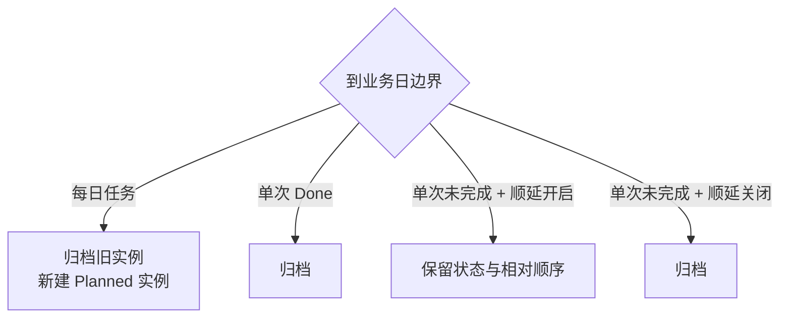

# Pusher：计划推进管理器（v2）

> 文档状态：v2 现行设计与实现契约。
>
> 通用岛状态、提示队列、CLI envelope、升级与错误规则以 [Peeker v2 PRD](../v2/PRD.md) 为准。

Pusher 是当前业务日的轻量看板。v2 保留 v1 的三列、拖拽、每日系列和结算语义，删除收敛态，并在成功新建、删除和跨状态移动后发布静音提示。

## 1. 使用目标

Pusher 让用户快速管理当天处于以下阶段的事项：

- `planned`：已经计划，尚未开始推进；
- `processing`：正在推进；
- `done`：当前业务日已完成。

Pusher 不承担截止日期、子任务、标签、搜索、协作或完整项目管理职责。

## 2. 配置

Pusher 设置包括：

- 功能卡是否启用；
- 单次未完成任务是否顺延到下一业务日，默认开启；
- 独立业务日刷新时间，默认本地 `00:00`，精确到分钟。

“未完成顺延”只作用于非每日任务。每日任务始终按每日重建规则处理。

## 3. 任务模型

| 字段 | 规则 |
| --- | --- |
| Task ID | 当前实例的稳定身份；每日重建时生成新 ID |
| Series ID | 每日任务共享；单次任务为空 |
| 标题 | 去除首尾空白后非空；允许重名 |
| 急迫度 | `urgent`、`progress`、`planning` |
| 状态 | `planned`、`processing`、`done` |
| 每日刷新 | 由 Series ID 是否存在表示 |
| 排序位置 | 当前状态列内连续位置 |
| Business Day ID | 当前实例所属业务日 |
| 创建/更新时间 | 用于持久化和变更返回 |

急迫度颜色固定为：urgent 红、progress 蓝、planning 绿。

## 4. 展开态

Pusher 最大展开表面保持 `960×371.429pt`：

- 左侧约 80%：Planned、Processing、Done 三列；
- 右侧约 20%：新增和日历按钮；
- 三列分别在固定区域内滚动。

任务卡默认显示标题和急迫度颜色，悬停后显示编辑操作。状态不在编辑表单中修改。

## 5. 静息态

Pusher 不提供收敛态。

- Pusher 未展开且没有正在播放的 Pusher 提示时，由宿主显示其他合格卡的收敛态或进入静息态。
- Pusher 被禁用后，业务数据、业务日结算和 CLI 仍可工作，但不显示标签或 Pusher 提示。

v1 的 Planned/Done/Processing 收敛摘要、黄色规划计数和相应尺寸要求在 v2 全部删除。

## 6. 拖拽、状态与排序

- UI 状态变化仍只能通过拖拽；不增加状态按钮或下拉框。
- 支持跨列移动和同列排序；落点同时决定状态与目标位置。
- 目标槽位按移动前可见列表解释：列首为 `0`，列尾为任务数；同列移除源后修正下标。
- 状态与完整列顺序在一个原子操作中持久化。
- 放下时展示层先乐观更新；提交成功不得产生第二次布局跳动。
- 无效或取消拖拽不写入。提交失败恢复原列和原位置并显示错误。
- 只接受本 App、当前业务日、随机 nonce、单项目 `.move` 会话；拒绝外部文本。
- 有效目标显示列框和插入线，系统预览落向目标 frame。
- 拖拽和其后的延迟跨日恢复共用 Store 级 mutation 边界；完成前拒绝第二次 CRUD 或移动。
- 拖拽期间岛保持展开。

CLI 可以直接执行同一领域 `move`，但不得复用或模拟 UI 拖拽信封。

## 7. 新建、编辑与删除

### 7.1 新建

新增 Popover 字段：标题、急迫度、是否每日刷新、取消、确认。

- 新任务进入 Planned 末尾。
- 名称校验和事务成功后关闭 Popover。
- 提交成功后发布“已新建”Pusher 提示。
- 失败时不保留临时任务，也不提示。

### 7.2 编辑

编辑 Popover允许修改标题、急迫度和每日刷新属性，不允许直接改状态。

- 编辑不改变当前状态和列内位置。
- 单次改为每日时创建 Series ID。
- 每日改为单次时，当前实例脱离系列；历史实例保留原 Series ID。
- 普通字段编辑不发布提示。

### 7.3 删除

- UI 删除要求二次确认；CLI 按公共契约直接执行。
- 删除单次任务立即移除当前实例。
- 删除每日任务移除当前实例并停止未来生成，过去历史不变。
- 提交成功后发布“已删除”Pusher 提示；提示必须保存被删除标题的快照。

## 8. 业务日结算



- 每日规则优先于顺延开关。
- 每日任务无论旧状态如何都归档，并在新日创建新 Task ID、沿用 Series ID 的 Planned 实例。
- 新的每日实例追加到 Planned 末尾。
- 单次 Done 归档。
- 单次未完成在顺延开启时保留状态和相对顺序；关闭时归档。
- 自动结算、归档和每日重建不发布 Pusher 提示。

## 9. 多日离线恢复

启动后按时间顺序补做每个遗漏边界：

1. 按最后实际使用日的持久化状态结算，该日已有 Done 必须计入完成数。
2. 完全离线的中间日为每日系列生成并结算实例，完成数为 0。
3. 当前业务日只保留一个新每日实例。
4. 可顺延单次未完成任务最终进入当前日；不可顺延项在首个遗漏边界归档。

恢复必须幂等。App 未运行或睡眠期间的自动变化不创建过期提示。

## 10. 日历

日历 Popover：

- 按月显示，可前后切换；
- 历史业务日显示边界冻结的 Done 数；
- 当前业务日显示实时 Done 数；
- 当前日新增、删除或移入/移出 Done 后即时变化；
- 历史值不因后续编辑或删除变化；
- 日期不可进入任务详情。

## 11. Popover 与岛状态

- 新增、编辑和日历均从岛下方打开 Popover。
- 打开时记录此前锁定状态，并阻止悬停离开收起。
- 关闭后恢复此前锁定状态；未锁定时按鼠标位置决定。
- 文本输入期间 `Esc` 优先关闭 Popover，不保存未确认内容。
- 展开期间成功的新建、删除或跨状态移动仍会发布提示；提示在岛结束展开后 `1.5` 秒开始播放。

## 12. 提示规则

提交成功后，以下操作逐条进入全局 FIFO：

| 操作 | 摘要 |
| --- | --- |
| 新建 | `已新建：<标题>` |
| 删除 | `已删除：<标题>` |
| 跨状态移动 | `<标题>：<旧状态> → <新状态>` |

不触发提示：

- 标题、急迫度或每日属性编辑；
- 同列排序；
- 自动跨日结算、归档、顺延和每日重建；
- 数据库失败；
- Pusher 被禁用时发生的操作。

提示静音；UI 与 CLI 来源规则相同。

## 13. 并发、错误与恢复

- CRUD、move、CLI 请求、跨日恢复和来源于定时事件的恢复共用 Pusher mutation gate。
- CLI 请求到达时先结算已过期业务日，再解析 Task ID/标题。
- 乐观 UI move 只有在提交成功后才能向 CLI 或提示系统发布成功。
- 写入失败恢复原 board，不得产生重复、丢失、状态/列不一致或提示。
- Pusher 错误不得修改 Timer 或 Scheduler 数据。

## 14. CLI 接口

Pusher CLI 继承 [v2 CLI 公共契约](../v2/PRD.md#7-cli-公共契约)。选择器为 `--id <task-id>` 或位置参数 `<exact-title>`，二者互斥；标题按去除首尾空白后的大小写敏感精确唯一匹配。

### 14.1 命令矩阵

| 命令 | 作用 | 主要校验与副作用 |
| --- | --- | --- |
| `peeker pusher list [--status planned\|processing\|done]` | 列出当前业务日任务 | 先恢复业务日；按状态与 position 排序 |
| `peeker pusher get (--id <id> \| <title>)` | 返回当前任务 | 不查询历史归档 |
| `peeker pusher create --title <title> --urgency <urgent\|progress\|planning> [--daily <bool>]` | 创建 Planned 任务 | `daily` 默认 false；提交后提示 |
| `peeker pusher update (--id <id> \| <title>) [--title <title>] [--urgency <urgency>] [--daily <bool>]` | 编辑业务字段 | 至少一个变更；不改变状态/位置；不提示 |
| `peeker pusher delete (--id <id> \| <title>)` | 删除当前任务 | 直接执行；提交后提示 |
| `peeker pusher move (--id <id> \| <title>) --status <status> [--before <task-id> \| --after <task-id>]` | 改状态或同列排序 | 默认目标列末尾；跨状态提交后提示 |
| `peeker pusher config get` | 返回核心配置 | enabled、carryIncomplete、refreshTime |
| `peeker pusher config set [--enabled <bool>] [--carry-incomplete <bool>] [--refresh-time <HH:mm>]` | 修改核心配置 | 至少一个字段；enabled 受全局约束 |

`--before` 与 `--after` 互斥，引用任务必须在命令指定的目标状态列。引用源任务自身、错误列或不存在 ID 返回校验/未找到错误。无位置参数时追加目标列末尾。

同列 `move` 只改变顺序，不提示。跨列 `move` 在一次事务中提交状态和完整目标顺序，返回后才入队提示。

### 14.2 返回数据

`list` 的 `data`：

```json
{
  "businessDay": {
    "start": "2026-08-10T00:00:00+08:00",
    "end": "2026-08-11T00:00:00+08:00"
  },
  "tasks": [
    {
      "taskId": "UUID",
      "seriesId": null,
      "title": "Ship v2 docs",
      "urgency": "progress",
      "status": "processing",
      "position": 0,
      "daily": false,
      "createdAt": "2026-08-10T09:00:00+08:00",
      "updatedAt": "2026-08-10T10:00:00+08:00"
    }
  ]
}
```

`get` 和变更命令返回单个同结构任务；`delete` 返回被删除任务快照及 `deleted:true`；`move` 返回新任务状态与目标列有序 ID。

`config get/set`：

```json
{"enabled":true,"carryIncomplete":true,"refreshTime":"00:00"}
```

### 14.3 模块错误

| error.code | 条件 |
| --- | --- |
| `pusher_invalid_title` | 标题为空 |
| `pusher_invalid_urgency` | 急迫度枚举无效 |
| `pusher_invalid_status` | 状态枚举无效 |
| `pusher_target_not_found` | before/after 目标不存在 |
| `pusher_target_wrong_column` | 定位目标不在指定状态列 |
| `pusher_move_unchanged` | 可返回成功并标记 `changed:false`，不得写库或提示 |

## 15. 非目标

- 截止日期、到期提醒、备注、附件、负责人；
- 标签、搜索、筛选、批量操作；
- UI 状态按钮或状态下拉框；
- 归档任务详情和历史任务 CLI；
- 数据导出、协作或云同步。

## 16. 验收清单

- [ ] Pusher 没有收敛态或旧统计摘要。
- [ ] UI 新任务进入 Planned 末尾，普通编辑不改状态和顺序。
- [ ] 跨列/同列移动、目标槽位、乐观更新和失败回滚符合事务规则。
- [ ] 每日任务、单次 Done 和顺延开关按边界正确处理，多日恢复幂等。
- [ ] 日历历史 Done 数冻结，当前日实时。
- [ ] 成功新建、删除和跨状态移动各产生一条静音提示；编辑、同列排序和自动结算不提示。
- [ ] 展开态产生的提示在收起 1.5 秒后按 FIFO 播放。
- [ ] CLI list/get 只返回当前业务日，且包含 Task ID 和可空 Series ID。
- [ ] CLI move 默认列尾，before/after 只能指向目标列并与状态/顺序原子提交。
- [ ] UI 与 CLI 共享 mutation gate；失败不返回成功、不发布提示。
