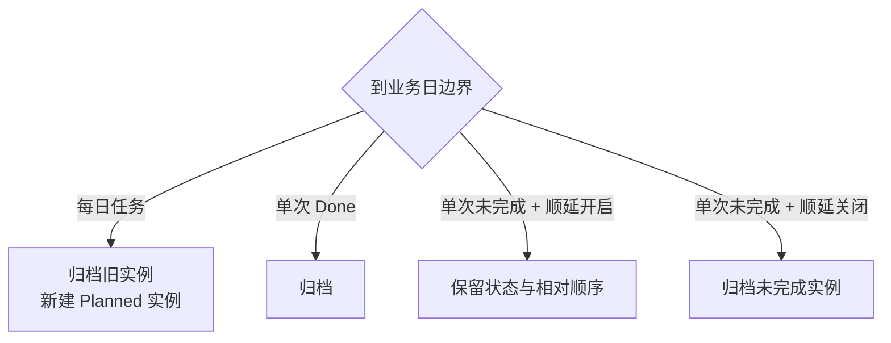

# Pusher：计划推进管理器

> 一个帮助用户管理当前业务日需要规划、推进和完成事项的功能卡。

本文档描述 Pusher 的功能级行为。通用的岛状态、功能卡导航、业务日、数据与错误处理规则以 `docs/PRD.md` 为准。

## 1. 使用目标

Pusher 让用户在屏幕顶部快速看到手头计划所处的阶段，并通过拖拽完成状态推进。它是轻量的每日看板，不承担完整项目管理职责。

任务的三个状态为：

- `Planned`：已经计划，但尚未开始推进；
- `Processing`：正在推进；
- `Done`：当前业务日已经完成。

## 2. 配置

Pusher 的设置包括：

- 是否启用；
- 单次未完成任务是否顺延到下一个业务日；
- 业务日刷新时间，默认本地时间 00:00，精确到分钟。

“未完成顺延”只作用于非每日任务。每日任务始终按自己的每日重建规则处理。

## 3. 任务数据

单个任务包括：

| 字段 | 规则 |
| --- | --- |
| 实例 ID | 每个具体任务实例的稳定身份；每日重建时生成新值 |
| 每日系列 ID | 可选；单次任务为空，每日任务的所有实例共享同一值 |
| 名称 | 必填、去除首尾空白后不能为空 |
| 急迫度 | 紧急、推进或规划 |
| 状态 | `Planned`、`Processing` 或 `Done` |
| 每日刷新 | 决定是否在每个业务日重建 |
| 排序位置 | 在当前列中的稳定位置 |
| 所属业务日 | 标识当前实例属于哪个业务日 |

急迫度颜色固定为：

- 紧急：红色；
- 推进：蓝色；
- 规划：绿色。

以上颜色用于展开态任务卡；收敛态 Processing 构成中的“规划”计数为提高小尺寸辨识度，单独使用黄色，不改变任务自身的业务颜色。

## 4. 展开态

展开态分为左右两部分：

- 左侧约 80%：Planned、Processing、Done 三列看板；
- 右侧约 20%：上下排列的“新增”和“日历”按钮。

三列分别在固定内容区域内滚动，岛不随任务数量无限增高。

### 4.1 任务卡

- 默认显示任务名称。
- 卡片颜色表示急迫度。
- 鼠标悬停时显示“编辑”操作。
- 点击“编辑”打开岛下方的编辑 Popover。
- 状态不在编辑表单中修改，只能通过拖拽修改。

### 4.2 拖拽与排序

- 支持跨列拖拽；目标列决定新状态。
- 支持同列拖拽；落点决定新的列内顺序。
- 跨列拖拽也必须记录目标列中的具体顺序。
- 状态和排序位置在一次原子操作中持久化。
- 拖拽成功后收敛态计数立即更新。
- 无效落点、取消拖拽或持久化失败时，任务回到原列和原位置。
- 拖拽期间岛保持展开。

Pusher v1 不提供前进、后退或状态下拉按钮；拖拽是唯一状态迁移方式。

## 5. 收敛态

当 Pusher 是最近选择的功能卡时，岛的收敛态实时显示：

```text
左侧：Planned 数 | Done 数
右侧：紧急数 | 推进数 | 规划数
```

- 统计范围是当前业务日的活跃任务。
- Planned 使用橙色图标，Done 使用绿色图标；收敛态不显示 Processing 总数。
- 右侧三个状态数量只统计 Processing 状态中的任务，分别使用红、蓝、黄标识；三者之和必须等于 Processing 总数。
- Planned 和 Done 状态中任务的急迫度不进入右侧分解。
- 新增、删除和拖拽后立即更新。
- 收敛态不是收起瞬间的静态快照。
- 当前业务日没有任务时，所有数量均显示为 0。

## 6. 新增任务

点击右侧“新增”后，从岛下方打开 Popover。Popover 打开期间，岛强制保持展开。

新增表单包括：

- 名称；
- 急迫度；
- 是否每日刷新；
- 取消；
- 确认创建。

创建规则：

- 名称校验通过后才能确认；
- 新任务的初始状态为 `Planned`；
- 新任务追加到 Planned 列末尾；
- 创建成功后关闭 Popover 并刷新三列及收敛态计数；
- 持久化失败时不保留临时任务，并显示可重试错误。

## 7. 编辑与删除

编辑 Popover 包括：

- 名称；
- 急迫度；
- 是否每日刷新；
- 红色“删除”操作；
- 取消；
- 确认修改。

编辑规则：

- 修改成功后保持任务当前状态和列内位置。
- 状态只能通过拖拽改变，编辑表单不提供状态字段。
- 将单次任务改为每日任务后，从当前实例开始建立未来每日重建关系。
- 将每日任务改为单次任务后，保留当前实例，但停止未来每日重建。
- 删除需要二次确认。
- 删除单次任务时，立即移除当前实例。
- 删除每日任务时，移除当前实例并停止未来生成。
- 删除不改写已冻结的历史业务日统计。

系列与实例规则：

- 单次任务只有实例 ID，不具有每日系列 ID。
- 单次任务改为每日任务时，创建一个每日系列 ID，并关联当前实例。
- 每日任务在新业务日创建新实例 ID，但沿用相同每日系列 ID。
- 每日任务改为单次任务时，当前实例脱离每日系列，未来不再生成；既往历史实例保留原系列 ID。
- 删除每日任务时删除当前及未来系列关系；历史实例和它们原有的系列 ID 保留。

## 8. 业务日结算



### 8.1 每日任务

- 每日任务规则优先于全局“未完成顺延”开关。
- 到边界时，旧实例无论处于哪个状态都归档。
- 新业务日创建一个 `Planned` 实例。
- 新实例追加到 Planned 列末尾。
- 旧实例是否为 Done 只影响旧日完成数量，不影响新实例生成。

### 8.2 单次任务

- `Done` 任务在边界归档，不进入新业务日。
- 未完成任务在顺延开启时进入新业务日，并保留原状态和相对顺序。
- 未完成任务在顺延关闭时归档，不进入新业务日。

### 8.3 App 多日未运行

启动后按时间顺序补做每一个遗漏业务日结算：

- 首先按持久化状态结算最后一个实际使用过的业务日；该日已经处于 Done 的任务必须计入完成数；
- 对之后完全离线的每个中间业务日，每日任务生成并结算一个实例，该日完成数为 0；
- 当前业务日只保留一个新的每日实例；
- 允许顺延的单次未完成任务最终带到当前业务日；
- 不允许顺延的单次未完成任务在第一个遗漏边界归档；
- 结算必须幂等，重复启动不能生成重复实例或重复快照。

## 9. 简易日历

点击右侧“日历”后，从岛下方打开日历 Popover。Popover 打开期间，岛保持展开。

- 日历按月显示，可切换前后月份。
- 每个历史业务日显示边界结算时冻结的 Done 数量。
- 当前业务日显示实时 Done 数量。
- 将任务移入或移出 Done、删除任务后，当前日计数即时变化。
- 历史日期的数字不因后续任务编辑或删除而变化。
- 日期不可点击进入任务详情。

## 10. Popover 与岛状态

- 新增、编辑和日历均使用岛下方 Popover，不打开独立业务窗口。
- 打开 Popover 时记录岛此前是否由用户锁定。
- Popover 打开期间禁止悬停离开导致的收起。
- 关闭后恢复此前的锁定状态；若此前未锁定，则根据鼠标位置决定保持展开或收起。
- Popover 内正在输入文本时，`Esc` 优先关闭 Popover，不得导致任务以未确认状态写入。

## 11. 错误与空状态

- 没有任务时，三列显示轻量空状态；右侧“新增”始终可用。
- 新增、编辑、删除、拖拽或排序写入失败时，界面恢复到操作前状态并显示可重试错误。
- 写入失败不得产生重复任务、丢失任务或状态与列不一致。
- 跨日结算部分失败时，整个结算事务回滚，下次启动可以安全重试。
- Pusher 错误不得清空或修改 Timer 数据。

## 12. v1 不包含

- 截止日期或到期提醒；
- 标签、子任务、备注、附件或负责人；
- 搜索、筛选或批量操作；
- 状态按钮、状态下拉框或键盘状态迁移；
- 归档任务详情或逐日任务列表；
- 数据导出、协作或云同步。

## 13. 验收清单

- [ ] 新任务进入 Planned 末尾，编辑不会改变状态或顺序。
- [ ] 跨列拖拽同时更新状态和目标列顺序。
- [ ] 同列拖拽正确保存新顺序，重启后保持。
- [ ] 无效拖拽和写入失败恢复原列与原位置。
- [ ] 收敛态左侧实时显示 Planned、Done 数量，右侧仅显示 Processing 中紧急、推进、规划数量，不显示 Processing 总数，且三个状态之和等于 Processing。
- [ ] 新增、编辑和日历 Popover 打开期间岛不收起，关闭后恢复原锁定状态。
- [ ] 删除每日任务会移除当前实例并停止未来生成，历史不回写。
- [ ] 每日任务跨日生成新的实例 ID，并保持相同系列 ID；单次任务不具有系列 ID。
- [ ] 每日任务、单次 Done 和单次未完成任务按边界规则正确处理。
- [ ] 多日未运行后的补结算幂等，不重复任务或快照。
- [ ] 离线前最后一个业务日已有 Done 任务时按保存状态结算，只有完全离线的中间业务日记为 0。
- [ ] 日历过去日期显示冻结 Done 数，当前日期显示实时 Done 数。
