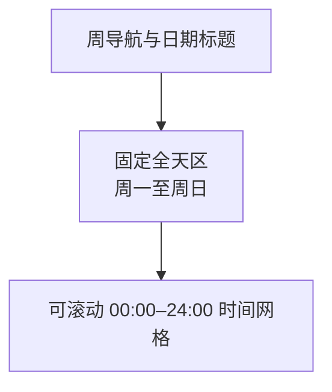
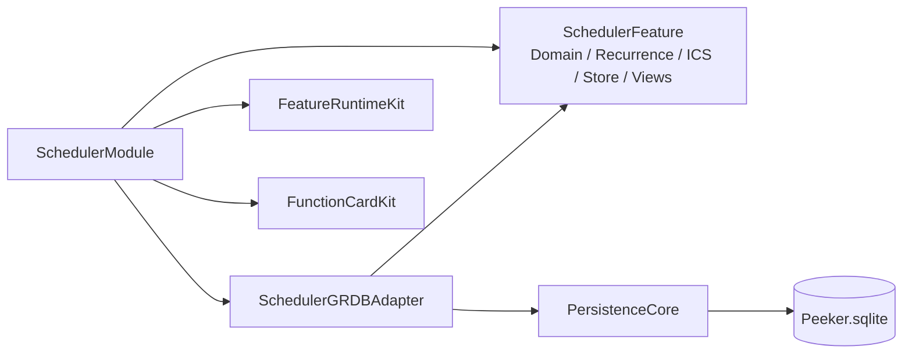

# Scheduler：本地日程管理（v2）

> 文档状态：已确认，可直接用于设计、实现和验收。
>
> Scheduler 是 v2 新增功能，仓库当前实现目标版本为 v2.0.0。
>
> 通用岛状态、提示队列、CLI envelope、升级与错误规则以 [Peeker v2 PRD](../v2/PRD.md) 为准。

Scheduler 是单一本地日历功能卡。它提供周视图、日程 CRUD、常用重复规则、可追踪 ICS 来源和静音提前提醒，不连接系统 Calendar 或云端服务。

## 1. 目标与非目标

### 1.1 目标

1. 在顶部岛内快速查看和编辑当前周日程。
2. 支持单次、重复、全天、定时、跨日和重叠日程。
3. 手动导入常见 ICS 文件，并可追踪来源后续刷新。
4. 在每个非全天 occurrence 开始前按统一提前量发布岛内提示。
5. 让 UI、CLI、ICS 导入和提醒使用同一领域与事务实现。

### 1.2 非目标

- 多日历、日历显隐、共享日历或账号；
- EventKit、Calendar.app、CalDAV 或网络订阅；
- 文件自动监视、启动刷新、定时刷新或 ICS 导出；
- 参与者响应、邀请发送、会议链接生成、附件；
- 拖拽移动、拖边调整时长；
- 每项独立提醒、全天提醒、系统通知或声音；
- 完整 RFC 5545 规则编辑器。

## 2. 配置

Scheduler 配置包括：

| 配置 | 默认 | 规则 |
| --- | --- | --- |
| 功能卡启用 | 开 | 禁用只隐藏 UI、收敛/提示；数据和 CLI 仍工作 |
| 提前提醒 | 10 分钟 | `off` 或整数 `1...60` 分钟 |
| ICS 来源 | 无 | 在设置页导入、刷新、重定位或移除 |

Scheduler 没有业务日刷新时间，也不生成每日快照。

设置页的来源列表至少显示来源名、canonical path、最近成功导入时间、最近导入结果，以及刷新、重定位、移除操作。

## 3. 展开态周视图

### 3.1 表面与导航

- 最大展开表面为 `1120×700pt`。
- 小屏按 v1 通用规则限制到可用区域；周网格和全天区内部滚动，岛不得超出屏幕。
- 一周固定为本地周一 `00:00` 至下周一 `00:00`，不跟随地区的首日偏好。
- 顶部提供上一周、下一周、今天。
- 首次打开当前周时，将时间网格滚到当前时间附近；打开非当前周时定位 `08:00`。
- 系统日期变化后，“今天”和当前时间线即时更新，不强制跳回当前周。

### 3.2 布局



- 日期列固定为周一至周日。
- 时间网格以 15 分钟为选择粒度，刻度可以按更疏的间隔标注。
- 当前周显示当前时间线。
- 定时日程按实际开始/结束纵向定位；跨午夜日程按日期切成连续视觉片段。
- 重叠日程在同一冲突组内横向分栏，不能彼此完全遮挡。
- 跨周日程在周边界裁剪显示，不修改真实开始/结束。
- 多日全天日程跨日期列显示；全天区内容过多时独立滚动或折叠，不挤压时间网格到不可用。
- 标题和时间不足以完整显示时截断，并保留可访问性完整文本。

### 3.3 新建、查看和编辑

- 点击时间网格空白处，将点击时间向下吸附到最近 15 分钟，创建默认 30 分钟的定时草稿。
- 点击全天区某日空白处，创建该日开始、次日排他结束的全天草稿。
- 点击日程 occurrence 打开其详情草稿。
- 编辑器从岛下方以 Popover 打开；打开、文本输入和保存期间阻止岛收起。
- 不支持在网格中拖拽或缩放。所有时间修改都在编辑器完成。

编辑字段：

| 字段 | 规则 |
| --- | --- |
| 标题 | 必填，去除首尾空白后非空 |
| 开始/结束 | 定时结束必须晚于开始 |
| 全天 | 切换后使用本地日期；排他结束至少比开始晚一天 |
| 重复 | 无、daily、weekly、monthly、yearly |
| 颜色 | 默认系统蓝；UI 可选颜色，持久化为 `#RRGGBB` |
| 备注 | 可空 |
| 地点 | 可空 |

新增提供取消/保存；编辑额外提供删除。保存失败时 Popover 保留草稿并显示可重试错误。

导入项显示来源标记和明确说明：本地修改允许暂时保存，但下次刷新该来源时会被来源数据覆盖。

## 4. 静息与提示

Scheduler 不提供收敛态。未展开且没有提示时，宿主显示其他卡收敛态或静息态。

提醒 Prompt 显示 Scheduler 图标、模块名、日程标题和本地开始时间的单行摘要。Scheduler 被禁用时：

- 日程与来源数据保留；
- CLI CRUD 和来源刷新可继续；
- 不调度或发布 Scheduler Prompt；
- 重新启用后只安排未来提醒，不补过期提醒。

## 5. 领域模型

### 5.1 系列

`SchedulerEvent` 表示单次事件或重复系列根：

| 字段 | 规则 |
| --- | --- |
| Event ID | UUID，稳定；重复 occurrence 不各自持久化 ID |
| Source ID / UID | 手工事件为空；导入事件用于来源覆盖 |
| 标题、备注、地点、颜色 | 对应编辑字段 |
| 时间类型 | `timed` 或 `allDay` |
| 开始/结束 | 按第 6 节保存 |
| Recurrence | 可空的版本化常用重复规则 |
| 创建/更新时间 | 毫秒时间戳 |

### 5.2 Occurrence

Occurrence 是系列在查询窗口中的展开结果。稳定身份由以下二元组组成：

```text
(Event ID, original occurrence key)
```

- 定时 key 使用按系列规则生成的原始计划开始毫秒值。
- 全天 key 使用原始计划开始日期 `YYYY-MM-DD`。
- 编辑造成的实际开始时间变化不改变 original key。
- CLI、提醒去重、override 和 cancellation 必须使用该身份，不能使用列表下标。

Occurrence 输出至少包含 Event ID、original key、实际开始/结束、字段快照、是否例外、是否导入以及来源 ID。

### 5.3 例外

`SchedulerOccurrenceOverride` 属于一个系列和 original key：

- 单次编辑保存完整替代值，避免字段继承在后续版本中产生歧义；
- 单次删除保存 cancellation；
- 同一系列和 original key 最多一条例外；
- cancellation 不从数据库物理删除系列。

## 6. 时间模型

### 6.1 全天

- 使用本地 `startDate` 和排他 `endDate`，格式 `YYYY-MM-DD`。
- `endDate` 必须晚于 `startDate`，最短一天。
- 全天日期不因系统时区变化而平移。
- 全天 occurrence 不产生提醒。

### 6.2 定时

为了保持实现确定且不提供独立时区产品：

1. UI 新建使用保存时的 macOS 系统时区。
2. ICS/CLI 带时区输入先换算到处理请求时的系统时区。
3. 持久化绝对开始/结束和该系统时区 ID；不保留来源 TZID 为可编辑或可导出字段。
4. 系统时区后来变化时，单次事件保持绝对时刻，显示钟点可随新系统时区变化。
5. 重复系列继续绑定创建/导入时保存的系统时区，以该时区的墙上日历规则生成，再换算到当前显示时区。
6. ICS floating time 按导入时系统时区解释。

该简化模型不承诺来源时区 round-trip。

### 6.3 输入与显示

- UI 按当前系统时区显示定时 occurrence。
- CLI 定时输入必须为带 `Z` 或数值 offset 的 RFC 3339。
- CLI 定时输出使用响应时系统时区的 RFC 3339 offset。
- 系统时间或时区变化后，Store 刷新当前窗口并重算未来提醒。

## 7. 重复规则

### 7.1 支持范围

```text
frequency: daily | weekly | monthly | yearly
interval: 正整数，默认 1
weekdays: weekly 可选，mon...sun；默认根 occurrence 的星期
end: never | until | count
```

- `until` 与 `count` 互斥。
- `until` 包含落在该时刻/日期上的 occurrence。
- `count` 包含根 occurrence。
- monthly 使用根事件的日号；不存在该日号的月份跳过。
- yearly 使用根事件的月和日；不存在该日期的年份跳过。
- 不自动夹到月末。
- 查询只展开与请求区间相交的 occurrence，不预物化无限序列。

### 7.2 操作范围

| Scope | 更新 | 删除 |
| --- | --- | --- |
| `this` | 为所选 original key 写完整 override | 写 cancellation |
| `future` | 将旧系列截止在所选 occurrence 前；从所选 occurrence 创建新 Event ID 的系列 | 截断旧系列，所选及以后不再生成 |
| `all` | 更新系列根和规则 | 删除整个系列及例外 |

规则：

- 重复系列 UI 必须要求选择本次、今后或全部。
- CLI 必须同时提供 occurrence key 和 scope。
- `future` 更新清除所选 occurrence 及之后已有例外，再创建新系列。
- `future` 删除清除该范围例外并截断系列。
- `all` 更新清除全部既有例外，并在执行前向 UI 用户明确警告。
- 非重复事件不接受 occurrence/scope。
- scope 操作必须与提醒撤销/重排在同一 mutation 边界内提交。

### 7.3 展开确定性

- 使用系列保存的时区和 Calendar 计算，不用固定 24 小时近似 monthly/yearly。
- 先生成原始 occurrence，再应用 cancellation/override。
- 修改后的 override 即使移出查询窗口，也只在其实际区间与请求窗口相交时返回。
- 返回顺序固定为实际开始、实际结束、Event ID、original key。

## 8. ICS 来源

### 8.1 来源生命周期

- 首次选择文件创建稳定 Source ID，显示名默认取文件名。
- 保存 canonical path；同一路径再次导入视为刷新现有来源。
- 设置页或 CLI 可为既有 Source ID 选择新路径并刷新；新路径先规范化为绝对 canonical path。
- 若重定位后的 canonical path 已属于另一 Source ID，操作返回冲突，不自动合并两个来源。
- 只支持手动刷新，不监视文件，不在 App 启动时读取。
- 移除来源时级联删除全部来源事件与例外；手工事件不受影响。
- 文件缺失、不可读或文件级解析失败时保留上次成功数据和最近成功时间，并记录本次错误。

### 8.2 来源身份与覆盖

- `(Source ID, UID)` 标识 ICS 中的一个逻辑系列；同一 UID 的 `RECURRENCE-ID` 记录映射为根系列例外。
- 用户对导入系列执行 `future` 时，可产生内部来源分段；分段仍归属同一 Source ID + UID，并记录独立 `sourceSegmentKey`，不能伪装成不受来源管理的手工事件。
- 刷新来源时，成功解析的数据覆盖并重建同 UID 的全部来源分段、字段和例外；已存在根段应保留 Event ID，避免仅刷新内容就使 CLI 选择器失效。
- 来源中已消失的合法 UID 删除；以后重新出现时可视为新根并获得新 Event ID。
- 若本次 VEVENT 无效但仍能识别 UID，则保留该 UID 的旧数据并返回 warning。
- 无法识别 UID 的无效条目只能跳过并 warning，不能关联或删除旧数据。
- 不同来源即使 UID 相同也互不覆盖。

### 8.3 支持的 ICS 内容

支持行折叠、转义和以下内容：

- `VCALENDAR`、`VEVENT`；
- `UID`、`SUMMARY`、`DESCRIPTION`、`LOCATION`；
- `DTSTART`、`DTEND` 或 `DURATION`；
- `VALUE=DATE` 全天日期；
- UTC、数值 offset、可解析 `TZID` 和 floating time；
- 可映射到第 7 节的 `RRULE` 子集；
- `RDATE`、`EXDATE`、`RECURRENCE-ID`；
- `STATUS:CANCELLED`。

字段处理：

- UID 与 DTSTART 必须可解析。
- 缺少 SUMMARY 时使用本地显示标题“无标题日程”。
- 定时事件必须得到正数时长；全天事件缺少结束时默认为一天。
- 无法映射的复杂 RRULE、不可解析时区或非正数定时时长跳过整个 VEVENT，并返回结构化 warning。
- 不得悄悄把不支持的重复规则降级为单次事件。
- `VALARM`、参与者、组织者、附件、URL、分类等不进入领域模型；不发送邀请，也不导入独立提醒。
- `VTODO`、`VJOURNAL` 不导入。

### 8.4 事务与部分成功

导入分为解析阶段和一次数据库事务：

1. 文件级语法无法建立 VCALENDAR 时，不执行任何写入。
2. 对每个可识别 UID 记录成功、受保护失败或缺失状态。
3. 在一个事务内 upsert 全部有效根系列和例外。
4. 删除来源中确认缺失、且不属于受保护失败 UID 的旧系列。
5. 更新来源最近成功时间与统计。
6. 任一数据库操作失败则整个刷新回滚。

成功响应报告 `created`、`updated`、`deleted`、`skipped` 和逐项 warnings。部分 warning 不把整个命令标为失败；文件级解析或事务失败返回错误并保留旧数据。

## 9. 提醒

### 9.1 触发

- 配置为 `off` 时不调度。
- 配置为 `1...60` 时，每个非全天 occurrence 在 `实际开始 - 提前分钟` 触发一次。
- 手工和 ICS 日程规则相同。
- 同时到期的多项按第 5.2 节稳定顺序分别入 FIFO，不合并。
- 重复 occurrence 使用 Event ID + original key 去重。

### 9.2 不补播

以下情况不产生提示：

- App 在触发时未运行；
- Mac 在触发时睡眠；
- 新建、导入或改期完成时触发点已经过去；
- Scheduler 被禁用；
- 全天日程。

启动、唤醒和重新启用仍应正确加载日程并安排未来提醒。

### 9.3 重排

CRUD、scope 操作、来源刷新、提醒配置变化、系统时间/时区变化后：

- 取消失效的定时事件；
- 从全局待播队列移除被删除或改期 occurrence 的旧提示；
- 只为未来触发点安排新提醒；
- 提交失败时恢复旧调度，不发布新提示。

Scheduler 可在共享 `TemporalEventHub` 中维护自己的下一事件 key；不得为每个无限 occurrence 创建永久系统定时器。

## 10. 架构与模块边界

建议目标结构：



- `SchedulerFeature`：领域值、重复展开器、ICS 解析结果、Repository Port、Store 和 SwiftUI 视图。
- `SchedulerGRDBAdapter`：Scheduler 迁移、记录映射和事务。
- `SchedulerModule`：偏好、依赖注入、卡片注册、提醒与 Host Actions。
- `BuiltInFeatureModules` 只加入 `SchedulerModule`；框架层不得 import 具体 Scheduler target。
- Feature 领域不 import GRDB；GRDB record 不跨 Repository Port。
- UI 与 CLI 必须调用同一 Store/应用服务，不得直接调用不同 repository 方法拼装业务规则。
- Scheduler 不依赖 Timer/Pusher，也不使用 `business_days`、`feature_runtime_state` 或每日快照。

建议文件责任：

```text
SchedulerFeatureID.swift
SchedulerDomain.swift
SchedulerRecurrence.swift
SchedulerICSImporter.swift
SchedulerRepository.swift
SchedulerStore.swift
SchedulerViews.swift
SchedulerDatabaseMigrations.swift
SchedulerGRDBRepository.swift
SchedulerModule.swift
```

文件名可按实现调整，但责任边界必须保留。

## 11. 持久化设计

### 11.1 scheduler_sources

| 列 | 约束 |
| --- | --- |
| `id` | TEXT UUID 主键 |
| `canonical_path` | TEXT 非空、唯一 |
| `display_name` | TEXT 非空 |
| `last_successful_import_at_ms` | INTEGER 可空 |
| `last_attempt_at_ms` | INTEGER 可空 |
| `last_result` | TEXT/版本化 JSON 可空 |

### 11.2 scheduler_events

| 列组 | 内容 |
| --- | --- |
| 身份 | `id` 主键；`source_id`、`source_uid`、`source_segment_key` 可空；来源事件三者组合唯一 |
| 内容 | title、notes、location、color_hex |
| 类型 | `kind` 为 timed/allDay |
| 定时 | start_at_ms、end_at_ms、normalized_timezone_id |
| 全天 | start_date、end_date_exclusive |
| 重复 | 可空、带 schema version 的 recurrence JSON |
| 审计 | created_at_ms、updated_at_ms |

约束：

- timed 只允许定时列非空，且 `end_at_ms > start_at_ms`；
- allDay 只允许日期列非空，且排他结束晚于开始；
- source 外键删除级联；
- 手工事件三个 source 字段均为空；
- 来源根段使用稳定 segment key（如 `root`），本地 `future` 分段使用由 original key 派生的稳定 key；刷新一个成功解析的 UID 时先替换该 UID 的全部段。

### 11.3 scheduler_occurrence_overrides

| 列 | 约束 |
| --- | --- |
| `id` | TEXT UUID 主键 |
| `event_id` | 外键，系列删除级联 |
| `occurrence_key` | TEXT，系列内唯一 |
| `is_cancelled` | BOOLEAN 非空 |
| `replacement_json` | 取消时为空；替代时为版本化完整值 |
| `updated_at_ms` | INTEGER 非空 |

### 11.4 索引与迁移

至少建立：

- `scheduler_events(source_id, source_uid, source_segment_key)` 唯一索引，并建立 `(source_id, source_uid)` 查询索引；
- 非重复定时开始/结束范围索引；
- 全天开始/结束范围索引；
- override 的 `(event_id, occurrence_key)` 唯一索引；
- 来源外键索引。

迁移只能追加 Scheduler 表，不修改或删除 v1 Timer/Pusher 表。提醒和已展开 occurrence 不持久化。

## 12. Repository 与 Store 契约

Repository Port 至少覆盖：

- 按区间加载可能相交的单次事件、重复系列和例外；
- 按 Event ID 读取系列；
- 创建/更新单次事件；
- 按 `this/future/all` 原子保存或删除；
- 列出、导入、刷新、重定位和移除来源；
- 在来源事务中返回导入统计与 warnings。

Store 责任：

- 将 repository 数据展开为当前周或 CLI 请求区间的 occurrence；
- 管理周导航、Popover 草稿和可见错误；
- 校验字段、scope 和重复规则；
- 串行化 UI、CLI、来源刷新、scope 操作和提醒重排；
- 只在持久化成功后发布状态与提示；
- 处理系统时间/时区变化和唤醒，但不补过期提醒。

Scheduler 使用独立 mutation gate。一个 mutation 完成数据库提交、内存发布和提醒重排前，不接受第二个写操作。只读区间查询可在一致快照上执行，但不能观察半提交来源刷新。

## 13. 错误与恢复

- CRUD 失败保留表单草稿和旧日程。
- 来源文件不可读、文件级解析失败或事务失败保留上次成功来源数据。
- 部分 VEVENT 无效时按第 8.4 节提交有效项并返回 warnings。
- 重复展开遇到损坏持久化规则时隔离该系列、显示错误，不清空其他系列。
- 提醒调度失败不得回滚已成功的日程 CRUD，但必须发布可见错误并在下次时间事件/启动时重试未来调度。
- 数据库提交失败不修改全局提示队列。
- Scheduler 错误不得修改 Timer/Pusher 数据。

## 14. 设置页

Scheduler 设置页包含：

1. 提醒：`off` 或提前 1–60 分钟；默认 10。
2. ICS 来源列表：文件名、路径、最近成功时间、最近结果。
3. “导入 ICS”文件选择器。
4. 每个来源的刷新、选择新文件、移除操作。
5. 导入 warnings 的可查看摘要。

功能卡启用开关仍在通用“功能卡”页面。CLI `scheduler config` 可以操作相同 enabled 状态。

## 15. CLI 接口

Scheduler CLI 继承 [v2 CLI 公共契约](../v2/PRD.md#7-cli-公共契约)。

### 15.1 时间与字段参数

- 定时时间：带 `Z` 或数值 offset 的 RFC 3339。
- 全天日期：`YYYY-MM-DD`。
- `list --to` 为排他边界；日期形式的 from/to 按当前系统时区的本地午夜解释。
- 颜色：`#RRGGBB`，省略时使用系统蓝。
- 可空字段在 update 中用 `--clear-notes`、`--clear-location` 清除；它们分别与对应赋值参数互斥。

创建时间二选一：

```text
--start <rfc3339> --end <rfc3339>
--all-day-start <date> [--all-day-end <exclusive-date>]
```

全天结束省略时默认为次日。两组参数不得混用。

重复 flags：

```text
--repeat none|daily|weekly|monthly|yearly
--interval <positive-int>
--weekdays <mon,tue,...>
--until <rfc3339-or-date>
--count <positive-int>
```

- `until` 与 `count` 互斥。
- `weekdays` 只允许 weekly。
- `repeat none` 清除重复，且不得同时提供其他重复参数。
- 创建时省略 `repeat` 等同 none；更新时省略表示不改。

### 15.2 命令矩阵

完整写入 synopsis：

```text
peeker scheduler create
  --title <title>
  (--start <rfc3339> --end <rfc3339> |
   --all-day-start <date> [--all-day-end <exclusive-date>])
  [--notes <text>] [--location <text>] [--color <#RRGGBB>]
  [--repeat <frequency> [--interval <n>] [--weekdays <days>]
   [--until <time-or-date> | --count <n>]]

peeker scheduler update --id <event-id>
  [--occurrence <key> --scope <this|future|all>]
  [--title <title>]
  [--start <rfc3339> --end <rfc3339> |
   --all-day-start <date> [--all-day-end <exclusive-date>]]
  [--notes <text> | --clear-notes]
  [--location <text> | --clear-location]
  [--color <#RRGGBB>]
  [--repeat <none|frequency> [--interval <n>] [--weekdays <days>]
   [--until <time-or-date> | --count <n>]]
```

update 至少提供一个实际变更。只要修改时间类型或边界，就必须提供完整的新定时 start/end 或全天日期组；不能只改一端。提供定时组会转换为 timed，提供全天组会转换为 allDay。

| 命令 | 作用 |
| --- | --- |
| `peeker scheduler list [--from <time-or-date> --to <time-or-date>]` | 返回窗口内 occurrence；均省略时为当前周一至下周一；自定义时必须成对提供 |
| `peeker scheduler get --id <event-id> [--occurrence <time-or-date>]` | 返回系列；给 occurrence 时返回应用例外后的实例 |
| `peeker scheduler create`（参数见上方 synopsis） | 创建单次或重复系列 |
| `peeker scheduler update --id <event-id>`（参数见上方 synopsis） | 更新事件或重复范围 |
| `peeker scheduler delete --id <event-id> [--occurrence <key> --scope this\|future\|all]` | 直接删除事件或重复范围 |
| `peeker scheduler source list` | 列出来源与最近结果 |
| `peeker scheduler source import --file <path>` | 新路径创建来源；同 canonical path 刷新 |
| `peeker scheduler source refresh --id <source-id> [--file <new-path>]` | 刷新或重定位既有来源 |
| `peeker scheduler source remove --id <source-id>` | 删除来源及其全部事件 |
| `peeker scheduler config get` | 返回 enabled 与 reminder |
| `peeker scheduler config set [--enabled <bool>] [--reminder <off\|1..60>]` | 修改核心配置 |

### 15.3 Scope 校验

- `list` 的 from/to 必须同时省略或同时提供，且 `to > from`。
- 非重复事件的 update/delete 不接受 `occurrence` 或 `scope`。
- 重复系列 update/delete 必须同时给 `--occurrence` 和 `--scope`。
- occurrence 必须解析为该系列现有 original key；实际改期后的开始时间不能代替 original key。
- `this` 允许修改全部内容字段和实际时间，但不能为单次 override 再定义独立 recurrence。
- `future`/`all` 可以修改重复规则，并按第 7.2 节清除受影响例外。
- 命令直接执行，不提示确认；响应必须报告清除的例外数量。

### 15.4 list/get 输出

`list`：

```json
{
  "from": "2026-08-10T00:00:00+08:00",
  "to": "2026-08-17T00:00:00+08:00",
  "occurrences": [
    {
      "eventId": "UUID",
      "occurrence": "2026-08-10T09:00:00+08:00",
      "title": "Weekly review",
      "allDay": false,
      "start": "2026-08-10T09:00:00+08:00",
      "end": "2026-08-10T09:30:00+08:00",
      "notes": null,
      "location": null,
      "color": "#0A84FF",
      "recurring": true,
      "exception": false,
      "sourceId": null
    }
  ]
}
```

`get` 系列数据额外返回 recurrence 对象、保存的 normalized time zone、来源 UID 和例外列表。

create/update 返回提交后的系列和受影响 occurrence 摘要。delete 返回 `deleted:true`、scope、受影响系列 ID 和清除例外数。

### 15.5 来源输出

`source import/refresh` 的 `data`：

```json
{
  "source": {
    "sourceId": "UUID",
    "name": "calendar.ics",
    "path": "/absolute/path/calendar.ics",
    "lastSuccessfulImportAt": "2026-08-10T10:00:00+08:00"
  },
  "created": 10,
  "updated": 3,
  "deleted": 1,
  "skipped": 2
}
```

逐项问题放在 envelope 的 `warnings`，每项至少有 `code`、可选 UID、源行/组件定位和 message。

`source list` 返回按显示名、Source ID 稳定排序的 `sources` 数组，字段与上例 `source` 相同并附最近尝试结果。`source remove` 返回被删除来源快照、`deleted:true` 和级联删除的事件数量。

`config get/set` 返回：

```json
{"enabled":true,"reminder":{"enabled":true,"minutes":10}}
```

`reminder: off` 时 `enabled` 为 false、`minutes` 为 null。

### 15.6 模块错误

| error.code | 条件 |
| --- | --- |
| `scheduler_invalid_title` | 标题为空 |
| `scheduler_invalid_time_range` | 结束不晚于开始，或全天日期无效 |
| `scheduler_invalid_recurrence` | repeat 参数组合或规则无效 |
| `scheduler_occurrence_not_found` | original key 不属于系列 |
| `scheduler_scope_required` | 重复变更缺少 occurrence/scope |
| `scheduler_scope_not_allowed` | 非重复事件提供 scope |
| `scheduler_source_not_found` | 来源不存在 |
| `scheduler_source_unreadable` | 文件缺失或无权限 |
| `scheduler_source_path_conflict` | 重定位 path 已属于另一来源 |
| `scheduler_ics_parse_failed` | 文件级解析失败 |
| `scheduler_import_failed` | 来源事务失败 |

## 16. 验收清单

### 16.1 UI

- [ ] 最大表面、小屏约束、周一首日、周导航、全天区和 24 小时滚动符合设计。
- [ ] 当前周初始定位当前时间，其他周定位 08:00。
- [ ] 空白定时点击按 15 分钟吸附并默认 30 分钟；全天点击默认一天。
- [ ] 定时、全天、跨日、跨周、重叠和全天溢出布局可用。
- [ ] Popover 阻止收起；取消不写入，失败保留草稿。
- [ ] 不存在网格拖拽移动或缩放入口。

### 16.2 重复与时间

- [ ] daily/weekly/monthly/yearly、interval、weekdays、until/count/never 结果确定。
- [ ] 不存在日期的月/年 occurrence 被跳过而非夹到月末。
- [ ] this 写 override/cancellation；future 拆分/截断；all 修改/删除根系列。
- [ ] future/all 按规则清除例外并在 UI/CLI 报告。
- [ ] 无限重复只展开查询窗口。
- [ ] 时区归一化、系统时区变化和 floating import 符合第 6 节。

### 16.3 ICS

- [ ] 首次导入创建来源，同 canonical path 再导入执行刷新。
- [ ] 同 Source ID + UID 更新，来源消失 UID 删除，本地手工事件不受影响。
- [ ] 可识别 UID 的无效项保留旧数据并 warning。
- [ ] 文件级失败和数据库失败保留全部旧来源状态。
- [ ] 有效项与部分 warning 在一次事务中提交并返回统计。
- [ ] 刷新覆盖导入项本地修改；移除来源级联删除来源事件。
- [ ] 不支持复杂 RRULE/时区时跳过并 warning，不降级为单次。

### 16.4 提醒

- [ ] 默认提前 10 分钟，可设置 off 或 1–60。
- [ ] 每个本地/ICS 非全天 occurrence 提醒一次；全天不提醒。
- [ ] App 未运行、睡眠、禁用和触发点已过时不补提示。
- [ ] 同时提醒按稳定顺序逐条进入全局 FIFO。
- [ ] 删除、改期、scope 和来源刷新撤销旧调度及待播提示。

### 16.5 CLI、事务与隔离

- [ ] list 默认当前周，to 排他，定时/全天输入格式严格校验。
- [ ] recurrence flags 和 scope 校验符合命令矩阵。
- [ ] source 命令返回统计与结构化 warnings。
- [ ] UI、CLI、来源刷新和提醒重排共用 Store 与 mutation gate。
- [ ] 写入失败不发布状态或提示，不破坏 Timer/Pusher 数据。
- [ ] Scheduler 不创建业务日或每日快照记录。
