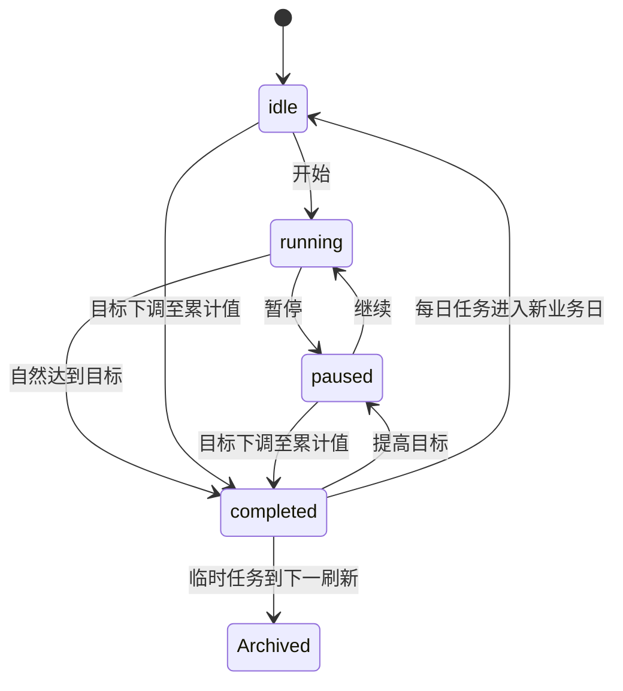

# Timer：每日与临时计时器（v2.1）

> 文档状态：已确认，可直接用于设计、实现和验收。
>
> 目标版本：v2.1.0。
>
> 通用岛状态、提示队列、CLI envelope、升级与错误规则以 [Peeker v2 PRD](../v2/PRD.md) 为准。

Timer 用于累计真实投入时间。每日任务来自可重复使用的模板，在每个 Timer 业务日重建；v2.1.0 新增可选的临时任务，用于一次性、可跨业务日累计的计时目标。两类任务共用同一个活动会话、跨日恢复、完成提示和统计表面。

## 1. 使用目标与非目标

用户可以为健身、阅读、编程等 routine 设置每日目标，也可以按需建立一次性临时目标。Timer 负责保存真实时间区间、恢复活动会话、按边界拆分计时，并展示当前日与历史完成度。

Timer 不是番茄钟，不提供休息循环、手动补录、逐段标签、后台活动检测、并行计时或临时任务历史浏览。

## 2. 配置

功能卡启用开关只出现在统一“功能卡”设置页。Timer 设置页包含：

- 右侧统计模式：今日总完成度或当月热力日历；
- 独立业务日刷新时间，默认本地 `00:00`，精确到分钟；
- “允许临时计时任务”，新安装和从旧版本升级均默认关闭；
- 每日任务模板的新增、编辑、删除和排序。

“允许临时计时任务”只控制新建能力和新增面板：

- 开启：岛内和 CLI 均可创建临时任务；
- 关闭：隐藏岛内新增面板，CLI create 返回 `timer_temporary_creation_disabled`；
- 关闭不会删除、隐藏或冻结已有临时任务；已有任务仍可开始、暂停、编辑和删除。

Timer 功能卡被禁用与上述开关是两个独立状态。卡片禁用后业务数据和活动会话继续工作，允许开关仍控制 CLI 创建，但宿主不显示 Timer Compact 或 Prompt。

## 3. 每日模板

模板字段：

| 字段 | 规则 |
| --- | --- |
| Template ID | UUID，创建后稳定；名称不是身份 |
| 名称 | 去除首尾空白后非空；允许重名 |
| 目标时长 | `1...86,399` 秒 |
| 显示颜色 | `#RRGGBB`；设置 UI 使用七种 Peeker 预设色 |
| 排序位置 | 连续、稳定，由设置或每日模板 CLI move 调整 |
| 更新时间 | 用于持久化和变更返回 |

每日任务列表严格使用模板顺序，不因运行、暂停或完成状态自动重排。

## 4. 临时任务

临时任务不是模板，不在新业务日创建副本。字段：

| 字段 | 规则 |
| --- | --- |
| Temporary Task ID | UUID，创建后稳定 |
| 名称 | 去除首尾空白后非空；允许重名 |
| 目标时长 | `1...86,399` 秒 |
| 显示颜色 | 只能取七种 Peeker 预设 hex 值 |
| 累计时长与状态 | 可按第 8 节跨业务日携带 |
| 随刷新消失 | Bool；新建默认 false |
| 创建/更新时间 | 毫秒时间戳；用于稳定排序和返回 |
| 归档时间/原因 | 活动任务为空；边界、完成后边界或显式删除时写入 |

七种预设色为：

```text
#FF3B30  #FFD60A  #4F9DFF  #34C759  #AF52DE  #FF2D55  #64D2FF
```

临时任务不支持排序。展开列表先显示全部每日任务，再显示活动临时任务；临时任务按 `createdAt`、Temporary Task ID 稳定排序。

## 5. 业务日与任务实例

Timer 业务日是相邻两次 Timer 刷新时间之间的区间，不等于固定自然日。

- 每个业务日根据当前模板生成每日任务实例。
- 每日实例保存当日名称、颜色、目标、累计时长、状态和 Template ID。
- 模板新增、编辑或删除立即影响当前业务日和未来业务日。
- 过去业务日只使用已冻结快照，不因后续模板或临时任务变化回写。
- 临时任务不生成每日副本；是否跨边界携带由自身 `expireOnRefresh` 和状态决定。
- App 未运行时，下次启动按事件时间顺序补做遗漏完成和边界结算。
- UI 和 CLI 变更前必须先执行相同恢复。

## 6. 统一任务状态

每日任务和临时任务状态都包括 `idle`、`running`、`paused`、`completed`。



- 任意时刻每日任务与临时任务合计最多一个 `running`。
- 已有运行任务时，不能直接启动另一任务；UI 和 CLI 都必须先暂停。
- 切换任务不得清空任何累计值。
- `completed` 任务不可重新启动；提高目标后变为 `paused` 才可继续。
- 下调目标至累计时长或以下时立即完成并封顶，不产生自然完成 Prompt。

## 7. 展开态

### 7.1 尺寸

Timer 展开宽度保持 `800pt`：

- “允许临时计时任务”关闭：`800×328.571pt`；
- 开启：动态变为 `800×371.429pt`，高度与 Pusher 一致；
- 开关变化时宿主平滑重算当前表面；小屏仍按通用可用区域约束。

展开尺寸必须通过功能卡通用可观察布局状态提供，宿主不得硬编码 Timer。

### 7.2 布局

关闭临时任务能力时沿用现有布局：

- 左侧约 75%：每日任务和已有临时任务列表；
- 右侧约 25%：今日总完成度或当月热力日历。

开启时右侧变为上下等高两板：

- 上板：Pusher 风格“新增”按钮，创建临时任务；
- 下板：保留完整的今日总完成度或当月热力日历。

两板均须在较小表面内保持可访问性和可操作性，不得让日历或完成环被裁剪。任务较多时只滚动左侧。

任务行至少显示颜色、名称、剩余时长、单项进度、状态和开始/暂停/继续操作。临时任务行悬停时额外显示“编辑”；每日任务仍在设置页编辑。

没有任何可见任务时显示空状态和前往 Timer 设置的操作。

### 7.3 临时任务 Popover

新增和编辑均从岛下方打开灰白 Popover，并复用 Pusher 的颜色边界和宿主 blocker：

- 字段：名称、时/分/秒、七种预设色、“随刷新消失”；
- 新增默认 `00:30:00`、湖蓝、随刷新消失关闭；
- 名称或时长无效时确认按钮禁用；
- 编辑额外提供删除；删除需二次确认；
- 文本输入、Popover 打开和保存期间岛不得自动收起；
- 保存失败时保留草稿并显示可重试错误。

删除运行中的临时任务时，先精确结算到操作时刻并停止会话，再归档为显式删除。

## 8. 收敛态与静息态

Timer 只有在以下条件同时满足时才声明 Compact 资格：

1. Timer 功能卡已启用；
2. 当前存在唯一 `running` 任务，不区分每日或临时。

Compact 只显示该运行任务的颜色、名称、实时剩余时长和单项进度。暂停、删除、归档、自然达标或边界后不再续跑时，Timer 立即撤销 Compact 资格。

宿主随后重新选择其他合格卡；没有合格卡时进入 Resting。Agentor 也可能提供 Compact，二者按通用“最近打开时间、启用顺序”竞争，Timer 不具有硬编码优先级。

## 9. 计时事实来源

Timer 记录持久化时间区间，不以内存逐秒累加作为事实来源。

- 开始或继续时，原子保存任务状态和活动会话开始时间，并记录任务种类及 ID。
- 暂停时，以 App 处理操作的当前时间结束会话并结算区间。
- 睡眠、锁屏、正常退出或崩溃不自动暂停。
- 重启后根据持久化开始时间恢复。
- UI 可以每秒刷新显示，但数据库不进行每秒写入或轮询。
- 每日实例与临时任务共享数据库级“最多一个活动会话”约束。

## 10. 跨业务日与临时任务刷新

事件恢复始终比较自然目标时刻与下一业务日边界；较早事件先处理，目标与边界同刻时目标达成优先。

### 10.1 每日任务

沿用既有规则：

- 目标先发生：结算到目标并停止，不续跑后续业务日；
- 边界先发生：结算旧日、冻结快照，在新业务日为同模板建立从 0 开始的实例并继续；
- 新日模板不存在时停止续跑。

### 10.2 未开启“随刷新消失”的临时任务

- 未完成的 idle/paused 任务携带同一 ID、累计时长和状态进入下一业务日。
- 运行任务在边界精确结束旧日会话，保存当日快照，再从同一边界为同一临时任务建立新活动会话；累计值不清零。
- 自然完成后保留在活动列表到下一次刷新，再归档。
- 已完成临时任务不跨下一边界继续显示。

### 10.3 开启“随刷新消失”的临时任务

- idle、paused、running、completed 均在下一边界归档。
- running 任务只结算到边界并停止，不在新业务日续跑。
- 若目标与边界同刻，先按自然完成提交，再在同一边界事务中归档。

### 10.4 多日离线

App 多日未运行时，按目标完成和边界的时间顺序重复上述算法，直到当前时间。恢复必须幂等，不能重复会话、快照、归档或实例。离线、睡眠和启动恢复不补过期 Prompt。

## 11. 达标与 Prompt

- 累计达到目标时自动停止在剩余 `00:00`。
- 计入时长封顶于目标，不保存超额值。
- 在线且系统唤醒时的自然达标，在完成事务提交后发布一条 Timer 静音 Prompt。
- 每日与临时任务使用相同摘要：完成符号和任务名称。
- App 未运行或 Mac 睡眠期间达到目标，恢复数据但不补提示。
- 用户编辑目标导致立即完成不提示。
- v2.1 不播放 Timer 声音。
- Timer 被禁用时宿主抑制 Prompt，但自然完成事务仍执行。

## 12. 完成度与历史

今日完成度：

```text
所有当前可见每日任务与活动临时任务的累计时长总和
÷
所有当前可见每日任务与活动临时任务的目标时长总和
```

- 单任务与总完成度均封顶 100%。
- 没有可见任务时显示空状态，不显示误导性的 0%。
- 临时任务在每个仍处于活动列表的业务日都以完整目标进入分母，以跨日累计值进入分子。
- 因此一个未完成跨日临时任务可在连续多个业务日显示递增的累计比例；该口径是明确产品行为，不按当日新增投入拆分。
- 创建、编辑或删除后，当前日分子和分母即时重算。
- 边界结算顺序是：先用边界时可见的每日任务和临时任务冻结快照，再归档或携带临时任务并建立新日状态。
- 历史热力日历按月显示冻结比例；后续编辑、删除或归档不回写历史。
- 未来日期和无任务日期为空；日期不可进入详情。

## 13. 每日模板变更

- 新增模板后，当前业务日立即生成每日实例并追加。
- 修改名称、颜色或目标后，当前日实例同步更新，过去快照不变。
- 提高目标可使 completed 变为 paused。
- 下调目标至累计值或以下时立即完成并封顶，不提示。
- 删除非运行模板时，从当前可见实例和完成度中移除。
- 删除运行模板时先结算到当前时间，再停止并删除。
- 底层历史会话保留；删除项不再进入当前可见分子或分母。

UI 可继续为活动模板删除提供确认。CLI 直接执行，不交互确认。

## 14. 临时任务变更与归档

- 新增后立即进入当前业务日活动列表和完成度。
- 修改名称、颜色或 expire flag 不改变累计值和状态。
- 提高/降低目标按统一状态规则执行。
- 把 expire flag 改为 true 后，在下一个实际边界归档；改为 false 后可按未完成规则携带。
- 显式删除、边界到期和完成后边界均保存归档时间与原因，并保留任务快照和会话。
- 归档项不再进入当前列表、Compact 选择或完成度。
- 首版不提供归档临时任务恢复、浏览或清理 UI/CLI。

## 15. 并发、错误与恢复

- 载入、两类任务 CRUD、模板排序、开始、暂停、跨日恢复和 CLI 请求共用 Timer mutation gate。
- 边界结算、会话拆分、临时状态、每日快照、归档和下一活动会话必须在一致事务中提交。
- 写入失败时恢复操作前状态，不得出现两个运行任务、已归档但仍运行或快照与任务不一致。
- 自然达标先提交完成状态，再发布 Prompt；提交失败不提示。
- IPC 响应丢失按 v2 PRD 返回 `outcome_unknown`，客户端用 list/get 核实。
- Timer 错误不得修改 Pusher、Scheduler、Agentor 或 Targetor 数据。

## 16. CLI 通用数据约定

Timer CLI 继承 [v2 CLI 公共契约](../v2/PRD.md#7-cli-公共契约)。每日模板与临时任务使用分离命令空间。

每日模板选择器：

```text
--id <template-id>
<exact-name>
```

临时任务选择器：

```text
--id <temporary-task-id>
<exact-name>
```

同一命令内两种形式互斥。名称去除首尾空白后大小写敏感精确匹配；重名返回 `ambiguous_selector` 和该命令空间内的候选 ID。

目标时长接受由 `h`、`m`、`s` 组成且单位不重复的组合，例如 `2h`、`1h30m`、`45s`；结果必须在 `1...86,399` 秒。JSON 统一输出秒数。刷新时间使用本地 `HH:mm`。

## 17. 每日模板 CLI

现有命令继续只表示每日模板及当前日实例：

| 命令 | 作用与规则 |
| --- | --- |
| `peeker timer list` | 先恢复业务日，按模板 position 列出每日任务 |
| `peeker timer get (--id <id> \| <name>)` | 返回模板及当前日实例 |
| `peeker timer create --name <name> --target <duration> --color <#RRGGBB>` | 创建模板并为当前日创建实例，不自动开始 |
| `peeker timer update (--id <id> \| <name>) [--name <name>] [--target <duration>] [--color <#RRGGBB>]` | 至少一个变更；下调造成完成不提示 |
| `peeker timer delete (--id <id> \| <name>)` | 活动模板先结算，直接执行 |
| `peeker timer start (--id <id> \| <name>)` | 开始/继续每日任务；不隐式切换 |
| `peeker timer pause` | 暂停唯一活动任务，不区分每日或临时 |
| `peeker timer move (--id <id> \| <name>) [--before <template-id> \| --after <template-id>]` | before/after 互斥；均省略移到末尾 |
| `peeker timer config get` | 返回 enabled、refreshTime、temporaryTasksEnabled |
| `peeker timer config set [--enabled <bool>] [--refresh-time <HH:mm>] [--temporary-tasks-enabled <bool>]` | 至少一个字段；enabled 受全局约束 |

`timer list/get/create/update/delete/start/move` 不匹配临时任务，避免 ID、名称和返回类型歧义。统计显示模式仍是纯 UI 偏好，不进入 CLI config。

### 17.1 每日 list/get 返回

`list` 的 `data`：

```json
{
  "businessDay": {
    "start": "2026-08-10T00:00:00+08:00",
    "end": "2026-08-11T00:00:00+08:00"
  },
  "activeTemplateId": null,
  "activeSession": {
    "sessionId": "UUID",
    "kind": "temporary",
    "temporaryTaskId": "UUID",
    "startedAt": "2026-08-10T10:00:00+08:00"
  },
  "tasks": [
    {
      "templateId": "UUID",
      "instanceId": "UUID",
      "kind": "daily",
      "name": "work out",
      "targetSeconds": 3600,
      "accumulatedSeconds": 900,
      "remainingSeconds": 2700,
      "status": "paused",
      "color": "#34C759",
      "position": 0
    }
  ]
}
```

没有活动会话时 activeSession 为 null。每日任务运行时 activeSession 使用 `kind:"daily"`、templateId、instanceId；临时任务运行时 activeTemplateId 为 null，并使用 `kind:"temporary"`、temporaryTaskId。这样每日 list 不混入临时任务数组，同时仍能解释全局启动冲突。

运行任务的 accumulated/remaining 按请求处理时刻计算并封顶。get 和每日变更命令返回单项 daily 结构；delete 额外返回 `deleted:true`。`pause` 按被暂停任务种类返回 daily 或 temporary 对象。

## 18. 临时任务 CLI

### 18.1 帮助层级

以下各级都必须支持 `-h`/`--help`，帮助不要求 App 运行：

```text
peeker timer --help
peeker timer temporary --help
peeker timer temporary <command> --help
```

### 18.2 命令矩阵

| 命令 | 作用与规则 |
| --- | --- |
| `peeker timer temporary list` | 列出活动临时任务；按 createdAt、ID 排序 |
| `peeker timer temporary get (--id <id> \| <name>)` | 读取一个活动临时任务 |
| `peeker timer temporary create --name <name> --target <duration> --color <preset-hex> [--expire-on-refresh <bool>]` | 开关开启时创建；expire 默认 false |
| `peeker timer temporary update (--id <id> \| <name>) [--name <name>] [--target <duration>] [--color <preset-hex>] [--expire-on-refresh <bool>]` | 至少一个实际变更；编辑完成不提示 |
| `peeker timer temporary delete (--id <id> \| <name>)` | 活动任务先结算，再显式归档 |
| `peeker timer temporary start (--id <id> \| <name>)` | 开始/继续；已有其他活动任务返回冲突 |

临时任务不提供 `move`、`pause` 或 history 子命令。暂停统一使用 `peeker timer pause`。

### 18.3 返回对象

```json
{
  "temporaryTaskId": "UUID",
  "kind": "temporary",
  "name": "发布前检查",
  "targetSeconds": 3600,
  "accumulatedSeconds": 900,
  "remainingSeconds": 2700,
  "status": "paused",
  "color": "#4F9DFF",
  "expireOnRefresh": false,
  "createdAt": "2026-08-10T09:00:00+08:00",
  "updatedAt": "2026-08-10T09:15:00+08:00",
  "archivedAt": null,
  "archiveReason": null
}
```

运行时 accumulated/remaining 必须按请求处理时刻动态计算并封顶。create/get/update/start 返回同结构；delete 返回删除前快照、`archived:true` 和 archiveReason `deleted`；list 返回 `temporaryTasks` 数组以及全局 activeSession 摘要。

### 18.4 config

`timer config get/set` 增加：

```text
--temporary-tasks-enabled <true|false>
```

返回：

```json
{"enabled":true,"refreshTime":"00:00","temporaryTasksEnabled":false}
```

设置为 false 不修改已有临时任务。

### 18.5 模块错误

| error.code | 条件 |
| --- | --- |
| `timer_invalid_duration` | 时长语法或范围无效 |
| `timer_invalid_color` | 每日模板颜色不是 `#RRGGBB` |
| `timer_invalid_preset_color` | 临时任务颜色不是七种预设值 |
| `timer_temporary_creation_disabled` | 允许开关关闭时 create |
| `timer_already_running` | 已有每日或临时任务运行 |
| `timer_no_active_task` | 无活动任务时 pause |
| `timer_task_completed` | 启动已完成任务 |
| `timer_target_not_found` | 模板 move 的 before/after 目标不存在 |

创建开关关闭属于业务状态冲突，映射公共退出码 `5`。参数校验、未找到、持久化和 IPC 错误使用公共映射。

## 19. 持久化与迁移

v2.1.0 新增版本化 Timer migration：

- `timer_temporary_tasks` 保存活动/归档任务快照、目标、累计、状态、expire flag 和审计时间；
- 活动会话明确保存 `task_kind` 与对应 ID，旧记录默认迁移为每日实例；
- 建立数据库级唯一活动会话约束和临时任务活动/排序索引；
- 归档原因至少区分 `expiredAtBoundary`、`completedAtBoundary` 和 `deleted`。

迁移只追加表、列和索引，不重写每日模板、每日实例、历史会话或快照。旧用户 `temporaryTasksEnabled` 初始化为 false，不创建示例任务。

Repository 事务必须覆盖边界时的：旧会话结束、累计更新、快照写入、临时归档/携带、每日实例创建和可选新活动会话。

## 20. 验收清单

### 20.1 既有 Timer

- [ ] 同时只能有一个运行任务；每日 CLI start 不隐式切换。
- [ ] 睡眠、锁屏、退出、崩溃和每日任务跨日恢复结果与 v2 既有规则一致。
- [ ] 目标与边界同刻时先达标，达标后不再错误续跑每日任务。
- [ ] 只有已启用且存在运行任务时出现 Timer Compact。
- [ ] 在线自然达标提交后显示静音 Prompt；离线、睡眠和编辑完成不提示。
- [ ] 模板修改影响当前与未来，过去快照不变。

### 20.2 临时任务设置与 UI

- [ ] 新安装和升级的允许开关均为 false，不创建示例任务。
- [ ] 关闭时岛内无新增板、CLI create JSON 拒绝，但已有任务可完整管理。
- [ ] 开关切换时表面在 `800×328.571pt` 与 `800×371.429pt` 间平滑变化。
- [ ] 开启时右侧两板等高，新增与统计/月历均不裁剪。
- [ ] 每日任务在前，临时任务按创建时间在后；临时任务不能排序。
- [ ] 灰白 Popover 字段、预设色、校验、删除确认和收起 blocker 可用。

### 20.3 临时任务领域

- [ ] 非 expire 任务跨一日、多日、睡眠和重启保持同一 ID 与累计值。
- [ ] 非 expire 运行任务在边界拆分会话并从边界继续，始终只有一个活动会话。
- [ ] expire 任务在四种状态下均于下一边界归档；running 只结算到边界。
- [ ] completed 非 expire 任务保留到下一边界后归档。
- [ ] 编辑目标导致完成/恢复暂停符合状态机且不误发 Prompt。
- [ ] 显式删除活动任务先结算并保留历史会话。

### 20.4 统计、并发与 CLI

- [ ] 当前完成度和边界快照包含活动临时任务的完整目标与累计进度。
- [ ] 快照先冻结再归档，后续编辑、删除和归档不回写历史。
- [ ] 每日与临时任务竞争同一活动会话；并发 UI/CLI 不产生双运行。
- [ ] `timer temporary` 功能级和所有叶命令均有帮助。
- [ ] 临时 JSON 字段、重名歧义、预设色、禁用创建和动态剩余时间符合契约。
- [ ] 边界事务或 IPC 失败不产生部分归档、重复会话、错误快照或 Prompt。
