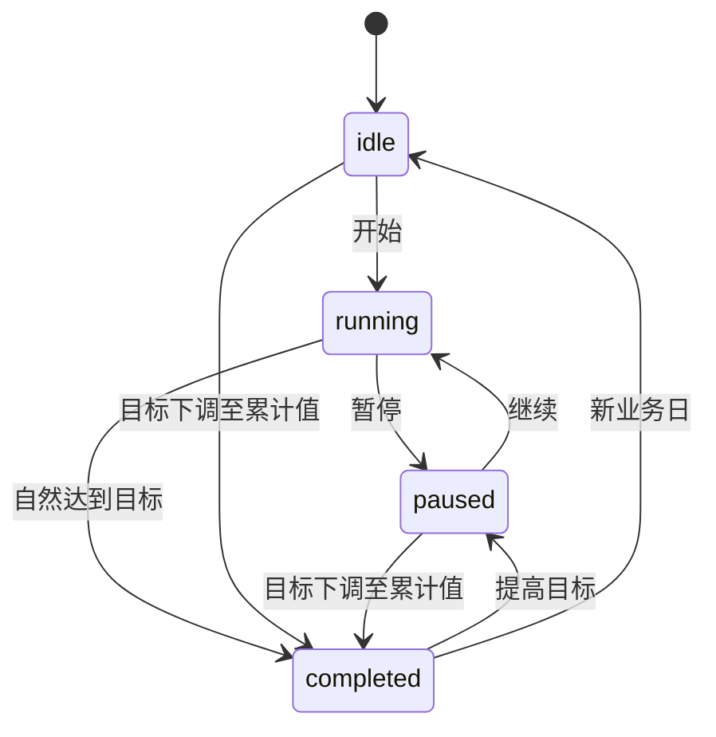
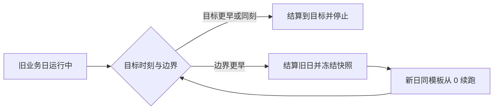

# Timer：每日计时器（v2）

> 文档状态：v2 现行设计与实现契约。
>
> 通用岛状态、提示队列、CLI envelope、升级与错误规则以 [Peeker v2 PRD](../v2/PRD.md) 为准。

Timer 用于累计当前业务日内多个目标事项的真实投入时间。v2 保留 v1 计时领域语义，但收敛态只在任务运行期间出现，达标反馈改为全局静音提示。

## 1. 使用目标

用户可以为健身、阅读、编程等事项设置每日目标，并多次开始、暂停和继续。Timer 负责保存真实时间区间、恢复活动会话、跨业务日拆分，并展示当前日与历史完成度。

Timer 不是番茄钟，不提供休息循环、手动补录、逐段标签或后台活动检测。

## 2. 配置与模板

Timer 设置包括：

- 功能卡是否启用；
- 右侧统计模式：今日总完成度或当月热力日历；
- 独立业务日刷新时间，默认本地时间 `00:00`，精确到分钟；
- 每日任务模板的新增、编辑、删除和排序。

模板字段：

| 字段 | 规则 |
| --- | --- |
| Template ID | 创建后稳定；名称不是身份 |
| 名称 | 去除首尾空白后非空；允许重名 |
| 目标时长 | `1...86,399` 秒 |
| 显示颜色 | `#RRGGBB`，用于任务标识和运行收敛态 |
| 排序位置 | 连续、稳定，由设置或 CLI 调整 |
| 更新时间 | 用于持久化和变更返回 |

岛内任务列表严格使用模板顺序，不因运行、暂停或完成状态自动重排。

## 3. 业务日与每日实例

Timer 业务日是相邻两次 Timer 刷新时间之间的区间，不等于固定自然日。

- 每个业务日根据当前模板生成任务实例。
- 实例保存当日名称、颜色、目标、累计时长、状态和 Template ID。
- 模板新增、编辑或删除立即影响当前业务日和未来业务日。
- 过去业务日只使用已冻结快照，不因模板变化回写。
- App 未运行时，下次启动依次补做遗漏结算。
- CLI 变更前必须先执行与 UI 相同的跨日恢复。

## 4. 任务状态

状态包括 `idle`、`running`、`paused`、`completed`。



- 任意时刻最多一个任务为 `running`。
- 已有运行任务时，不能直接启动其他任务；UI 和 CLI 都必须先暂停。
- 切换任务不得清空任何累计值。
- `completed` 任务在当前业务日不可重新启动；提高目标后变为 `paused` 才可继续。

## 5. 展开态

展开态沿用 v1 布局和 `800×328.571pt` 最大表面：

- 左侧约 75%：当前业务日任务列表；
- 右侧约 25%：今日总完成度或当月热力日历；
- 任务较多时左侧内部滚动，岛不随数据无限增高。

任务行至少显示颜色、名称、已计时或剩余时长、状态以及开始/暂停/继续操作。没有任务时显示空状态和前往 Timer 设置的操作。

## 6. 收敛态与静息态

Timer 只有在以下条件同时满足时才声明需要收敛态：

1. Timer 功能卡已启用；
2. 当前业务日存在唯一 `running` 任务。

收敛态只显示该运行任务：

- 左侧：颜色点与名称；
- 右侧：实时剩余时长；
- 不显示进度条、已完成摘要或“未配置”占位。

状态变化规则：

- 开始任务后，若没有更高优先级的展开或提示，宿主解析为 Timer 收敛态。
- 暂停、删除活动模板、自然达标或跨日后未续跑时，Timer 立即撤销收敛资格。
- 撤销后由宿主重新选择其他合格卡；没有合格卡时进入静息态。
- 悬停 Timer 收敛态时展开 Timer，并记为最近打开卡。
- Timer 被禁用后活动会话继续计时，但不显示收敛态或完成提示。

## 7. 计时事实来源

Timer 记录持久化时间区间，不用内存逐秒累加作为事实来源。

- 开始或继续时，原子保存任务状态和活动会话开始时间。
- 暂停时，以 App 处理操作的当前时间结束会话并结算区间。
- 睡眠、锁屏、正常退出或崩溃不自动暂停。
- 重启后根据持久化开始时间恢复。
- 退出 App 不创建人为停止点。
- UI 可以每秒刷新显示，但数据库不进行每秒写入或轮询。

## 8. 跨业务日与离线恢复

运行任务跨过刷新边界时，精确拆分区间：



- 目标达成与业务日边界同刻时，目标达成优先。
- 边界先发生时，旧日只获得边界前时长；新日使用完整目标重新比较。
- 新日模板不存在时停止续跑。
- App 多日未运行时按时间顺序重复算法，直到当前时间。
- 达标后不继续累计后续业务日。
- 恢复必须幂等，不能重复会话、快照或实例。

## 9. 达标与提示

- 累计达到目标时自动停止在剩余 `00:00`。
- 计入时长封顶于目标，不保存超额值。
- 在线且系统唤醒时的自然达标，在完成事务提交后向全局队列发布一条 Timer 提示。
- 提示摘要包含完成符号和任务名称，遵守全局 `420×72pt`、6 秒、FIFO 和静音规则。
- App 未运行或 Mac 睡眠期间达到目标，恢复数据但不补提示。
- 用户通过 UI 或 CLI 下调目标造成完成，不产生提示。
- v2 不播放任何 Timer 提示音；该规则覆盖 v1 声音要求。

## 10. 完成度与历史

今日完成度：

```text
所有当前可见任务的已计时总和 / 所有当前可见任务的目标总和
```

- 单任务与总完成度均封顶 100%。
- 没有可见任务时显示空状态，不显示误导性的 0%。
- 模板即时变化后，当前日分子和分母同步重算。
- 历史热力日历按月显示业务日结算时冻结的比例。
- 未来日期和无任务日期为空；日期不可进入逐日详情。

## 11. 模板变更与删除

- 新增模板后，当前业务日立即生成实例并追加。
- 修改名称、颜色或目标后，当前日实例同步更新，过去快照不变。
- 提高目标可使 `completed` 变为 `paused`。
- 下调目标至累计时长或以下时立即完成并封顶，不提示。
- 删除非运行模板时，从当前可见实例和完成度中移除。
- 删除运行模板直接执行前必须先结算到当前时间，再停止活动会话并删除。
- 底层历史会话保留；删除项不再进入当前可见分子或分母。

UI 可继续为活动模板删除提供确认。CLI 按公共契约直接执行，不交互确认。

## 12. 并发、错误与恢复

- 载入、CRUD、排序、开始、暂停、跨日恢复和 CLI 请求共用 Timer mutation gate。
- 写入失败时恢复操作前状态，不得出现两个运行任务。
- 自然达标必须先提交完成状态，再发布提示；提交失败不提示。
- IPC 响应丢失按 v2 PRD 返回 `outcome_unknown`，客户端用 `get`/`list` 核实。
- Timer 错误不得修改 Pusher 或 Scheduler 数据。

## 13. CLI 数据约定

Timer CLI 继承 [v2 CLI 公共契约](../v2/PRD.md#7-cli-公共契约)。选择器形式为：

```text
--id <template-id>
<exact-name>
```

两者互斥。名称去除首尾空白后进行大小写敏感的精确匹配；重名返回 `ambiguous_selector` 和候选 Template ID。

目标时长接受由 `h`、`m`、`s` 组成且单位不重复的组合，例如 `2h`、`1h30m`、`45s`。解析结果必须在 `1...86,399` 秒；JSON 统一输出秒数。

颜色必须为 `#RRGGBB`。刷新时间必须为本地 `HH:mm`。

## 14. CLI 接口

### 14.1 命令矩阵

| 命令 | 作用 | 主要校验与副作用 |
| --- | --- | --- |
| `peeker timer list` | 列出全部模板及当前业务日实例 | 先恢复当前业务日；按模板 position 排序 |
| `peeker timer get (--id <id> \| <name>)` | 返回一个模板及当日实例 | 未找到/歧义使用公共错误 |
| `peeker timer create --name <name> --target <duration> --color <#RRGGBB>` | 创建模板 | 当前日创建实例；不自动开始 |
| `peeker timer update (--id <id> \| <name>) [--name <name>] [--target <duration>] [--color <#RRGGBB>]` | 编辑模板 | 至少一个变更字段；下调造成完成不提示 |
| `peeker timer delete (--id <id> \| <name>)` | 删除模板 | 活动模板先结算；直接执行 |
| `peeker timer start (--id <id> \| <name>)` | 开始/继续当日任务 | 已有活动任务返回 `conflict`；不自动切换 |
| `peeker timer pause` | 暂停唯一活动任务 | 无活动任务返回 `conflict` |
| `peeker timer move (--id <id> \| <name>) [--before <template-id> \| --after <template-id>]` | 调整模板顺序 | before/after 互斥；均省略则移到末尾 |
| `peeker timer config get` | 返回 enabled、refreshTime | 只读 |
| `peeker timer config set [--enabled <bool>] [--refresh-time <HH:mm>]` | 更新核心配置 | 至少一个字段；禁用受至少一张卡约束 |

统计显示模式是纯 UI 偏好，不属于 v2 Timer CLI。

### 14.2 返回数据

`list` 的 `data`：

```json
{
  "businessDay": {
    "start": "2026-08-10T00:00:00+08:00",
    "end": "2026-08-11T00:00:00+08:00"
  },
  "activeTemplateId": null,
  "activeSession": null,
  "tasks": [
    {
      "templateId": "UUID",
      "instanceId": "UUID",
      "name": "work out",
      "targetSeconds": 3600,
      "accumulatedSeconds": 900,
      "remainingSeconds": 2700,
      "status": "paused",
      "color": "#34C759",
      "position": 0
    }
  ]
}
```

任务正在运行时，`activeSession` 返回 `sessionId`、`templateId`、`instanceId` 和 RFC 3339 `startedAt`；`accumulatedSeconds` 与 `remainingSeconds` 都按请求处理时刻计算并封顶，不能只返回尚未包含活动区间的数据库结算值。

`get` 和所有变更命令返回对应单项的同结构任务；`pause` 返回刚暂停的任务。`config get/set` 返回：

```json
{"enabled":true,"refreshTime":"00:00"}
```

### 14.3 模块错误

| error.code | 条件 |
| --- | --- |
| `timer_invalid_duration` | 时长语法或范围无效 |
| `timer_invalid_color` | 颜色不是 `#RRGGBB` |
| `timer_already_running` | 已有任务运行时启动另一任务 |
| `timer_no_active_task` | 无活动任务时暂停 |
| `timer_task_completed` | 启动已完成任务 |
| `timer_target_not_found` | before/after 目标不存在 |

这些错误映射到公共退出码 `2`、`4` 或 `5`；持久化和 IPC 错误使用公共错误。

## 15. 验收清单

- [ ] 同时只能有一个运行任务；CLI `start` 不隐式切换。
- [ ] 睡眠、锁屏、退出、崩溃和跨业务日恢复结果与 v1 规则一致。
- [ ] 目标与边界同刻时先达标，达标后不再跨日累计。
- [ ] 只有已启用且有运行任务时出现 Timer 收敛态。
- [ ] 暂停、删除、达标或未续跑后不保留完成/未配置收敛摘要。
- [ ] 在线自然达标在提交后显示一条静音 Prompt；离线、睡眠和目标编辑完成不提示。
- [ ] v2 不播放 Timer 声音。
- [ ] 模板修改影响当前与未来，过去快照不变。
- [ ] CLI list/get 返回稳定 Template ID、当前 Instance ID 和请求时的动态剩余时间。
- [ ] CLI CRUD、排序、开始、暂停和配置符合命令矩阵、JSON 与错误契约。
- [ ] UI 与 CLI 并发操作经同一 mutation gate，不产生双运行或部分提交。
