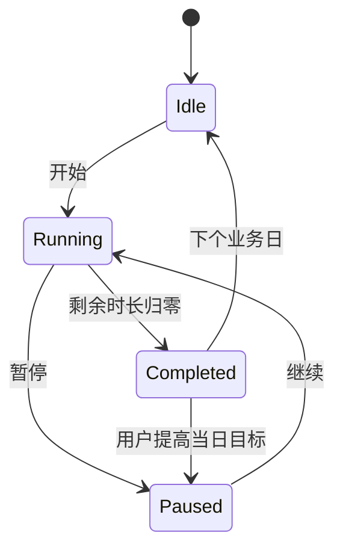
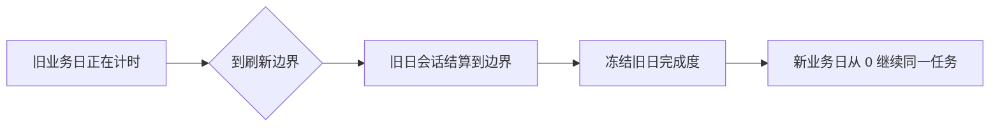

# Timer：每日计时器

> 一个用于累计每日目标事项真实投入时间的功能卡。

本文档描述 Timer 的功能级行为。通用的岛状态、功能卡导航、业务日、数据与错误处理规则以 `docs/PRD.md` 为准。

## 1. 使用目标

用户可以为一天安排多个投入目标，例如：

- 健身 2 小时；
- 阅读 1 小时；
- 编程 2 小时；
- 思考 30 分钟。

这些事项不要求连续完成，也不要求完成一项后才能开始下一项。用户可以多次暂停和继续，在多个任务之间切换；Timer 负责累计每个任务在当前业务日的总投入时间。

## 2. 配置

Timer 的设置包括：

- 是否启用；
- 右侧统计显示模式：今日总完成度或当月热力日历；
- 业务日刷新时间，默认本地时间 00:00，精确到分钟；
- 每日任务模板的新增、编辑、删除和拖拽排序。

单个任务模板包括：

| 字段 | 规则 |
| --- | --- |
| ID | 创建后保持稳定，不使用名称作为身份 |
| 名称 | 必填、去除首尾空白后不能为空 |
| 目标时长 | 1 秒至 23:59:59 |
| 显示颜色 | 用于任务标识与收敛态颜色点 |
| 排序位置 | 在设置页通过拖拽调整 |

岛内列表严格使用配置顺序，不因运行、暂停或完成状态自动置顶。

## 3. 业务日与每日实例

业务日是相邻两次 Timer 刷新时间之间的区间，不等同于固定自然日。

- 每个业务日根据当前模板生成任务实例。
- 实例记录该日目标、累计时长、状态及其对应模板 ID。
- 模板新增、修改或删除立即影响当前业务日和未来业务日。
- 过去业务日使用已冻结快照，不因模板变化而回写。
- App 未运行时，下一次启动需要补做所有遗漏业务日结算。

## 4. 展开态

展开态分为左右两部分：

- 左侧约 75%：当前业务日任务列表；
- 右侧约 25%：今日总完成度或当月热力日历。

任务较多时，左侧列表在固定内容区域内滚动，岛不随任务数量无限增高。

### 4.1 任务行

任务行至少显示：

- 颜色标识；
- 名称；
- 已计时或剩余时长；
- 当前状态；
- 开始、暂停或继续操作。

任务状态包括：

- `Idle`：本业务日尚未开始；
- `Running`：正在计时；
- `Paused`：已有累计时长但当前暂停；
- `Completed`：达到目标并自动停止。



### 4.2 单活动任务约束

- 任意时刻最多一个任务为 `Running`。
- 当前存在运行任务时，其他任务不能直接启动。
- 用户必须先暂停当前任务，之后才能启动或继续另一任务。
- 切换任务不会清空任何累计时长。

## 5. 收敛态

当 Timer 是最近选择的功能卡时，岛的收敛态实时显示一个任务摘要：

- 未完成：左侧显示 `任务颜色点 + 名称`，右侧显示剩余时长；
- 已完成：左侧显示 `任务颜色点 + 名称`，右侧显示绿色对勾；
- 没有任务：左侧显示 Timer 标志，右侧显示“未配置”。

收敛态不显示任务进度条。颜色点和名称靠近表面左边缘，剩余时长或完成图标靠近表面右边缘；带刘海屏的两组内容必须分别位于物理摄像头区域两侧。

摘要任务按以下优先级选择：

1. 正在运行的任务；
2. 最近操作过的任务；
3. 配置排序中的第一项。

收敛态不是收起瞬间的静态快照。计时、暂停、达标和模板变化必须实时反映到摘要。

## 6. 计时语义

Timer 记录时间区间，而不是依靠内存中的逐秒自增值作为事实来源。

- 开始或继续任务时，持久化活动会话的开始时间。
- 暂停时，以当前时间结束会话并结算区间。
- 睡眠、锁屏、正常退出或崩溃不会自动暂停任务。
- App 重新启动后，根据持久化开始时间计算未结算区间，并恢复正确状态。
- 退出 App 时不创建人为停止点。

这种语义允许用户计量不依赖持续使用电脑的活动，例如阅读、健身或思考。

## 7. 跨业务日

运行任务跨过 Timer 刷新边界时，需要精确拆分区间并自动续跑：



- 旧业务日只获得边界之前的时长。
- 新业务日从边界开始累计，不继承旧日累计值。
- 若新日模板中该任务仍存在，则继续同一模板对应的新实例。
- 若 App 在多个边界期间未运行，启动后依次拆分所有受影响的日期。
- 跨日续跑只适用于尚未达到目标的任务。

在线运行与离线恢复使用同一事件顺序算法：

1. 根据当前实例的累计时长，计算继续运行后的目标达成时刻。
2. 取得下一次业务日边界。
3. 先处理两个时刻中较早的事件。
4. 若先达标，则只结算到目标时刻并停止，不再跨日累计。
5. 若先到边界，则结算旧日、冻结快照、为新日创建实例，并使用新日完整目标重复比较。

例如：刷新时间为 00:00、每日目标为 30 分钟，用户 23:50 开始计时并在两天后重启。旧业务日结算 10 分钟；新业务日从 00:00 重新获得 30 分钟目标，在 00:30 达标并停止；之后日期不得继续累计。

## 8. 达标行为

- 累计时长达到目标时，任务自动停止在剩余 00:00。
- 实际计入时长封顶于目标，不记录超过目标的部分。
- App 正在运行时，达标触发短暂岛内完成动效、绿色对勾和单一内置提示音。
- 提示音遵循系统输出音量；v1 不提供声音选择或独立音量。
- 若在 App 未运行期间达到目标，重新启动后直接显示 `Completed`，不补播过时提示音。
- `Completed` 任务在当前业务日不可再次启动。
- 用户提高目标，使新目标大于当前累计时长时，任务变为 `Paused`，可由用户手动继续。

## 9. 完成度

### 9.1 今日总完成度

今日完成度使用当前业务日可见任务计算：

```text
今日完成度 = 所有可见任务已计时总和 / 所有可见任务目标时长总和
```

- 视觉显示范围为 0% 至 100%。
- 单任务计时本身也封顶于目标，因此不会产生超过 100% 的总完成度。
- 没有任务时显示空状态，不显示具有误导性的 0% 环。
- 模板即时变化后，当前业务日的分子和分母同步重算。

### 9.2 当月热力日历

- 日历以月为单位显示，可切换前后月份。
- 每个历史业务日使用结算时冻结的完成比例着色。
- 颜色强度最高对应 100%。
- 未来日期与没有任务的日期保持空白。
- 日期不可点击进入逐日详情。

“今日总完成度”和“当月热力日历”使用同一完成度定义。

## 10. 模板变更与删除

- 新增任务后，当前业务日立即生成对应实例并追加到列表。
- 修改名称、颜色或目标后，当前业务日立即更新，未来业务日使用新值。
- 提高目标可将已完成任务重新置为 `Paused`。
- 将目标降低到已累计时长或以下时，当前实例立即按新目标完成并封顶；由用户编辑触发的完成不播放提示音。
- 删除未运行任务时，当前实例立即从列表和今日完成度中移除。
- 删除正在运行的任务必须二次确认；确认后先结算到当前时间，再删除当前实例并停止未来生成。
- 已记录的底层会话保留用于数据完整性，但删除项不再计入当前业务日可见总时长或目标分母。
- 过去业务日快照和历史完成度不回写。

## 11. 错误与空状态

- 没有任务时，展开态显示说明和“前往 Timer 设置”操作。
- 持久化开始、暂停、排序或编辑失败时，界面恢复到操作前状态并显示可重试错误。
- 写入失败不得让两个任务同时处于 `Running`。
- 恢复活动会话时若发现目标已达到，只结算到目标时间点并标记完成。
- Timer 错误不得清空或修改 Pusher 数据。

## 12. v1 不包含

- 番茄钟或工作/休息循环；
- 单任务分段标签、备注或手动补录；
- 系统通知中心提醒；
- 提示音自定义；
- 逐日明细、数据导出或云同步；
- 自动根据活动状态重排任务。

## 13. 验收清单

- [ ] 同时只能运行一个任务，暂停后可切换且累计值不丢失。
- [ ] 睡眠、锁屏、退出和崩溃期间按真实时间恢复。
- [ ] 跨业务日会话准确拆分，旧日结算、新日续跑。
- [ ] 离线跨日恢复时，目标达成与业务日边界按时间先后处理；达标后不再累计后续日期。
- [ ] 达标自动停止在 00:00，在线时播放提示音并显示绿色对勾。
- [ ] App 离线达标后正确恢复完成态且不补播声音。
- [ ] 收敛态按优先级在左侧显示颜色点与名称、在右侧显示剩余时长或绿色对勾，不显示进度条，并实时更新。
- [ ] 模板变化立即影响今日与未来，过去快照不变。
- [ ] 删除活动任务前确认并先结算，当前完成度排除删除项。
- [ ] 今日完成环和当月热力日历使用一致算法。
- [ ] 重启后任务顺序、最近任务和活动会话正确恢复。


# v2新增

## 状态

没有计时中的任务则为静息态。

计时中展示为收敛态。

展开态样式不变。


## CLI

<to be designed>


## 提示

计时中的任务完成，则触发提示。