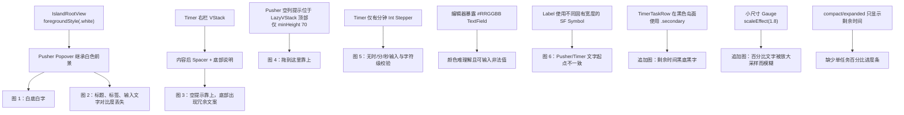

# Peeker Usability Polish Implementation Plan

> **For agentic workers:** REQUIRED SUB-SKILL: Use superpowers:subagent-driven-development (recommended) or superpowers:executing-plans to implement this plan task-by-task. Steps use checkbox (`- [ ]`) syntax for tracking.

**Goal:** 修复 Pusher 弹层文字对比度、Timer 深色岛面文字与进度显示、Timer 空状态与表单可用性、Pusher 空列垂直对齐，以及功能卡设置列表的文字对齐问题，并为单个 Timer 任务在收敛态和展开态补充实时百分比进度条。

**Architecture:** 保持 Timer/Pusher 业务模型、数据库结构和灵动岛尺寸不变。Pusher 弹层在 presentation 边界显式重建浅色语义颜色；Timer 将时长字符串解析、颜色预设和进度计算抽成可单测的模型，新增与编辑共用同一组输入控件，compact/expanded 共用同一套实时进度口径；纯布局问题留在各自 View 内修复。

**Tech Stack:** macOS 26、Swift 6.2、SwiftUI、Observation、SwiftPM/XCTest。

## Global Constraints

- 不改变 Timer/Pusher 的计时、跨日、拖拽、持久化和排序业务逻辑。
- Timer 目标时长仍限制为 `1...86_399` 秒，即 `00:00:01...23:59:59`。
- 不新增数据库字段、偏好键、第三方依赖或数据迁移。
- 不改变 Timer `760×420`、Pusher `920×480` 以及 compact 尺寸。
- Timer 任务进度只由现有 `targetSeconds`、`accumulatedSeconds` 和活动会话经过时间计算得出，不新增或持久化百分比字段。
- 总完成度与单任务进度在运行期间按秒刷新，但计时事实来源仍是时间戳，不新增高频数据库写入或轮询。
- 不回退当前工作区内上一轮设置入口、图标导航和 panel 动画修复。
- 保留工作区已有的 README、验证文档、构建脚本和依赖解析文件改动；如需触碰同一文档，必须先逐段合并，不覆盖用户内容。
- 弹层及输入控件继续提供 VoiceOver 标签、键盘操作和标准焦点环。

---

## 已确认根因



---

### Task 1: 隔离 Pusher 弹层的颜色环境

**Files:**
- Modify: `Sources/PusherFeature/PusherViews.swift:181-214,299-383`

**Interfaces:**
- Consumes: `PusherPopover`、`PusherEditor`、`PusherCalendarView` 现有 presentation 流程。
- Produces: 私有的 `PusherPopoverAppearance` ViewModifier；不改变 feature factory 或 store 接口。

- [ ] **Step 1: 在 Popover presentation 边界添加统一浅色外观修饰器**

  新增私有 ViewModifier，并只应用在 `.popover(item:)` 生成的内容上：

  ```swift
  private struct PusherPopoverAppearance: ViewModifier {
      func body(content: Content) -> some View {
          content
              .environment(\.colorScheme, .light)
              .foregroundStyle(.primary)
              .tint(.accentColor)
      }
  }

  private extension View {
      func pusherPopoverAppearance() -> some View {
          modifier(PusherPopoverAppearance())
      }
  }
  ```

  将 switch 包进一个 `Group` 后应用 `.pusherPopoverAppearance()`，确保日历、新增和编辑三种内容使用同一颜色边界，不依赖岛根视图传入的白色前景。

- [ ] **Step 2: 将日历内容设为浅色背景上的主文本**

  在 `PusherCalendarView` 根容器覆盖继承值：标题、日期、完成数量及 `ContentUnavailableView` 使用 `.foregroundStyle(.primary)`。在浅色环境中主文本解析为黑色，空状态的辅助元素保持系统次级灰色。

- [ ] **Step 3: 区分编辑器的辅助文字、占位符和用户输入**

  - 标题、Picker 标签、Toggle 标签使用 `.secondary`，对应白底灰字。
  - 将名称输入改为带显式 prompt 的 `TextField`；prompt 使用 `.secondary`，用户输入使用 `.primary`，对应白底灰色提示、输入后黑字。
  - 取消、确认、删除继续使用系统按钮语义色，不强制染灰。
  - 保留空名称禁用确认、文本编辑 blocker 和删除确认流程。

- [ ] **Step 4: 构建 PusherFeature**

  Run:

  ```bash
  swift build --target PusherFeature --disable-sandbox --disable-automatic-resolution
  ```

  Expected: 编译成功，没有 Swift 6 actor isolation 或 ViewBuilder 类型错误。

---

### Task 2: 修正 Timer 空状态和右侧统计区垂直布局

**Files:**
- Modify: `Sources/TimerFeature/TimerViews.swift:97-153`

**Interfaces:**
- Consumes: `TimerStore.dayState`、`statisticsMode`、`completionRatio`、`snapshots`。
- Produces: 相同的 Timer 展开态业务内容，仅调整文案和对齐。

- [ ] **Step 1: 删除左侧空状态说明句**

  将当前带 description 的 `ContentUnavailableView` 改为只保留图标与标题“还没有计时目标”，彻底移除“请在 Timer 设置中添加每日目标。”。

- [ ] **Step 2: 删除右栏底部冗余说明**

  删除 `Text("按真实时间累计")` 及用于把它推到底部的 `Spacer()`。

- [ ] **Step 3: 将统计内容作为整体垂直居中**

  用稳定容器承载三种右栏状态：完成度 Gauge、无目标提示、热力图。容器设置：

  ```swift
  Group {
      // Gauge / empty message / heatmap
  }
  .frame(maxWidth: .infinity, maxHeight: .infinity, alignment: .center)
  ```

  右栏继续固定宽 `165`，其中“添加目标后显示完成度”在整个可用高度中居中，而不是只在顶部内容区居中。

- [ ] **Step 4: 编译 TimerFeature**

  Run:

  ```bash
  swift build --target TimerFeature --disable-sandbox --disable-automatic-resolution
  ```

  Expected: 编译成功，Timer 尺寸和 store 接口未变化。

---

### Task 3: 将 Pusher 空列落点提示垂直居中

**Files:**
- Modify: `Sources/PusherFeature/PusherViews.swift:218-267`

**Interfaces:**
- Consumes: `tasks`、列级 `.dropDestination`、任务卡级 `.dropDestination`。
- Produces: 空列和非空列两个清晰布局分支；拖拽接口不变。

- [ ] **Step 1: 将空状态移出 LazyVStack 顶部**

  `tasks.isEmpty` 时不创建只有 `minHeight: 70` 的提示行，改为让 `Text("拖到这里")` 填满列标题下方的剩余空间：

  ```swift
  if tasks.isEmpty {
      Text("拖到这里")
          .foregroundStyle(.tertiary)
          .frame(maxWidth: .infinity, maxHeight: .infinity, alignment: .center)
  } else {
      ScrollView {
          LazyVStack(spacing: 7) {
              // task cards
          }
      }
  }
  ```

- [ ] **Step 2: 保留整列 drop destination**

  保持列根容器现有 `.dropDestination`，使居中的空状态区域全部可接收拖入；非空列仍保留按 index 插入和列尾插入行为。

- [ ] **Step 3: 运行 Pusher domain 回归测试**

  Run:

  ```bash
  swift test --filter PusherFeatureTests --disable-sandbox --disable-automatic-resolution
  ```

  Expected: 移动、排序、业务日结算测试全部通过。

---

### Task 4: 建立可验证的 Timer 时长草稿和颜色预设

**Files:**
- Create: `Sources/TimerFeature/TimerGoalFormModel.swift`
- Create: `Tests/TimerFeatureTests/TimerGoalFormModelTests.swift`

**Interfaces:**
- Produces: `TimerDurationComponent`、`TimerDurationDraft`、`TimerPresetColor`，供 Task 5 的新增和编辑表单共用。
- Does not consume: repository、store 或 SwiftUI View 状态。

- [ ] **Step 1: 先编写时长解析失败测试**

  覆盖以下输入：

  ```swift
  func testDurationDraftAcceptsBoundaryValues() {
      XCTAssertEqual(TimerDurationDraft(hours: "00", minutes: "00", seconds: "01").targetSeconds, 1)
      XCTAssertEqual(TimerDurationDraft(hours: "23", minutes: "59", seconds: "59").targetSeconds, 86_399)
  }

  func testDurationDraftRejectsInvalidTextRangesAndZero() {
      XCTAssertNil(TimerDurationDraft(hours: "", minutes: "00", seconds: "01").targetSeconds)
      XCTAssertNil(TimerDurationDraft(hours: "abc", minutes: "00", seconds: "01").targetSeconds)
      XCTAssertNil(TimerDurationDraft(hours: "1.5", minutes: "00", seconds: "01").targetSeconds)
      XCTAssertNil(TimerDurationDraft(hours: "-1", minutes: "00", seconds: "01").targetSeconds)
      XCTAssertNil(TimerDurationDraft(hours: "24", minutes: "00", seconds: "00").targetSeconds)
      XCTAssertNil(TimerDurationDraft(hours: "00", minutes: "60", seconds: "00").targetSeconds)
      XCTAssertNil(TimerDurationDraft(hours: "00", minutes: "00", seconds: "60").targetSeconds)
      XCTAssertNil(TimerDurationDraft(hours: "00", minutes: "00", seconds: "00").targetSeconds)
  }
  ```

- [ ] **Step 2: 运行新测试并确认失败**

  Run:

  ```bash
  swift test --filter TimerGoalFormModelTests --disable-sandbox --disable-automatic-resolution
  ```

  Expected: FAIL，因为草稿和预设类型尚不存在。

- [ ] **Step 3: 实现 `TimerDurationDraft`**

  类型保存三个原始字符串，以便用户输入非法字符时保留现场并禁用提交，而不是立即强制改写：

  ```swift
  enum TimerDurationComponent: CaseIterable, Sendable {
      case hours
      case minutes
      case seconds
  }

  struct TimerDurationDraft: Equatable, Sendable {
      var hours: String
      var minutes: String
      var seconds: String

      init(hours: String = "00", minutes: String = "30", seconds: String = "00")
      init(targetSeconds: Int64)
      var targetSeconds: Int64? { get }
      mutating func adjust(_ component: TimerDurationComponent, by delta: Int)
  }
  ```

  解析规则为：三个字段必须非空且可直接转换为十进制 `Int`；时 `0...23`、分 `0...59`、秒 `0...59`；总值必须在 `1...86_399`。箭头调整使用各字段范围进行 clamp；当原字符串非法时，从该字段下限恢复后再应用增减。

- [ ] **Step 4: 增加箭头调整测试**

  验证合法值加减、`23/59/59` 上限、`0/0/0` 下限，以及非法字符串点击箭头后恢复为合法数字。

- [ ] **Step 5: 实现固定颜色枚举并测试映射**

  使用稳定 raw value，避免颜色选项变更导致持久化含义漂移：

  ```swift
  enum TimerPresetColor: String, CaseIterable, Identifiable, Sendable {
      case red = "#FF3B30"
      case lightYellow = "#FFD60A"
      case lakeBlue = "#4F9DFF"
      case lightGreen = "#34C759"
      case purple = "#AF52DE"
      case pink = "#FF2D55"
      case cyan = "#64D2FF"

      var id: String { rawValue }
      var localizedName: String { get }
  }
  ```

  `localizedName` 依次为“正红、浅黄、湖蓝、浅绿、紫、粉、青”。测试 `allCases` 数量、顺序、名称和 hex 值，创建表单默认使用 `.lakeBlue`。

- [ ] **Step 6: 运行模型测试**

  Run:

  ```bash
  swift test --filter TimerGoalFormModelTests --disable-sandbox --disable-automatic-resolution
  ```

  Expected: 所有合法性、边界、箭头和颜色映射测试通过。

---

### Task 5: 重构 Timer 新增与编辑表单

**Files:**
- Modify: `Sources/TimerFeature/TimerViews.swift:193-342`
- Test: `Tests/TimerFeatureTests/TimerGoalFormModelTests.swift`

**Interfaces:**
- Consumes: `TimerDurationDraft.targetSeconds`、`adjust(_:by:)`、`TimerPresetColor.allCases`。
- Produces: 私有 `TimerDurationInput`、`TimerPresetColorPicker`；`TimerStore.createTemplate` 和 `updateTemplate` 签名保持不变。

- [ ] **Step 1: 创建可复用的时、分、秒输入控件**

  `TimerDurationInput` 接收 `Binding<TimerDurationDraft>`，横向显示三个组件。每个组件包含：

  - 上方固定标签“时”“分”“秒”；
  - 可手动输入的 rounded-border `TextField`；
  - labels-hidden 的 `Stepper` 上下箭头，调用 `adjust(_:by:)`；
  - 固定字段宽度、尾部数字对齐和 monospaced digits；
  - VoiceOver 标签“小时”“分钟”“秒钟”。

  不在 `onChange` 中过滤字符；非法文本必须留在输入框中，同时通过 `targetSeconds == nil` 使提交按钮变灰且不可点击。

- [ ] **Step 2: 创建固定颜色选择器**

  `TimerPresetColorPicker` 接收 `Binding<String>`，按计划顺序显示七个颜色圆点。当前项使用描边和 checkmark 双重选中状态；每项设置 `.help(localizedName)` 和 `.accessibilityLabel(localizedName)`。

  编辑旧版本产生的非预设 hex 时，在用户未选择新颜色前保留原值；界面显示“当前颜色”色点但不提供文本输入。一旦选择预设色，保存该预设 hex。这样不需要迁移，也不会静默改写已有数据。

- [ ] **Step 3: 重排新增目标区域并显式修复文字颜色**

  将原 `TextField + 分钟 Stepper + 添加` 单行替换为清晰的输入组：名称、时分秒、颜色、添加按钮。名称 prompt 使用 `.secondary`，已输入文字使用 `.primary`，在当前浅色设置窗口中呈现灰色提示和黑色输入。

  添加按钮的唯一启用条件：

  ```swift
  !name.trimmingCharacters(in: .whitespacesAndNewlines).isEmpty
      && duration.targetSeconds != nil
  ```

  点击添加时先保存 `targetSeconds`，再提交给 store；有效提交发出后将名称重置为空、时长重置为 `00:30:00`、颜色重置为湖蓝。不得在输入非法时清空草稿。

- [ ] **Step 4: 用相同控件重构编辑 sheet**

  - 由 template 的 `targetSeconds` 初始化 `TimerDurationDraft`。
  - 删除 `Stepper("目标 …")` 和 `TextField("颜色（#RRGGBB）")`。
  - 名称或时长非法时保存按钮禁用。
  - 保存时使用 `TimerTemplate` initializer 重新构造同 ID、position 的模板，以复用 domain 的名称和时长校验；保留 `updatedAtMilliseconds` 更新时间。
  - 取消和默认 Return 保存行为不变。

- [ ] **Step 5: 增加草稿往返测试**

  验证 `1`、`1_800`、`3_661`、`86_399` 秒经 `init(targetSeconds:)` 拆分后再读取 `targetSeconds` 得到原值，确保编辑旧目标不会改变时长。

- [ ] **Step 6: 运行 Timer 测试**

  Run:

  ```bash
  swift test --filter TimerFeatureTests --disable-sandbox --disable-automatic-resolution
  ```

  Expected: 表单模型和既有 Timer domain 测试全部通过。

---

### Task 6: 对齐功能卡设置列表的文字起点

**Files:**
- Modify: `Sources/PeekerApp/SettingsRootView.swift:102-148`

**Interfaces:**
- Consumes: `FunctionCardRegistration.name`、`systemImage`、现有启用 Binding。
- Produces: 私有 `CardSettingsRow`，同时用于启用和未启用卡片。

- [ ] **Step 1: 用固定图标槽替换自动 Label 布局**

  新增行组件：

  ```swift
  private struct CardSettingsRow: View {
      let name: String
      let systemImage: String
      @Binding var isEnabled: Bool

      var body: some View {
          HStack(spacing: 8) {
              Image(systemName: systemImage)
                  .frame(width: 18, alignment: .center)
              Text(name)
              Spacer()
              Toggle("启用", isOn: $isEnabled).labelsHidden()
          }
      }
  }
  ```

  固定 `18` 点图标槽后，`rectangle.3.group` 与 `timer` 的文字起点一致；整行仍保留完整可访问性语义。

- [ ] **Step 2: 复用到两个 ForEach 分支**

  已启用卡片继续支持 `.onMove`，未启用卡片仍可重新打开；不改变 `CardRegistry` 顺序与至少启用一项的约束。

- [ ] **Step 3: 构建可执行 App**

  Run:

  ```bash
  swift build --disable-sandbox --disable-automatic-resolution
  ```

  Expected: `PeekerApp` 及所有 feature target 编译成功。

---

### Task 7: 建立统一、可测试的 Timer 实时进度口径

**Files:**
- Create: `Sources/TimerFeature/TimerProgressMetrics.swift`
- Create: `Tests/TimerFeatureTests/TimerProgressMetricsTests.swift`

**Interfaces:**
- Consumes: 现有 `TimerStore.remainingSeconds(for:at:)` 产生的实时剩余秒数。
- Produces: `TimerProgressSnapshot`、`TimerProgressMetrics.totalRatio(_:)`；Task 8 的 compact、expanded 和总完成度圆环全部使用这些结果。
- Does not produce: 数据库字段、持久化事件或新的计时状态。

- [ ] **Step 1: 先编写单任务进度失败测试**

  使用目标秒数和实时剩余秒数定义进度，而不是在 View 中重复计算：

  ```swift
  func testTaskRatioUsesElapsedFractionAndClampsBounds() {
      XCTAssertEqual(
          TimerProgressSnapshot(targetSeconds: 100, remainingSeconds: 75).ratio,
          0.25,
          accuracy: 0.000_001
      )
      XCTAssertEqual(
          TimerProgressSnapshot(targetSeconds: 100, remainingSeconds: 100).ratio,
          0
      )
      XCTAssertEqual(
          TimerProgressSnapshot(targetSeconds: 100, remainingSeconds: 0).ratio,
          1
      )
      XCTAssertEqual(
          TimerProgressSnapshot(targetSeconds: 100, remainingSeconds: -20).ratio,
          1
      )
      XCTAssertEqual(
          TimerProgressSnapshot(targetSeconds: 100, remainingSeconds: 120).ratio,
          0
      )
  }
  ```

- [ ] **Step 2: 编写总完成度加权测试**

  总完成度必须按目标秒数加权，不能简单平均每个任务的百分比：

  ```swift
  func testTotalRatioIsWeightedByTargetSeconds() throws {
      let snapshots = [
          TimerProgressSnapshot(targetSeconds: 100, remainingSeconds: 50),
          TimerProgressSnapshot(targetSeconds: 300, remainingSeconds: 225),
      ]
      let ratio = try XCTUnwrap(TimerProgressMetrics.totalRatio(snapshots))

      XCTAssertEqual(
          ratio,
          0.3125,
          accuracy: 0.000_001
      )
  }

  func testTotalRatioIsNilWithoutPositiveTargets() {
      XCTAssertNil(TimerProgressMetrics.totalRatio([]))
  }
  ```

  上例已推进 `50 + 75 = 125` 秒，总目标 `400` 秒，因此结果为 `31.25%`。

- [ ] **Step 3: 运行测试并确认失败**

  Run:

  ```bash
  swift test --filter TimerProgressMetricsTests --disable-sandbox --disable-automatic-resolution
  ```

  Expected: FAIL，因为进度类型尚不存在。

- [ ] **Step 4: 实现不可持久化的进度快照**

  ```swift
  struct TimerProgressSnapshot: Equatable, Sendable {
      let targetSeconds: Int64
      let remainingSeconds: Int64

      var ratio: Double {
          guard targetSeconds > 0 else { return 0 }
          let clampedRemaining = min(max(remainingSeconds, 0), targetSeconds)
          return Double(targetSeconds - clampedRemaining) / Double(targetSeconds)
      }
  }

  enum TimerProgressMetrics {
      static func totalRatio(_ snapshots: [TimerProgressSnapshot]) -> Double? {
          let valid = snapshots.filter { $0.targetSeconds > 0 }
          let target = valid.reduce(Int64(0)) { $0 + $1.targetSeconds }
          guard target > 0 else { return nil }
          let progressed = valid.reduce(Int64(0)) { partial, snapshot in
              let remaining = min(max(snapshot.remainingSeconds, 0), snapshot.targetSeconds)
              return partial + snapshot.targetSeconds - remaining
          }
          return min(1, max(0, Double(progressed) / Double(target)))
      }
  }
  ```

  该快照是展示层即时值，不采用 `Codable`，防止误用为新的持久化事实来源。

- [ ] **Step 5: 增加完成、暂停与运行中语义测试**

  验证：完成任务为 `1.0`；尚未开始为 `0.0`；暂停任务根据已累计时间得到稳定结果；运行中的剩余秒数每减少 1 秒时 ratio 单调增加。

- [ ] **Step 6: 运行进度模型测试**

  Run:

  ```bash
  swift test --filter TimerProgressMetricsTests --disable-sandbox --disable-automatic-resolution
  ```

  Expected: 单任务 clamp、加权总完成度、空输入与单调性测试全部通过。

---

### Task 8: 修复 Timer 深色文字和模糊百分比，并增加单任务进度条

**Files:**
- Create: `Sources/TimerFeature/TimerProgressViews.swift`
- Modify: `Sources/TimerFeature/TimerViews.swift:72-191`
- Test: `Tests/TimerFeatureTests/TimerProgressMetricsTests.swift`

**Interfaces:**
- Consumes: `TimerProgressSnapshot.ratio`、`TimerProgressMetrics.totalRatio(_:)`、`TimerStore.remainingSeconds(for:at:)`。
- Produces: `TimerTaskProgressBar`、`TimerCompletionRing`，以及 compact/expanded 一致的实时进度展示。
- Preserves: compact `340×38`、expanded `760×420`、任务开始/暂停按钮和任务列表滚动。

- [ ] **Step 1: 定义岛内深色表面的显式语义色**

  在 `TimerProgressViews.swift` 中提供仅供 Timer 岛内容使用的颜色 token：

  ```swift
  enum TimerIslandAppearance {
      static let primaryText = Color.white
      static let secondaryText = Color.white.opacity(0.58)
      static let track = Color.white.opacity(0.14)
  }
  ```

  自定义黑色表面上的主次文字不再使用受窗口浅色环境影响的 `.primary/.secondary`。设置窗口仍继续使用系统语义色，不应用这些 token。

- [ ] **Step 2: 修复任务名称下方的剩余时间颜色**

  `TimerTaskRow` 中：

  - 任务名称显式使用 `TimerIslandAppearance.primaryText`；
  - 未完成任务的剩余时间使用 `TimerIslandAppearance.secondaryText`；
  - 已完成状态继续使用绿色；
  - compact 的名称、剩余时间以及“Timer 尚未配置”也使用适合黑底的对应 token。

  这样“29:06”“30:00”等时间在黑色卡片上显示为清晰浅灰色，不再出现黑底黑字。

- [ ] **Step 3: 实现可复用的线性任务进度条**

  `TimerTaskProgressBar` 接收 `ratio` 和任务颜色，直接按最终尺寸绘制两个 Capsule：

  ```swift
  struct TimerTaskProgressBar: View {
      let ratio: Double
      let color: Color

      var body: some View {
          GeometryReader { proxy in
              ZStack(alignment: .leading) {
                  Capsule().fill(TimerIslandAppearance.track)
                  Capsule()
                      .fill(color)
                      .frame(width: proxy.size.width * min(max(ratio, 0), 1))
              }
          }
          .accessibilityElement(children: .ignore)
          .accessibilityLabel("任务进度")
          .accessibilityValue("\(Int((min(max(ratio, 0), 1) * 100).rounded()))%")
      }
  }
  ```

  不使用 `scaleEffect` 或 `drawingGroup`，避免细线和文字被离屏缩放后发虚。

- [ ] **Step 4: 在收敛态加入单任务进度条**

  将 `TimerCompactView` 的任务摘要改为上下结构：原有名称/剩余时间 HStack 在上方，任务色线性进度条在底部。规则：

  - 进度条高度 `3` 点；
  - 宽度使用 compact 内容区全部可用宽度；
  - 颜色使用任务模板颜色；
  - 完成时填满，仍显示绿色完成图标；
  - `TimelineView` 每秒用 `remainingSeconds(for:at:)` 生成新快照，因此运行中连续推进；
  - 总内容保持在既有 `38` 点 panel 高度内，不修改 compact metrics。

- [ ] **Step 5: 在展开态每个任务行加入单任务进度条**

  将 `TimerTaskRow` 的外层改为 `VStack`：上方保留名称、剩余时间和开始/暂停按钮，下方增加高度 `4` 点的 `TimerTaskProgressBar`。规则：

  - 每一行只表示该任务自身进度；
  - 未开始为 0%，暂停显示稳定累计比例，运行中每秒增加，完成为 100%；
  - 进度条使用目标的预设/历史颜色；
  - 增加进度条后任务列表继续内部滚动，不增加 expanded panel 高度。

- [ ] **Step 6: 用原生尺寸矢量圆环替换被缩放的系统 Gauge**

  当前模糊源是 `.accessoryCircularCapacity` Gauge 先按小型控件绘制，再被 `.scaleEffect(1.8)` 连同文字一起放大。新增 `TimerCompletionRing`：

  ```swift
  struct TimerCompletionRing: View {
      let ratio: Double

      var body: some View {
          ZStack {
              Circle()
                  .stroke(TimerIslandAppearance.track, lineWidth: 8)
              Circle()
                  .trim(from: 0, to: min(max(ratio, 0), 1))
                  .stroke(
                      Color.accentColor,
                      style: StrokeStyle(lineWidth: 8, lineCap: .round)
                  )
                  .rotationEffect(.degrees(-90))
              Text(ratio, format: .percent.precision(.fractionLength(0)))
                  .font(.system(size: 34, weight: .semibold, design: .rounded))
                  .monospacedDigit()
                  .foregroundStyle(TimerIslandAppearance.primaryText)
          }
          .frame(width: 120, height: 120)
          .accessibilityElement(children: .ignore)
          .accessibilityLabel("今日完成度")
          .accessibilityValue("\(Int((min(max(ratio, 0), 1) * 100).rounded()))%")
      }
  }
  ```

  圆环和文字从一开始就按 `120×120` 与 34 点字号绘制；删除原 Gauge 的 `.scaleEffect(1.8)`，也不对新组件使用任何整体缩放。

- [ ] **Step 7: 让右侧总完成度在运行中实时更新**

  在右栏使用 `TimelineView(.periodic(from: .now, by: 1))`。每个 tick 将全部 `visibleTasks` 映射为：

  ```swift
  TimerProgressSnapshot(
      targetSeconds: task.targetSeconds,
      remainingSeconds: store.remainingSeconds(for: task, at: context.date)
  )
  ```

  然后用 `TimerProgressMetrics.totalRatio(_:)` 驱动 `TimerCompletionRing`。该更新只重新计算内存中的展示值，不写数据库。没有任务时仍显示 Task 2 规划的居中提示。

- [ ] **Step 8: 运行 Timer 测试和 target 构建**

  Run:

  ```bash
  swift test --filter TimerFeatureTests --disable-sandbox --disable-automatic-resolution
  swift build --target TimerFeature --disable-sandbox --disable-automatic-resolution
  ```

  Expected: Timer domain、表单和进度测试全部通过；没有 GeometryReader、FormatStyle 或 Swift 6 actor isolation 编译问题。

---

### Task 9: 全量验证与真实界面验收

**Files:**
- Verify only: all modified and existing sources/tests.

**Interfaces:**
- Consumes: Tasks 1-8 的完成结果。
- Produces: 可复现的自动化与人工验收证据。

- [ ] **Step 1: 运行全量单元测试**

  Run:

  ```bash
  swift test --disable-sandbox --disable-automatic-resolution
  ```

  Expected: 现有 29 项测试与新增 Timer 表单、进度计算测试全部通过。

- [ ] **Step 2: 检查补丁格式并验证 App bundle**

  Run:

  ```bash
  git diff --check
  ./script/build_and_run.sh --verify
  ```

  Expected: 无 whitespace error；`dist/Peeker.app` 构建、签名验证和启动成功；没有 Swift 6 concurrency、deprecated API 或 ViewBuilder 警告。

- [ ] **Step 3: 验收 Pusher 日历 Popover**

  - 展开 Pusher，点击“日历”。
  - 标题、空状态、日期与完成数量在白底上清晰显示为黑色/系统主文本色。
  - Popover 打开期间岛不收起，关闭后恢复原 hover/pin 状态。

- [ ] **Step 4: 验收 Pusher 新增与编辑 Popover**

  - 标题、急迫度、每日刷新等说明在白底上为灰色可读文字。
  - “任务名称”未输入时为灰色提示；输入中文、英文或数字后为黑色。
  - 空名称时确认按钮禁用；有效名称时确认按钮恢复。
  - 文本输入期间 hover blocker 生效，岛不意外收起。

- [ ] **Step 5: 验收 Timer 展开空状态**

  - 左侧只显示图标和“还没有计时目标”，不再出现“请在 Timer 设置中添加每日目标。”。
  - 右侧不再出现“按真实时间累计”。
  - “添加目标后显示完成度”在右栏水平、垂直方向均居中。

- [ ] **Step 6: 验收 Pusher 空列**

  - Planned、Processing、Done 为空时，“拖到这里”位于各列标题下方可用内容区正中。
  - 从有任务列拖入空列的整个内容区都能接收，最终顺序正确并可重启恢复。

- [ ] **Step 7: 验收 Timer 新增表单**

  - 白色输入背景上的提示为灰色，名称和数字输入为黑色。
  - 明确出现“时、分、秒”三个字段，每个字段既可手动输入，也可使用上下箭头。
  - `00:00:01` 与 `23:59:59` 可添加；`00:00:00`、`24:00:00`、分钟/秒 `60`、空字段、负号、小数点、字母、中文字符均使“添加”变灰且无法点击。
  - 七个颜色依次为正红、浅黄、湖蓝、浅绿、紫、粉、青；选中状态不只依赖颜色本身表达。

- [ ] **Step 8: 验收 Timer 编辑表单**

  - 现有目标时长正确拆成时、分、秒，保存但不修改时数值不漂移。
  - 不再出现 RGB/hex 手动输入入口。
  - 预设颜色可选；旧的非预设颜色在未选择新颜色时保持不变。
  - 非法名称或时长使保存按钮禁用。

- [ ] **Step 9: 验收功能卡设置列表**

  - Pusher 与 Timer 的图标占用相同宽度，文字左边缘严格对齐。
  - 开关右边缘对齐；启用、禁用和拖拽排序行为无回归。

- [ ] **Step 10: 验收 Timer 深色表面文字和单任务进度条**

  - 展开态中任务名称为清晰白色，名称下的剩余时间为清晰浅灰色，不再出现“黑底黑字”。
  - 每个任务行底部都有自身的线性进度条；不同目标时长按各自比例显示，不共享同一个宽度值。
  - 收敛态摘要底部也显示当前 summary task 的进度条，岛仍保持 `340×38`，名称、剩余时间和完成图标没有被裁剪。
  - 尚未开始为 0%，暂停后进度稳定，运行中每秒向前推进，完成后为 100%。
  - 运行、暂停、切换任务、重启恢复后，compact 与 expanded 对同一任务显示相同进度。
  - VoiceOver 将进度条读作“任务进度，N%”，进度含义不只依赖颜色表达。

- [ ] **Step 11: 验收右侧总完成度圆环清晰度**

  - 删除原 Gauge 的整体 `scaleEffect` 后，百分比数字和 `%` 符号在 Retina 与非 Retina/缩放显示器上均边缘清晰。
  - 圆环轨道、进度弧和百分比文字按最终尺寸直接绘制，窗口移动到外接屏幕后不发生二次缩放发虚。
  - 总完成度按全部可见任务的目标秒数加权；不是任务百分比的简单平均。
  - 有任务运行时圆环和数字每秒更新，但数据库不会每秒写入。
  - 0%、3%、50%、99%、100% 下数字均在圆环中心稳定对齐，不因位数变化跳动。

---

## 需求覆盖自检

| 用户要求 | 计划任务 | 验收位置 |
|---|---|---|
| 图 1 日历白底黑字 | Task 1 | Task 9 / Step 3 |
| 图 2 新增任务白底灰字、输入黑字 | Task 1 | Task 9 / Step 4 |
| 图 3 删除两处文案并居中右栏提示 | Task 2 | Task 9 / Step 5 |
| 图 4 “拖到这里”垂直居中 | Task 3 | Task 9 / Step 6 |
| 图 5 白底文字、时分秒、箭头/手输、非法禁用 | Task 4-5 | Task 9 / Step 7-8 |
| 图 5 七种预设色、移除 RGB 输入 | Task 4-5 | Task 9 / Step 7-8 |
| 图 6 功能栏文字对齐 | Task 6 | Task 9 / Step 9 |
| 追加图：名称下时间黑底黑字 | Task 8 | Task 9 / Step 10 |
| 追加图：右侧百分比数字模糊 | Task 8 | Task 9 / Step 11 |
| compact 与 expanded 增加单任务百分比进度条 | Task 7-8 | Task 9 / Step 10 |

没有引入数据库迁移、业务逻辑改写、第三方依赖或岛尺寸变化。
