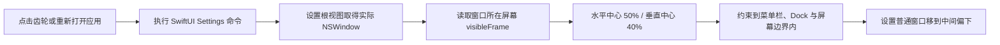

# Peeker 设置窗口定位与 Timer 进度条布局设计

## 目标

本轮只调整两个界面行为：

1. 设置窗口在目标屏幕可见区域内水平居中，窗口中心位于可见区域自底部起 `40%` 的高度，避免被屏幕顶部已经展开的灵动岛遮挡。
2. Timer 单任务进度条从文字下方移入行内：收敛态位于标题与剩余时间之间，展开态位于文字信息与计时控制按钮之间。

不修改 Timer 计时状态、进度计算、数据库结构、偏好设置、功能卡尺寸或灵动岛窗口动画。

## 设置窗口定位



采用窄 AppKit bridge 从 `SettingsRootView` 获取其实际 `NSWindow`，不依赖 SwiftUI 私有窗口标识符或标题。窗口引用登记给设置窗口定位器：

- 首次创建 Settings Scene 时，在窗口附着完成后定位。
- 设置窗口已经存在时，再次点击齿轮或重新打开应用会将同一窗口置前并重新应用目标位置。
- 目标屏幕优先使用设置窗口当前所在屏幕；首次创建时回退到鼠标所在屏幕，再回退到主屏幕。
- 目标窗口中心点为：
  - `centerX = visibleFrame.midX`
  - `centerY = visibleFrame.minY + visibleFrame.height * 0.40`
- 计算后的窗口原点会被约束在 `visibleFrame` 内。若窗口大于可见区域，则贴齐相应轴的可见区域起点，不产生无穷或负尺寸计算。
- 只移动窗口，不修改窗口大小、层级、样式、Scene 生命周期或持久化规则。

纯 frame 计算放在 `MacPlatform` 中，以 XCTest 覆盖普通屏幕、带原点偏移的外接屏幕、菜单栏/Dock 安全区以及超大窗口边界。

## Timer 进度条布局

### 收敛态

```text
●  任务标题  ─────────任务进度─────────  剩余时间
```

- 根布局从“文字行 + 底部进度条”的 `VStack` 改为单个 `HStack`。
- 颜色圆点与标题保持左侧语义，剩余时间或完成图标保持最右侧。
- 进度条占据标题与剩余信息之间的可伸缩空间，并设置合理最小宽度。
- 标题过长时优先单行截断，剩余时间、完成图标与进度条不得被挤出 `340×38` 的现有边界。

### 展开态

```text
色条  [任务标题 / 剩余时间]  ─────────任务进度─────────  [继续/暂停]
```

- 每个任务卡从“操作行 + 底部进度条”的 `VStack` 改为单行 `HStack`。
- 标题与剩余时间继续组成左侧垂直文字组。
- 进度条位于文字组与计时控制之间，并使用剩余水平空间。
- 开始、暂停、已完成图标保持当前行为、禁用条件与辅助功能语义。
- 进度条继续复用 `TimerTaskProgressBar`，因此百分比计算、颜色、每秒刷新和 VoiceOver 值不变。

## 验证

- 新增 `SettingsWindowGeometry` 单元测试，验证 `40%` 垂直中心、水平居中、非零屏幕原点和边界约束。
- 运行全部 SwiftPM 测试与 `git diff --check`。
- 运行应用构建验证 Swift 6 actor isolation、AppKit bridge 和 SwiftUI 布局均可编译。
- 实际打开设置页，确认窗口位于展开岛下方；实际查看 Timer 收敛与展开状态，确认两个进度条均在指定元素之间且无裁剪。

## 非目标

- 不加入可配置的窗口位置百分比。
- 不根据灵动岛实时高度动态漂移设置窗口。
- 不更改设置窗口尺寸、Timer 卡片尺寸、进度算法或计时按钮文案。
