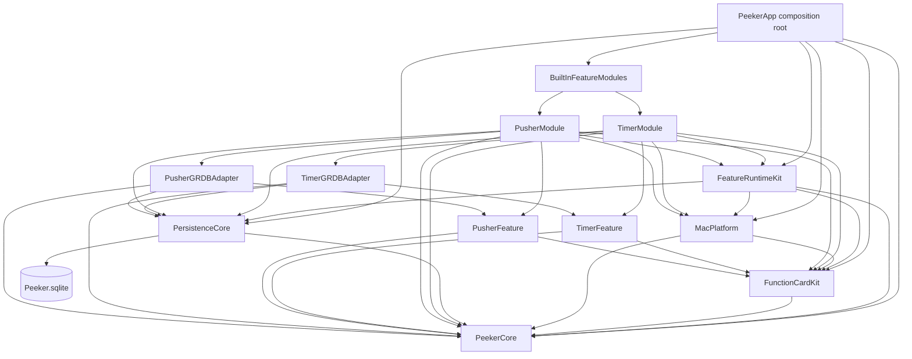

# Peeker v1 Architecture

> Historical architecture of the implemented v1 codebase. The planned Scheduler, CLI IPC, resting island, and prompt queue are specified by [`docs/v2/PRD.md`](../v2/PRD.md) and are not part of this graph.

Peeker v1 is a single-process, Swift-native modular monolith. SwiftUI owns view state and rendering; AppKit is restricted to the floating panel, display topology, input monitors, login items, system audio, and feature-owned UI bridges.

## Dependency graph

Dependency rules:

- Framework targets (`PeekerCore`, `FunctionCardKit`, `PersistenceCore`, `MacPlatform`, and `FeatureRuntimeKit`) never import concrete feature targets.
- `Sources/PeekerApp/BuiltInFeatureModules.swift` is the only application source that imports and instantiates concrete modules.
- Timer and Pusher never import one another. Each feature owns its identity, domain, store, views, preferences, unavailable repository, GRDB schema, and repository adapter.
- Feature domains do not import GRDB. AppKit is allowed only in feature-owned UI bridge files.
- SwiftUI views send intents to `@MainActor @Observable final class` stores.
- GRDB records never cross repository ports.
- A single `TemporalEventHub` schedules the earliest target or business-day boundary; target completion has higher priority when timestamps tie.
- One `DatabaseQueue` serializes all SQLite work. `PersistenceCore` owns shared tables; feature adapters contribute idempotent migrations for their own tables.

The executable assembles features through `FunctionCardModule`. `FunctionCardModuleContext` supplies shared runtime services without exposing `AppRuntime` or window controllers. `FunctionCardModuleCatalog` rejects duplicate feature and migration identifiers before registrations are built.

## Adding an internal feature

1. Add the feature domain/UI, persistence adapter, and module assembly under `Sources/Features/<Feature>/`.
2. Implement `FunctionCardModule`; keep the feature ID, preference keys, unavailable repository, and schema migrations inside that feature tree.
3. Add matching isolated test targets under `Tests/Features/<Feature>/`.
4. Declare the targets in `Package.swift` and add one module instance to `BuiltInFeatureModules.all`.
5. Run `Tests/Shell/feature_boundary_contract.sh` and the full local acceptance suite.

Adding a feature must not require edits to the island state machine, generic settings navigation, `AppPreferences`, or shared database schema. Removing a feature is the reverse operation; existing SQLite tables are intentionally retained and no destructive uninstall migration runs.

Persistent business data lives at `~/Library/Application Support/Peeker/Peeker.sqlite`. Lightweight display and card preferences use `UserDefaults`; feature modules preserve their published raw keys through the generic `FeaturePreferenceStore`.
