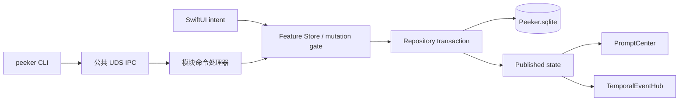

# Peeker v2.1 Architecture

> 文档状态：v2.1.0 当前实现架构契约。
>
> 产品行为分别以 [v2 PRD](PRD.md) 和各 [功能文档](../functions/) 为准。

## 1. Target graph

```text
PeekerApp
  ├─ FunctionCardKit / FeatureRuntimeKit / MacPlatform
  ├─ PeekerProtocol / PeekerIPC
  ├─ TimerModule ─ TimerFeature ─ TimerGRDBAdapter
  ├─ PusherModule ─ PusherFeature ─ PusherGRDBAdapter
  ├─ SchedulerModule ─ SchedulerFeature ─ SchedulerGRDBAdapter
  ├─ AgentorModule ─ AgentorFeature ─ AgentorProtocol
  └─ TargetorModule ─ TargetorFeature ─ TargetorGRDBAdapter

peeker-cli ─ PeekerProtocol ─ PeekerIPC
peeker-agentor-hook ─ AgentorProtocol ─ Agentor private UDS
```

框架 target 不 import 具体功能卡。`BuiltInFeatureModules.swift` 是 App 唯一组装点。Agentor 无 GRDB Adapter；Targetor 不依赖其他 Feature。

## 2. UI、CLI 与事务流



App 是唯一打开 `Peeker.sqlite` 的进程。CLI 只解析命令、完成协议握手并转发请求；模块处理器调用与 SwiftUI 相同的 Store。禁止在 CLI 复制跨日恢复、周期计算、重复规则、事务、Prompt 或校验逻辑。

每张持久化功能卡拥有独立 mutation gate。一次写操作在数据库提交、内存发布和相关调度更新完成前，不接受同模块第二个写操作。功能卡之间不得互相修改私有表。

## 3. 公共 IPC 与 CLI

- Socket：当前用户临时目录 `com.scpz24.Peeker/ipc-v1.sock`。
- 父目录 mode `0700`；socket mode `0600`。
- Server 用 `getpeereid` 验证 peer euid。
- 帧为 4-byte big-endian 长度加 UTF-8 JSON，上限 16 MiB。
- 每个连接执行一次协议握手和一次请求/响应。
- CLI 不启动 App、不链接 GRDB、不直接打开数据库。
- v2.1.0 公共 protocol version 与 JSON schema version 继续为 `1`；Targetor 和 Timer temporary 是向后兼容的新增命令与字段。

公开顶层命令为 `status`、`timer`、`pusher`、`scheduler`、`targetor`。Agentor 继续使用私有 helper/UDS，不进入公共 CLI。

## 4. 功能卡宿主

### 4.1 注册

每张卡注册：

- 稳定 Feature ID、名称、默认顺序、introduced configuration version；
- 受信任图标描述符；
- Compact 可选 provider；
- Expanded、Settings；
- 可观察的展开尺寸状态；
- CLI handler 和生命周期回调。

宿主接口保持功能卡无关，不出现 Timer、Agentor 或 Targetor 分支。

### 4.2 图标描述符

v2.0.x 的 `systemImage: String` 扩展为受信任图标描述符：

```text
systemSymbol(name)
bundleSVG(featureID, manifestResourceName)
```

- 现有 Timer、Pusher、Scheduler、Agentor 卡片继续使用 SF Symbol。
- Targetor 使用 Targetor Bundle manifest 中的 Lucide `target`。
- 标签栏、设置侧栏、功能卡列表和 Prompt glyph 统一渲染描述符。
- Bundle SVG 只能来自模块注册的 manifest canonical name；不得接受路径、网络 URL 或任意 SVG 内容。
- SVG 运行时通过公开 `NSImage`/SwiftUI API 按需渲染；不得链接或调用私有 CoreSVG。`sips` 只用于发布验证。
- 保留 system symbol convenience initializer，避免现有卡迁移产生行为变化。

### 4.3 动态展开尺寸

注册持有宿主可观察的布局状态，至少提供当前 expanded width/height。功能卡修改该状态后，Panel Controller 重新计算目标屏幕约束和顶边锚定动画。

- Timer 临时任务能力关闭：`800×328.571pt`；开启：`800×371.429pt`。
- 其他卡当前使用静态值，但走同一接口。
- 面板观察布局状态，而不是观察 Timer 偏好键或硬编码 Feature ID。
- 尺寸变化继续遵守小屏裁剪、Reduce Motion、物理刘海和顶边连续连接规则。

### 4.4 Compact 与 Resting

`CardRegistry` 按启用顺序、当前选择和最近打开时间管理卡片。Compact provider 可省略；合格卡按最近打开时间、再按启用顺序选择。

v2.1.0：

| 卡片 | Compact 资格 |
| --- | --- |
| Timer | 存在运行中的每日或临时任务 |
| Agentor | 至少一个活跃顶层 Agent 会话 |
| Pusher | 无 |
| Scheduler | 无 |
| Targetor | 无 |

没有合格卡时进入透明 Resting 热区。Targetor 打卡不会赋予 Compact 资格。

### 4.5 Prompt

`PromptCenter` 继续拥有 100 条内存 FIFO、稳定 token 撤销、6 秒播放和展开结束后 1.5 秒延迟。禁用功能卡清除该来源 Prompt。

Prompt 图标改用与注册兼容的受信任描述符；既有 system symbol 初始化保持兼容。功能卡只能选择图标和语义样式，不能注入任意 Prompt View。

## 5. 时间调度

`TemporalEventHub` 拥有一个平台 timer，并按时间和 priority 排序。触发原因区分正常 scheduled callback、wake recovery 和 clock/time-zone recovery。恢复更新业务状态和未来调度，但不补 stale Prompt。

- Timer：目标时刻 priority 高于业务日边界；临时任务遵守同一顺序。
- Pusher：维护自己的业务日边界。
- Scheduler：只维护下一提醒，occurrence 惰性展开。
- Agentor：使用内存事件和失联清理，不注册业务日。
- Targetor：维护下一周期边界；离线时在 Store 内按序补齐日/周/月周期。

Targetor 周/月边界属于模块领域，不扩展共享 `BusinessDay` 为通用月份周期。共享层只提供 Clock、Calendar/时区事件和 TemporalEventHub。

## 6. Timer v2.1 persistence boundary

既有 Timer 表继续保存模板、每日实例、会话和每日快照。v2.1 migration 追加：

- `timer_temporary_tasks`：稳定 ID、名称、目标、颜色、累计、状态、expire flag、创建/更新/归档时间和原因；
- 活动会话 task kind/identity：明确区分 `dailyInstance` 与 `temporary`，旧记录默认 `dailyInstance`；
- 临时任务活动/归档和排序索引；
- 数据库级唯一活动会话约束继续覆盖两类任务。

业务日边界事务必须原子完成：

```text
结束旧会话
→ 更新累计与状态
→ 冻结包含活动临时任务的每日快照
→ 归档或携带临时任务
→ 创建每日新实例
→ 可选建立下一活动会话
```

临时任务不塞入 `timer_day_instances`，也不伪造 Template ID。历史会话保留任务种类和稳定身份。

## 7. Scheduler persistence boundary

Scheduler 保持既有三表：

- `scheduler_sources`
- `scheduler_events`
- `scheduler_occurrence_overrides`

Timer/Targetor migration 不修改 Scheduler 表。重复 occurrence 和提醒继续按查询窗口惰性生成，不持久化无限实例。

## 8. Agentor boundary

Agentor 继续由 `AgentorFeature`、`AgentorModule`、`AgentorProtocol` 和 Bundle 私有 helper 组成：

- 私有 socket：`com.scpz24.Peeker/agentor-v1.sock`；
- 状态、问题和答案只在内存；
- 不注册 GRDB migration；
- 不扩展公共 `peeker` CLI；
- 禁用时清空内存状态、Compact 和 Prompt，并让可回答问题回落上游原生流程。

v2.1 文档不得再把 Timer 描述为唯一 Compact 卡。

## 9. Targetor persistence boundary

Migration `targetor-schema-v1` 只追加：

### `targetor_targets`

- Target ID 主键；
- title、nullable description、Lucide canonical icon name；
- period rule、max count、position；
- created/updated/archived timestamps。

### `targetor_periods`

- Period ID 主键与 Target ID 外键；
- 目标内单调递增的 sequence、start/end；
- period rule 与 max 快照；
- created/settled timestamps；
- `(target_id, start)` 与 `(target_id, sequence)` 唯一。

### `targetor_checkins`

- Event ID 主键；
- Target ID、Period ID；
- occurredAt；
- 索引支持按 period/time 查询。

目标软归档不得级联删除 period/check-in。`uncheck` 只在事务校验事件属于活动目标当前周期后物理删除该 event。

Targetor Store 负责：

- 计算和恢复日/周/月周期；同一 Targetor 日内多个周期相交时，日历选择 `start` 最晚的周期；
- 串行 CRUD、设置排序、打卡、撤销和边界；
- 构造当前状态、9 列汇总和悬停日历；
- 提交后发布庆祝反馈和 Prompt。

Targetor CLI 周期状态 wire value 固定为 `notStarted | started | progressing | completed`。汇总日历使用系统蓝语义色的四档非空明度；周周期按橙、黄、绿、蓝、青的 `sequence % 5` 稳定色相循环，并以明度表达完成级别。

## 10. Lucide Bundle 资源

`Resources/Targetor/Lucide/` 固定 vendored Lucide v1.27.0：

- 完整 SVG 图标目录；
- canonical name/tag 搜索元数据；
- 版本化 manifest 与每文件 SHA-256；
- MIT icon artwork notice 与 ISC project metadata/code notice。

构建脚本把目录复制到 `Peeker.app/Contents/Resources/Targetor/Lucide`。Bundle 验证至少检查：manifest schema/version、许可文件、清单数量、全部文件哈希、`target.svg` 和代表性样本可由 CoreSVG 渲染。运行时只通过 manifest 查找，不扫描任意路径。

## 11. 偏好与升级

卡配置版本从 3 提升到 4：

- 新安装默认顺序：Timer、Pusher、Scheduler、Agentor、Targetor；
- v2.0.x 升级保留旧卡相对顺序、最近选择和禁用状态；
- Targetor 默认启用并追加到末尾；
- 不重新启用用户主动禁用的旧卡；
- Timer `temporaryTasksEnabled` 对新安装和升级均注册为 false；
- Prompt 队列不迁移。

数据库迁移只追加表、列和索引。任一 migration 失败时 App 进入现有 persistence unavailable 错误路径，不删除或重建数据库。

## 12. 边界与验证

- Framework targets 不依赖具体 Feature/Adapter/Module。
- App 具体模块 import 只允许出现在 `BuiltInFeatureModules.swift`。
- Targetor/Pusher/Scheduler 无 Compact provider；Timer/Agentor eligibility 可实时变化。
- 动态尺寸、SVG 图标和 Prompt 渲染具有 FunctionCardKit 单元测试，不能靠 Timer/Targetor 视图特判。
- Timer migration 覆盖旧 session 默认种类、跨边界原子性和双运行约束。
- Targetor migration 覆盖软归档保留历史、周期唯一性、打卡上限并发和当前事件撤销。
- CLI help contract 覆盖 `timer temporary` 与 `targetor` 全部层级。
- Bundle contract 覆盖 Lucide manifest、哈希、许可和可渲染性。
