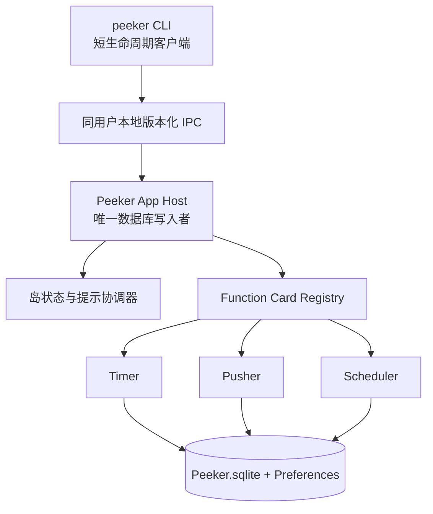
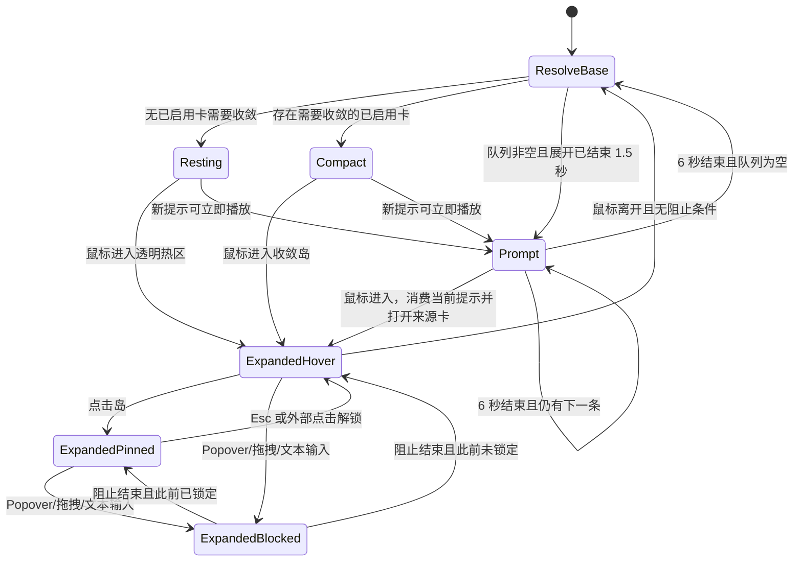

# Peeker v2 增量产品需求文档

> 文档状态：已确认，可用于 v2 设计、开发和验收
>
> 目标版本：v2
>
> 当前代码状态：仓库已实现 v2.0.0；本文继续作为行为与验收契约
>
> 最低系统：macOS 26
>
> 继承基线：[Peeker v1 PRD](../v1/PRD.md)

本文档只描述 v2 相对 v1 的新增、修改和删除。未被本文覆盖的 v1 规则继续有效。发生冲突时，优先级如下：

1. 本文档；
2. `docs/functions/` 下的 v2 现行模块文档；
3. `docs/v1/PRD.md`。

Timer、Pusher、Scheduler 的完整行为分别见 [timer.md](../functions/timer.md)、[pusher.md](../functions/pusher.md) 和 [scheduler.md](../functions/scheduler.md)。

## 1. 摘要

v2 将 Peeker 从“始终显示摘要的双功能卡岛”扩展为可静息的本地效率入口：

- 无需持续展示信息时，岛完全隐藏黑色表面，只保留顶部透明热区；
- 功能卡可按自身实时状态选择是否提供收敛态；
- 功能卡可向统一、静音、FIFO 的岛内提示队列发布消息；
- 新增本地周日历 Scheduler，支持 CRUD、常用重复规则、ICS 导入和日程提醒；
- 新增面向用户与 Coding Agent 的 `peeker` CLI，由已运行 App 统一执行业务操作。

v2 仍是本地优先、无账号、无遥测的原生 macOS App。CLI 不是第二套业务实现，也不拥有数据库。

## 2. 目标与非目标

### 2.1 目标

1. 无活跃信息时不持续占用屏幕顶部视觉空间，同时保留可发现的悬停入口。
2. 让 Timer、Pusher、Scheduler 通过同一提示机制提供及时但不使用系统通知的反馈。
3. 提供可由 Coding Agent 稳定解析和调用的本地 CLI。
4. 提供足以替代轻量周日历的本地 Scheduler，并允许导入常见 ICS 数据。
5. 无损升级 v1 Timer、Pusher 数据、活动会话和用户偏好。

### 2.2 非目标

- 云同步、CalDAV、账号、团队协作或遥测；
- EventKit、系统 Calendar 或其他第三方日历的实时同步；
- ICS 文件监视、启动刷新、定时刷新或 ICS 导出；
- 邮件邀请、参与者响应、附件或会议服务集成；
- 系统通知中心通知或任何 v2 提示声音；
- Scheduler 拖拽移动、拖边缩放、复杂 RRULE 编辑器或每项独立提醒；
- CLI 直接访问 SQLite、自动启动 App、后台守护进程或 XPC Service；
- 第三方功能卡 SDK 或插件市场。

## 3. v1 → v2 覆盖矩阵

| 领域 | v1 | v2 决定 |
| --- | --- | --- |
| 默认岛面 | 始终为最近卡片的收敛态 | 无卡片需要收敛时进入 `Resting`，不绘制黑色表面 |
| 收敛能力 | 每张卡必须提供 | 变为可选、实时能力 |
| Timer 收敛态 | 始终可见最近任务摘要 | 仅已启用且存在运行任务时可见，只显示运行任务 |
| Pusher 收敛态 | 显示三列统计 | 删除；Pusher 平时静息 |
| 主动反馈 | Timer 达标动效和声音 | 统一静音提示队列；删除 Timer 声音 |
| 功能卡 | Timer、Pusher | 新增 Scheduler |
| 外部操作 | 无 CLI | 新增只调用已运行 App 的 `peeker` CLI |
| 进程边界 | 单 App 进程 | 一个长期 App 数据进程；允许短生命周期 CLI 客户端，但 App 仍是唯一数据库写入者 |

未列出的 v1 平台、窗口、业务日、更新、分发、隐私和模块隔离规则继续有效。

## 4. 产品结构



CLI 请求必须进入与 UI 相同的 Store 或应用服务。不得为 CLI 复制跨日恢复、重复规则、事务、提示或校验逻辑。

## 5. 岛状态与交互

### 5.1 状态



`ResolveBase` 是重新计算动作，不是用户可见表面。用户交互中的展开态优先级最高；展开期间到达的提示只能排队。

### 5.2 Resting

- 不渲染黑色岛面、文字或阴影。
- 保留透明悬停热区以进入最近选择的已启用卡。
- 带刘海屏：热区使用完整顶部安全区高度，宽度为物理刘海宽度左右各外扩 `16pt`。
- 无刘海屏：热区为屏幕顶部中央 `220×8pt`。
- 热区之外不得截获菜单栏鼠标操作。
- 透明热区必须提供可访问性入口，且不得因透明而产生可见缝隙或背景。

### 5.3 Compact

- 功能卡可实时声明“当前需要收敛态”；没有声明的卡不得占用 Compact。
- 只考虑已启用卡。禁用不停止模块后台数据或 CLI，但禁止该卡产生 Compact 或 Prompt。
- 多张卡同时合格时，选择最近被用户打开的合格卡；没有打开记录时按已启用排序选择第一张。
- 从 Compact 悬停展开时，打开 Compact 的来源卡，并更新该卡的最近打开时间。
- 展开结束后重新计算，而不是无条件恢复展开前的 Compact。

v2 内置卡中只有 Timer 在运行任务存在时提供 Compact。设计必须保持通用，不得在宿主中硬编码 Timer 特权。

### 5.4 Expanded

v1 的悬停展开、点击锁定、`Esc`、外部点击、Popover、拖拽、文本输入阻止收起、屏幕定位和减少动态效果规则继续有效。

- 从 Resting 展开最近选择的已启用卡。
- 从 Prompt 展开提示来源卡。
- 如果来源卡在提示播放前已禁用，应移除该提示，不能临时绕过禁用状态。
- 展开结束指岛已离开展开态且所有收起阻止条件消失；从该时刻起等待 `1.5` 秒再播放队列。

### 5.5 Prompt

- 最大表面为 `420×72pt`，顶部居中并与屏幕上沿连续连接。
- 显示来源图标、模块名和单行摘要；过长摘要尾部截断。
- 带刘海屏的文字与图标放在摄像头区下方，不得被物理刘海遮挡。
- 单条显示 `6` 秒。超时后有下一条则立即播放下一条，否则重新计算 Compact/Resting。
- 鼠标进入后立即消费当前项并展开来源卡；未播放项继续等待下一次展开结束。
- 动画尊重系统“减少动态效果”。

### 5.6 功能卡宿主边界

v2 的宿主接口必须保持功能卡无关：

- Function Card 注册可选的 Compact 内容，以及可观察的“当前是否需要 Compact”状态；没有提供者等同永不合格。
- 注册仍提供 Expanded、Settings、身份、排序和尺寸，不要求空的占位 Compact view。
- 宿主向模块提供 Prompt 发布与按稳定 token 撤销能力；提示项至少包含 token、来源 Feature ID、图标、模块名、摘要和发生时间。
- Scheduler 用 occurrence 身份派生稳定 token，以支持删除/改期撤销；Pusher/Timer 每次成功事件可生成新 token。
- CardRegistry 启用状态是主动展示的统一门禁。禁用时宿主清除该来源当前/待播 Prompt，并排除 Compact，但不得销毁模块 Store。
- Compact 解析、Prompt 排队、1.5 秒延迟和鼠标进入行为只在通用宿主实现；不得在 Timer、Pusher、Scheduler 视图中各自复制状态机。

## 6. 全局提示队列

### 6.1 队列规则

- 严格 FIFO，不合并、不按对象覆盖。
- 当前显示项与待播项合计最多 `100` 条。
- 队列已满时静默丢弃新提示；不得驱逐更早提示。
- 队列只保存在内存中，不跨重启、崩溃或升级恢复。
- 所有提示静音，不调用通知中心。
- 数据库提交失败的操作不得产生提示。

### 6.2 在线与过期

“在线提示”要求 App 进程正在运行，且系统在事件到期时处于唤醒状态并通过正常定时回调处理事件。

- App 未运行期间发生的事件不补提示。
- Mac 睡眠期间发生的事件在唤醒恢复时不补提示。
- 启动或唤醒仍必须正确恢复业务数据，只是不创建过期提示。
- 已过触发点才创建或改期的 Scheduler 日程不立即补提示。

### 6.3 触发来源

| 模块 | 触发 | 不触发 |
| --- | --- | --- |
| Timer | 在线、自然计时达到目标且事务已提交 | 编辑目标造成完成；启动/唤醒恢复的过期完成；开始、暂停、模板 CRUD |
| Pusher | 成功新建、删除、跨状态移动 | 标题/急迫度/每日属性编辑；同列排序；跨日自动归档或重建 |
| Scheduler | 每个非全天 occurrence 到达全局提前提醒时刻 | 全天日程；过期提醒；CRUD 本身 |

Pusher 的 UI 和 CLI 操作使用相同触发规则。UI 在展开态完成操作时，提示先入队，收起 `1.5` 秒后再播放。

Scheduler 日程已入队但未显示时：

- 删除 occurrence/系列会移除对应待播提示；
- 改期会移除旧提示，并仅在新触发点仍在未来时重新安排；
- 同时到期的 occurrence 按开始时刻、系列 ID、occurrence key 的稳定顺序入队。

## 7. CLI 公共契约

### 7.1 分发与进程约束

- 用户命令名为 `peeker`。
- App Bundle 内的 CLI 物理文件名不得与主可执行文件 `Peeker` 仅大小写不同；建议使用 `peeker-cli`，由 Homebrew Cask 映射为 `peeker`。
- CLI 是短生命周期请求客户端，不是守护进程，也不直接打开 `Peeker.sqlite`。
- 使用同一登录用户可访问的版本化本地请求/响应 IPC；推荐 Unix domain socket。不得使用本地 HTTP 或 XPC Service。
- App 是唯一数据库写入者和业务状态事实来源。
- 除 `status` 外，App 未运行时命令失败；CLI 不自动启动 App。
- IPC 必须限制为当前登录用户，并在执行命令前完成协议版本握手。

### 7.2 顶层命令

```bash
peeker --help
peeker --version
peeker status
peeker timer ...
peeker pusher ...
peeker scheduler ...
```

`--help` 输出用法文本。除此之外，正常结果和错误只输出 JSON，不提供 text 模式或 TTY 自动切换。

### 7.3 JSON envelope

成功输出到 stdout：

```json
{
  "schemaVersion": 1,
  "ok": true,
  "data": {},
  "warnings": []
}
```

无警告时可以省略 `warnings`。失败输出到 stderr：

```json
{
  "schemaVersion": 1,
  "ok": false,
  "error": {
    "code": "validation_error",
    "message": "Human-readable message",
    "details": {}
  }
}
```

JSON key 和 `error.code` 使用英文。`message` 可本地化，但调用方不得依赖其文本解析。

### 7.4 退出码

| 退出码 | 类别 | 典型 error.code |
| --- | --- | --- |
| `0` | 成功；包括 `status` 返回 `running: false` | — |
| `2` | 用法或参数校验失败 | `invalid_usage`, `validation_error` |
| `3` | App 或 IPC 不可用 | `app_not_running`, `ipc_unavailable`, `ipc_timeout` |
| `4` | 对象未找到或名称歧义 | `not_found`, `ambiguous_selector` |
| `5` | 当前业务状态冲突 | `conflict`, `card_enablement_conflict` |
| `6` | 持久化或内部执行失败 | `persistence_error`, `internal_error`, `outcome_unknown` |
| `7` | CLI/App 协议不兼容 | `protocol_mismatch` |

IPC 在提交后、响应前断开时，不得猜测成功或自动重试非幂等命令；返回 `outcome_unknown`，调用方通过 `get`/`list` 核实。

### 7.5 version 与 status

`peeker --version` 不要求 App 运行，退出 `0` 并返回：

```json
{"schemaVersion":1,"ok":true,"data":{"cliVersion":"2.0.0","protocolVersion":1}}
```

`peeker status` 在 App 未运行时：

```json
{"schemaVersion":1,"ok":true,"data":{"running":false}}
```

App 运行时，`data` 至少包含：

```json
{
  "running": true,
  "appVersion": "2.0.0",
  "protocolVersion": 1,
  "pid": 12345
}
```

### 7.6 选择器与事务

- UUID 是稳定主键；`list`/`get` 必须返回后续命令所需 ID。
- Timer/Pusher 允许名称快捷选择，但仅接受去除首尾空白后的精确唯一匹配。
- 没有匹配返回 `not_found`；多个匹配返回 `ambiguous_selector` 及候选 ID。
- 变更命令只在事务提交后返回成功，并返回提交后的对象状态。
- 删除立即执行，不交互确认，也不要求 `--yes`。
- CLI 请求进入与 UI 相同的恢复和 mutation gate；同一模块的并发变更串行执行。
- `config set --enabled false` 必须保留“至少启用一张卡”的全局约束。
- 禁用卡仍接受业务 CLI 操作，但不产生 Compact 或 Prompt。

模块命令及字段见各功能文档。

## 8. Scheduler 概要

Scheduler 是 v2 新增的单一本地日历功能卡：

- 周一至周日的全天区和 24 小时时间网格；
- 单次、全天、跨日和常用重复日程；
- “本次 / 今后 / 全部”重复编辑范围；
- 手工追踪和刷新 ICS 来源；
- 全局 `off` 或提前 `1–60` 分钟的静音岛内提醒，默认 `10` 分钟；
- UI 与 CLI 共用领域、事务和提醒调度。

Scheduler 不使用 Peeker 业务日或每日快照。完整实现设计见 [Scheduler 功能文档](../functions/scheduler.md)。

## 9. 默认配置与升级

### 9.1 新安装

- 默认启用顺序：Timer、Pusher、Scheduler。
- Scheduler 提醒默认提前 `10` 分钟。
- Scheduler 默认事件颜色为系统蓝。
- 其他 v1 默认值保持不变。

### 9.2 从 v1 升级

- 无损保留 Timer/Pusher SQLite 数据、快照、活动 Timer 会话和模块偏好。
- 保留用户已有卡片启用状态、相对排序和最近选择。
- 自动启用 Scheduler，并追加到已有启用顺序末尾。
- 不得重新启用用户此前主动禁用的 Timer 或 Pusher。
- 若最近选择卡无效，按升级后的已启用顺序回退。
- 活动 Timer 继续按原开始时间计时；v2 达标后只产生静音 Prompt。
- 只追加 Scheduler schema、CLI/提示所需宿主状态迁移，不执行破坏性迁移。
- Prompt 队列不迁移。

CLI 协议与 JSON schema 在 v2 从版本 `1` 起步。破坏性变更必须提升对应版本并返回明确的 `protocol_mismatch`，不得静默兼容。

## 10. 错误、安全、隐私与性能

- v1 的 SQLite 原子性、幂等迁移、功能卡错误隔离和写入失败回滚规则继续适用。
- IPC 不扩大数据访问到其他本地用户，不接受网络连接。
- CLI 不上传业务数据；ICS 文件只在本地解析和保存。
- Scheduler 来源刷新失败必须保留上次成功数据和来源元数据。
- 无限重复日程只在请求窗口内惰性展开，不预生成无限实例。
- Resting 不得通过高频轮询维持；Prompt 和 Scheduler 提醒使用统一时间调度。
- 禁止为了 CLI 在 App 外复制 GRDB migration 或业务恢复代码。
- v2 仍无账号、遥测、业务数据上传和系统通知。

## 11. 验收标准

### 11.1 文档与升级

- [ ] v2 PRD、三个模块文档不存在相互冲突或未决占位符。
- [ ] v1 数据和偏好升级后无损；Scheduler 被启用并追加，不改变既有卡相对顺序。
- [ ] v1 活动 Timer 升级后继续计时，达标时没有声音。

### 11.2 岛状态

- [ ] 无已启用卡需要收敛态时不绘制黑框；透明热区仍可展开最近卡。
- [ ] 无刘海屏只有顶部中央 `220×8pt` 热区截获 hover；其余菜单栏可交互。
- [ ] Timer 运行时出现 Compact，暂停、删除、达标或不再运行后重新解析为其他 Compact 或 Resting。
- [ ] Pusher 和 Scheduler 不提供 Compact。
- [ ] 多卡需要 Compact 时按最近打开时间选择，未记录时按卡片顺序选择。
- [ ] 展开、锁定、Popover、拖拽和文本输入继续遵守 v1 收起阻止规则。

### 11.3 提示

- [ ] Prompt 使用 `420×72pt` 上限、单行摘要和静音显示。
- [ ] 展开期间提示排队，并在展开结束 `1.5` 秒后开始；每条显示 `6` 秒。
- [ ] 鼠标进入 Prompt 会消费当前项并打开来源卡。
- [ ] FIFO 次序稳定；第 101 条新提示在总数已达 100 时被丢弃且不驱逐旧项。
- [ ] App 未运行或 Mac 睡眠期间的 Timer 完成、Scheduler 提醒不补播。
- [ ] 禁用来源卡会清除其待播提示，并禁止后续主动展示。
- [ ] 数据库失败不产生 Prompt。

### 11.4 CLI

- [ ] Cask 可同时安装 `Peeker.app` 和命令名 `peeker`，物理 CLI 文件不与 `Peeker` 大小写冲突。
- [ ] `peeker status` 在 App 未运行时退出 `0` 并返回合法 JSON `running:false`。
- [ ] 其他命令在 App 未运行时不启动 App、不打开数据库，并返回 `app_not_running`。
- [ ] 正常结果、错误、退出码、名称歧义和协议不兼容符合公共契约。
- [ ] UI 与 CLI 的同类操作产生相同数据、恢复、事务和提示结果。
- [ ] 提交后响应丢失返回 `outcome_unknown`，客户端不自动重放变更。

### 11.5 Timer 与 Pusher

- [ ] Timer v1 计时、跨日、快照和单活动任务验收继续通过。
- [ ] Timer 仅自然在线达标产生 Prompt，且不播放 v1 提示音。
- [ ] Pusher 不再显示收敛摘要。
- [ ] Pusher 新建、删除和跨状态移动在提交后提示；字段编辑与同列排序不提示。
- [ ] 三个模块 CLI 命令、校验和返回字段符合各自文档。

### 11.6 Scheduler

- [ ] 周视图、CRUD、全天/定时/跨日、重叠布局和 Popover 符合功能文档。
- [ ] daily/weekly/monthly/yearly、until/count/never、单次例外、今后拆分和全部编辑结果确定。
- [ ] ICS 首次导入、同来源刷新、部分无效、文件级失败和来源删除不会静默丢失非来源数据。
- [ ] 本地和 ICS 非全天 occurrence 按全局提前量提醒；全天和过期 occurrence 不提醒。
- [ ] 删除或改期能撤销旧调度和待播 Prompt。
- [ ] 无限重复查询不会预生成无界数据。

## 12. 后续方向

v2 不承诺 CalDAV、EventKit、系统通知、复杂 iCalendar 全兼容或第三方扩展。若后续增加这些能力，应另行设计权限、来源冲突、协议兼容和迁移，不得把 v2 的一次性本地 ICS 来源机制隐式升级为云同步。
